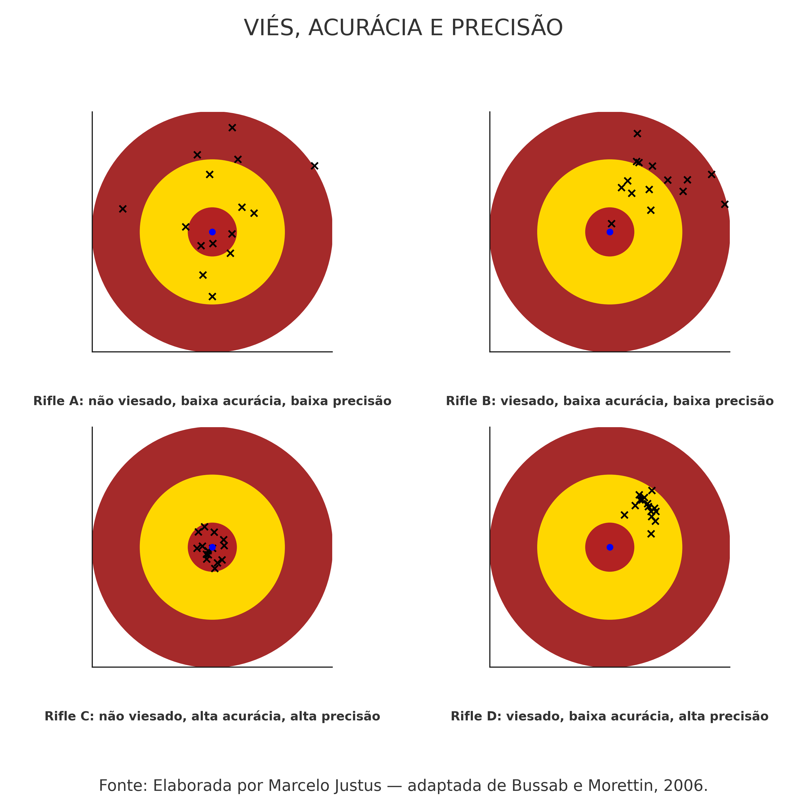

<nav id="meu-header">
  <div class="header-titulo">
  </div>

  <button id="botao-leitura">
    📖 Modo leitura
  </button>
</nav>

```{r}
# Bibliotecas R utilizadas

library(tidyverse)
library(ggplot2)
library(dplyr)
library(AER)
library(lmtest)
library(gridExtra)
```


# Apresentação {.unnumbered}

Este material tem finalidade didática, tratando-se de uma apostila de apoio
aos meus alunos da graduação e da extensão. Ele nasceu do meu desejo de
organizar um livro de estatística na medida suficiente para o uso por
estudantes de econometria (nem mais, nem menos: na medida certa). O texto e
as práticas com R vêm sendo desenvolvidos gradativamente a partir dos
conteúdos (slides, textos, scripts em R, minhas anotações de estudos e
outros materiais) utilizados nas minhas aulas da graduação desde 2014 e nos
cursos de extensão desde 2017 no Instituto de Economia da Unicamp.

O principal objetivo é sumarizar os conceitos fundamentais de estatística
aplicados à econometria, servindo como uma introdução à modelagem
econométrica. Pretende-se que seu conteúdo cubra desde os princípios básicos
da estatística inferencial até os fundamentos do modelo clássico de
regressão linear.

Ao final, encontra-se uma lista com os livros-texto recomendados por mim,
que foram fundamentais para a organização do roteiro e do conteúdo desta
versão preliminar.

Este material está em constante processo de revisão e ampliação. Caso você
identifique algum erro ou tenha sugestões, agradecerei se puder compartilhar
comigo pelo endereço mjustus@unicamp.br.


## Declaração de uso de inteligência artificial generativa {.unnumbered}

Os códigos em R utilizados neste material foram elaborados com base em exemplos apresentados em livros de Estatística e Econometria com R, bem como em adaptações didáticas desenvolvidas especificamente para os objetivos da disciplina.

Na preparação das práticas computacionais, especialmente dos exercícios de simulação, foi utilizada a assistência da ferramenta de inteligência artificial generativa ChatGPT, da OpenAI, exclusivamente como apoio à implementação, à organização e ao refinamento técnico dos códigos. A ferramenta também foi empregada como apoio à revisão gramatical, estrutural e formal do texto, com o objetivo de aprimorar a clareza, a legibilidade e a objetividade da exposição.

O uso da inteligência artificial generativa restringiu-se a atividades auxiliares de apoio técnico e formal, sem substituição da elaboração intelectual, da autoria humana ou da responsabilidade docente pelo conteúdo. A definição dos objetivos didáticos, a seleção dos temas, a construção dos exercícios, a supervisão conceitual, a validação dos códigos, a interpretação dos resultados e a forma final do material permaneceram integralmente sob responsabilidade do docente responsável.

Todos os resultados, códigos e trechos textuais produzidos com apoio da ferramenta foram revisados criticamente, linha por linha e trecho por trecho, com base em fontes confiáveis e no conhecimento técnico da área, a fim de assegurar correção estatística, consistência econométrica, adequação didática e conformidade com os princípios de integridade acadêmica.

Esta declaração é feita em observância às diretrizes institucionais da Unicamp sobre o uso ético, transparente, responsável e seguro de inteligência artificial generativa em atividades acadêmicas..

# Parte I — A natureza da econometria e dos dados {.unnumbered}

# Introdução

A nossa discussão começa com uma frase muito conhecida de Angrist e Pischke, no livro clássico de 2015, recomendado a quem deseja se tornar economista empírico ou conhecer melhor a econometria empírica e aplicada. 

> “A economia é empolgante; é tão excitante quanto qualquer outra ciência pode  ser. O mundo é o nosso laboratório, e as muitas pessoas que nele vivem são os  nossos sujeitos de análise. A empolgação, a emoção do nosso trabalho como economistas, vem da oportunidade de estudar as relações de causa e efeito nos  assuntos humanos.” 

Essa frase serve como ponto de partida para a compreensão dos principais fundamentos que estruturam a econometria. 

Este capítulo apresenta e discute a natureza da economia, da econometria e dos dados. O objetivo é compreender o que é econometria e qual é o seu papel dentro da economia e de outras áreas do conhecimento. Também se busca diferenciar modelos econômicos teóricos, modelos matemáticos, modelos estatísticos e modelos econométricos. Por fim, o capítulo apresenta a lógica de construção dos modelos econométricos. 

Neste capítulo, a atenção recai principalmente sobre a distinção entre correlação e causalidade. Compreender essa diferença é um passo fundamental para entender a natureza da econometria. Também se discute o papel da condição ceteris paribus, isto é, a hipótese de que as demais condições permanecem constantes, tanto na construção dos modelos teóricos quanto na identificação empírica de relações causais por meio da econometria.


# A natureza da econometria

A discussão começa pela definição de econometria. Uma das definições mais clássicas, com diferentes formulações na literatura, afirma que a econometria consiste no uso de métodos estatísticos para dar conteúdo empírico às teorias econômicas. Essa definição destaca a principal missão da econometria e do economista aplicado: transformar teorias sobre o comportamento humano e sobre relações comportamentais em hipóteses empiricamente testáveis, com o uso de estatística e dados.

Econometria, portanto, não se resume a “rodar regressões”. É muito comum, no início dos estudos em economia, que estudantes façam referência a expressões como “estou estimando um modelo de regressão”, “ajustei um modelo de regressão”, “estou rodando uma regressão” ou “quais dados são necessários para estimar a minha regressão?”.

A regressão é uma técnica, isto é, uma das ferramentas da econometria. Em sentido mais preciso, estimam-se parâmetros de modelos formulados a partir de uma teoria, de uma pergunta de pesquisa e de uma estratégia empírica. Esses modelos, estimados com dados e metodologias específicas, permitem investigar possíveis relações entre variáveis, inclusive relações causais, quando as hipóteses de identificação são defensáveis.

A econometria também pode ser usada com finalidade descritiva e preditiva. Contudo, uma de suas preocupações centrais, especialmente na econometria aplicada moderna, é avaliar relações de causa e efeito. Trata-se de uma disciplina científica voltada à modelagem empírica de fenômenos reais, desenvolvida na interseção entre economia, matemática, estatística, dados e recursos computacionais. Suas ferramentas são utilizadas em várias áreas do conhecimento, sempre que há interesse em compreender relações empíricas, testar hipóteses, fazer previsões, avaliar políticas ou orientar decisões sob incerteza.

Diversas profissões utilizam ferramentas desenvolvidas pela econometria e evidências produzidas por economistas empíricos para lançar luz sobre relações comportamentais em seus respectivos campos. Por essa razão, a econometria é muito mais do que simplesmente aplicar estatística a dados econômicos. Também é muito mais do que “rodar regressões”. A econometria constitui um campo científico próprio, com fundamentos teóricos, métodos estatísticos, estratégias de identificação e critérios de validação empírica.

A discussão avança, então, para os componentes centrais da econometria, com o objetivo de compreender o papel dos economistas e a importância dessa formação para a análise empírica rigorosa.


## Componentes centrais da econometria

Quais são os componentes que fundamentam a econometria? Quais áreas se combinam para que estudos econométricos sejam bem formulados e produzam evidências robustas?

O primeiro componente é a teoria econômica. A teoria fornece as hipóteses substantivas sobre as relações entre variáveis. Em muitos casos, essas hipóteses são causais e precisam ser confrontadas com os dados. A teoria, portanto, orienta a formulação da pergunta de pesquisa, a escolha das variáveis relevantes e a interpretação dos resultados.

O segundo componente é a matemática. A estrutura matemática permite expressar relações comportamentais por meio de funções, equações e sistemas formais. Desse modo, a matemática formaliza as relações entre variáveis, explicita as hipóteses do modelo e permite compreender sua estrutura lógica.

Entretanto, a econometria não se reduz à matemática. Econometria não é apenas economia matemática. A natureza da economia matemática, por exemplo, é discutida por Chiang e Wainwright em Matemática para Economistas, especialmente no capítulo introdutório. A diferença é essencial: enquanto um modelo matemático pode representar relações determinísticas, os fenômenos econômicos e sociais são, em geral, influenciados por muitos fatores. Alguns são conhecidos; outros, desconhecidos. Alguns são observáveis; outros, não observáveis, no sentido de que não podem ser diretamente medidos ou quantificados para inclusão no modelo.

É nesse ponto que entra o papel da estatística. A estatística permite incorporar a incerteza inerente aos modelos empíricos. Essa incerteza decorre da variabilidade dos dados, da imperfeição das medidas, da presença de fatores omitidos, da existência de choques aleatórios e do desconhecimento completo sobre todos os determinantes do fenômeno analisado. A inferência estatística é o instrumento que permite avaliar se os resultados obtidos são compatíveis com as hipóteses formuladas e qual é o grau de incerteza associado às estimativas.

Além da teoria, da matemática e da estatística, a econometria exige dados. Os dados são as observações utilizadas para estimar, testar e avaliar empiricamente as relações investigadas. Sem dados, não há passagem efetiva do modelo teórico para a evidência empírica.

Deve-se destacar a palavra “observações”. Na maior parte das aplicações em economia, trabalha-se com dados observacionais. Raramente há a possibilidade de conduzir experimentos plenamente controlados, como ocorre em algumas ciências de laboratório. Em geral, os economistas observam dados produzidos por processos sociais, econômicos e institucionais que já ocorreram ou estão em curso. Esses dados resultam de um processo gerador de dados, muitas vezes complexo, no qual várias forças atuam simultaneamente.

Esse ponto é fundamental para distinguir a econometria de outras ciências aplicadas que conseguem realizar experimentos controlados com maior frequência. Em economia e em outras ciências sociais, a identificação de relações causais exige estratégias empíricas capazes de aproximar, sob condições defensáveis, a comparação que seria obtida em um experimento ideal.


## Do modelo teórico à evidência empírica

A próxima etapa consiste em compreender o que é um modelo econométrico. Um exemplo clássico entre economistas é a chamada “lei da demanda”. A teoria econômica afirma que, ceteris paribus, quando o preço de um bem aumenta, sua quantidade demandada tende a diminuir. A econometria pergunta: quanto a quantidade demandada diminui? Qual é a magnitude dessa relação? Esse efeito é estatisticamente significante? A evidência é suficientemente confiável para orientar decisões de preço, regulação ou política pública?

Observe-se a passagem da teoria econômica para a economia aplicada. A teoria afirma: quando o preço aumenta, a quantidade demandada se reduz, mantidas constantes as demais condições relevantes. A economia aplicada pergunta: qual é a magnitude dessa redução? Essa redução pode ser estimada com dados? A estimativa é estatisticamente precisa? A interpretação causal é defensável?

Nesse momento, torna-se mais clara a natureza empírica da econometria. A econometria busca testar hipóteses econômicas e hipóteses oriundas de outras áreas do conhecimento, desde que estejam teoricamente bem estruturadas. Para isso, utiliza dados, modelos com estrutura matemática, métodos estatísticos e estratégias de identificação. O objetivo é avaliar se as relações presumidas teoricamente encontram sustentação empírica no mundo real. 

Em síntese, a econometria surge da interseção entre teoria econômica, matemática e estatística. Os dados são sua matéria-prima, isto é, o insumo principal dos modelos econométricos. É a partir dos dados que se torna possível aprender sobre relações comportamentais e, sob condições adequadas, sobre relações de causa e efeito em assuntos humanos. 

Cabe um esclarecimento importante: econometria não é sinônimo de ciência de dados, e ciência de dados não se confunde com econometria. Há interseções relevantes entre as duas áreas, sobretudo no uso de dados, métodos computacionais e técnicas estatísticas. Contudo, a econometria se caracteriza pela combinação entre teoria substantiva, estrutura matemática, inferência estatística e preocupação explícita com identificação, especialmente quando o objetivo é sustentar interpretações causais. 

Antes de estudar métodos sofisticados e o estado da arte da econometria aplicada moderna, é necessário compreender o que se busca com a econometria, qual é sua essência e por que ela é utilizada. A teoria econômica, ou outra teoria substantiva, formula hipóteses sobre relações entre variáveis. A matemática formaliza essas relações por meio de funções e equações. Os dados permitem observar manifestações empíricas dessas relações. A estatística fornece as ferramentas para estimar, testar e avaliar a incerteza associada aos resultados. A identificação empírica, por sua vez, permite discutir se as relações estimadas podem ser interpretadas como causais. 

Nesse sentido, um bom treinamento em estatística inferencial é indispensável à formação de um econometrista, pois dá rigor científico à avaliação dos modelos empíricos. Sem um referencial teórico consistente, preferencialmente estruturado de forma matemática quando isso for possível, o trabalho econométrico corre o risco de se tornar ingênuo ou meramente especulativo. Em alguns casos, exercícios exploratórios de associação entre variáveis podem ajudar a formular hipóteses, especialmente quando ainda não há uma teoria bem desenvolvida sobre a relação investigada. Contudo, sempre que houver uma teoria de base, econômica ou de outra natureza, o modelo econométrico deve ser estruturado a partir dela, pois é da teoria que se derivam hipóteses empiricamente testáveis. 

Mais uma vez, sem um referencial teórico consistente, a econometria corre o risco de se reduzir a um estudo de associações entre variáveis. Sem estatística, não há avaliação rigorosa da incerteza. Sem dados, não há evidência empírica. E sem uma estratégia de identificação adequada, não há base suficiente para sustentar interpretações causais. A econometria, portanto, deve ser entendida como uma disciplina científica, e não apenas como uma coleção de técnicas estatísticas.

## Tipos de modelos: econômico, matemático e estatístico

É importante distinguir os principais tipos de modelos utilizados na análise econométrica, pois é comum que a econometria seja confundida com estatística aplicada ou com economia matemática. Embora dialogue com ambas, a econometria não se reduz a nenhuma delas.


### Modelo teórico

Um modelo econômico teórico é construído a partir de hipóteses sobre o comportamento humano e expressa relações presumidas entre variáveis. Todos os modelos teóricos dependem de hipóteses. Um exemplo clássico é a teoria do consumidor. 

Da teoria do consumidor deriva-se a lei da demanda. Essa lei afirma que, ceteris paribus, se o preço de um bem aumenta, sua quantidade demandada tende a diminuir, ainda que a própria microeconomia reconheça situações específicas em que essa regularidade pode não se verificar de forma simples. A teoria sustenta essa relação com base em hipóteses fundamentais, como o princípio da racionalidade do consumidor e os axiomas que fundamentam a teoria neoclássica da escolha. Em termos matemáticos, pode-se representar essa relação como:

$$
Q^d = f(P), \qquad f'(P) < 0
$$

Essa expressão indica que a quantidade demandada depende do preço e que a relação esperada entre preço e quantidade demandada é negativa.


### Modelo matemático com forma funcional expressa

O modelo matemático formaliza essas relações por meio de equações. 
Por exemplo, a quantidade demandada de determinado produto, $Q^d$, 
pode ser representada como uma função linear do preço, $P$:

$$
Q^d = 𝑎 − 𝑏𝑃
$$

Essa expressão é uma equação matemática linear. Nela, $(a)$ e $(b)$ são parâmetros, e $(P)$ é a variável explicativa. A equação expressa que o preço está associado à quantidade demandada e que essa relação é negativa quando $(b > 0)$. Se os parâmetros fossem conhecidos, seria possível obter a quantidade demandada correspondente a determinado preço de forma determinística. Contudo, como se trata de uma representação teórica, seus parâmetros precisam ser estimados com dados e sua aderência empírica precisa ser avaliada. 

Além do preço do próprio bem, há várias outras variáveis que influenciam o comportamento do consumidor e sua decisão de consumo. Entre elas, estão o preço de bens substitutos, o preço de bens complementares e a renda do consumidor, que é uma das principais determinantes de sua capacidade de compra. A renda, em conjunto com os preços dos bens, define a restrição orçamentária do consumidor. A microeconomia também ensina que expectativas, sazonalidade, padrões de referência de consumo, preferências, instituições e outras variáveis podem ser relevantes para explicar a quantidade demandada.


### Modelo estatístico

O modelo estatístico incorpora a incerteza inerente aos fenômenos empíricos. Ele considera a variabilidade das observações, as imperfeições na coleta dos dados, os erros de medida e o desconhecimento sobre todos os determinantes de determinada variável. Quais são os determinantes da quantidade demandada de um bem? Em alguns casos, a teoria econômica permite listar as principais variáveis relevantes. Ainda assim, há fatores menos

relevantes, fatores difíceis de observar e fatores importantes que não podem ser medidos diretamente. Questões culturais, religiosas, institucionais, psicológicas ou relacionadas à confiança, por exemplo, podem afetar a demanda por certos bens, mas nem sempre são observáveis ou mensuráveis de forma adequada. Tudo isso introduz incerteza na determinação da quantidade demandada. Portanto, a relação entre quantidade demandada e preço não deve ser tratada como puramente determinística. Em termos empíricos, ela deve ser representada como uma relação estocástica. A estatística e a econometria, sob hipóteses específicas, permitem controlar outros fatores relevantes. Ainda assim, mesmo que fossem incluídas variáveis como renda, preço de bens substitutos e preço de bens complementares, permaneceria algum grau de incerteza. A expressão “controlar outros fatores” será fundamental ao longo de todo o estudo da econometria. Para lidar com essa incerteza, pode-se escrever um modelo estatístico geral. Seja $(Y)$ a quantidade demandada e $(X)$ o preço de determinado bem:

$$
Y = \beta_0 + \beta_1 X + u
$$

Nesse modelo, $\beta_0$ e $\beta_1$ são parâmetros desconhecidos, que precisam ser estimados com dados. O termo $(u)$ é o erro ou termo estocástico do modelo. Ele representa a parte de $(Y)$ que não é explicada por $(X)$ e pode incluir fatores omitidos, choques aleatórios, erros de medida e outros elementos não capturados explicitamente pela especificação. Essa estrutura, isoladamente, ainda não garante uma interpretação econométrica causal. A presença de um termo de erro não transforma automaticamente uma equação em um modelo econométrico causal. Para que o modelo tenha conteúdo econométrico substantivo, é necessário que esteja vinculado a uma teoria, a uma pergunta empírica, a dados adequados, a hipóteses estatísticas e, quando o objetivo for causal, a uma estratégia de identificação defensável. A variável $(Y)$ é usualmente chamada de variável dependente, variável resposta ou regressando. Em alguns contextos específicos, especialmente em modelos estruturais ou sistemas de equações simultâneas, também pode ser chamada de variável endógena. A variável $(X)$, por sua vez, pode ser chamada de variável explicativa, regressor ou covariada. A terminologia deve sempre ser usada de acordo com o contexto do modelo. 

**O que transforma um modelo estatístico em modelo econométrico** 

O que transforma um modelo estatístico em um modelo econométrico? Em primeiro lugar, a teoria. A estrutura matemática já existe, pois há uma equação relacionando variáveis. Também há parâmetros desconhecidos, como $(X_0)$ e $(X_1)$ que podem ser estimados com dados. Contudo, a estimação de uma equação não é suficiente para caracterizar uma análise econométrica rigorosa. Com dados de $(Y)$ e $(X)$, por exemplo, quantidade demandada e preço, pode-se estimar o modelo por diferentes métodos. Mas, para que esse modelo sustente uma interpretação causal entre preço e quantidade demandada, é necessário mais do que ajustar uma regressão. É preciso que a relação esteja teoricamente fundamentada, que as variáveis relevantes sejam consideradas, que as hipóteses estatísticas sejam explicitadas e que a estratégia de identificação aproxime, de modo plausível, a condição ceteris paribus. Uma parte importante desse processo consiste em retirar do termo de erro variáveis observáveis relevantes e incluí-las explicitamente no modelo como variáveis de controle. No exemplo da demanda, isso significa controlar, sempre que possível, renda, preço de bens substitutos, preço de bens complementares, sazonalidade, características dos consumidores e outros fatores observáveis que afetam a quantidade demandada.

Contudo, o controle de variáveis observáveis não resolve todos os problemas. Sempre pode haver fatores não observáveis relevantes. Por isso, a econometria desenvolveu técnicas voltadas a lidar com problemas de endogeneidade, variáveis omitidas, seleção, causalidade reversa e confundimento. Entre essas técnicas, estão estratégias baseadas em experimentos naturais, variáveis instrumentais, diferenças em diferenças, descontinuidade de regressão, efeitos fixos e outros métodos usados para aproximar a condição ceteris paribus. Portanto, o modelo econométrico permite testar hipóteses, estimar magnitudes, fazer predições, produzir previsões e, quando as hipóteses de identificação são defensáveis, sustentar interpretações causais. Para isso, utiliza teoria, dados, estatística, métodos de estimação, recursos computacionais e uma estratégia empírica coerente. Em síntese, parte-se da teoria econômica para o modelo matemático. Do modelo matemático, passa-se a uma estrutura estatística. Essa estrutura somente se torna um modelo econométrico substantivo quando está vinculada a uma teoria, a uma pergunta empírica clara, a dados adequados, a hipóteses estatísticas explícitas e a uma metodologia capaz de sustentar a interpretação pretendida. Assim, é essencial distinguir um modelo meramente estatístico de um modelo econométrico. O modelo econométrico exige fundamentação teórica e estratégia empírica. Exige também cuidado com a escolha das variáveis, com a interpretação dos parâmetros e com a validade das inferências. Sobretudo quando o objetivo é produzir evidências causais, os resultados precisam ser sustentados simultaneamente pela teoria, pelos dados, pela estatística e por hipóteses de identificação plausíveis.

# Correlação versus causalidade: o grande desafio da econometria

O maior desafio do economista moderno, sem dúvida, não é apenas obter dados. Em muitos contextos, esse já foi um obstáculo maior do que é atualmente. Também não é, necessariamente, a estrutura matemática, pois muitos estudos aplicados exigem apenas um conjunto bem delimitado de conceitos matemáticos. Tampouco é o uso de programas computacionais para estimação de modelos simples ou complexos, uma vez que os recursos computacionais disponíveis tornaram essa tarefa muito mais acessível, especialmente com o avanço recente das ferramentas de inteligência artificial. 

O maior desafio do economista empírico é separar correlação de causalidade. Não se trata apenas de compreender a diferença conceitual entre esses dois termos, mas de conseguir separá-los empiricamente. 

A correlação mede associação estatística entre duas variáveis. Por isso, correlação não é causalidade. Duas variáveis podem estar correlacionadas sem que uma cause a outra. Da mesma forma, a existência de uma hipótese causal teoricamente plausível não é suficiente para concluir que a relação observada nos dados é causal. Para isso, é necessário demonstrar que a associação empírica não decorre de fatores omitidos, causalidade reversa, seleção, confundimento ou outras fontes de viés. 

A causalidade exige raciocínio contrafactual. A pergunta central é: o que teria acontecido com $(Y)$ se $(X)$ tivesse sido diferente? A causalidade implica que uma mudança em $(X)$, mantidas constantes as demais condições relevantes, provoca uma mudança em $(Y)$. Essa é a base da condição ceteris paribus. 

Há exemplos conhecidos de correlação espúria, como os reunidos por [Tyler Vigen](https://www.tylervigen.com/spurious-correlations){target="_blank"}. Os exemplos de correlação espúria apresentados por Tyler Vigen são hilários, mas também muito úteis didaticamente para mostrar que correlação não implica causalidade. Correlação espúria ocorre quando há uma associação estatística entre duas variáveis, mas não há relação causal direta entre elas. Isso pode decorrer de mera coincidência, de tendências comuns ou da presença de um terceiro fator, chamado confundidor. Em muitas aplicações empíricas, esse problema está associado à omissão de variáveis relevantes. 

Um exemplo clássico é a relação entre a quantidade vendida de sorvetes e o número de afogamentos. As duas variáveis tendem a aumentar no verão. Portanto, é possível observar uma associação positiva entre elas em períodos de maior temperatura. No entanto, essa associação não representa uma relação causal direta. Mais sorvetes vendidos não causam mais afogamentos. O fator comum é a temperatura: no verão, as pessoas compram mais sorvete e também frequentam mais piscinas, praias, rios e outros locais de banho. Nesse caso, a correlação decorre de um terceiro fator omitido.

O foco da econometria aplicada moderna é usar teoria, métodos, modelos e dados para identificar relações causais com sustentação estatística, mesmo quando se dispõe apenas de dados observacionais. Na maior parte das aplicações em economia, não há laboratório controlado. Como lembram Angrist e Pischke, o mundo é o laboratório, e as pessoas que nele vivem são os sujeitos de análise. A econometria precisa lidar com essa condição imperfeita.

Outro exemplo clássico é a relação entre educação e salário. A pergunta causal é: educação aumenta o salário? Teoricamente, a resposta esperada é sim. Entretanto, há outras variáveis relevantes que também afetam o salário, como habilidade, experiência, idade, região, setor de ocupação, origem familiar e motivação. Para isolar o efeito da educação, é necessário controlar esses fatores ou utilizar uma estratégia empírica capaz de aproximar uma comparação contrafactual adequada. Essa é a função das variáveis de controle e, em muitos casos, dos métodos quase-experimentais. Quando aplicados corretamente e com bons dados, esses métodos podem aproximar a lógica de um experimento controlado.

Aproximar a condição ceteris paribus é uma condição central para sustentar interpretações causais. No exemplo da lei da demanda, a formulação correta é: a quantidade demandada tende a se reduzir quando o preço aumenta, ceteris paribus. Isso significa que as demais condições relevantes devem ser mantidas constantes ou adequadamente consideradas na análise.

Portanto, quando se avalia o efeito de uma variável sobre outra, é fundamental considerar os demais fatores relevantes. No modelo teórico, a condição ceteris paribus pode ser assumida. Na modelagem empírica, porém, ela precisa ser sustentada por meio de dados, especificação adequada, controles relevantes e estratégia de identificação.

No mundo real, em geral, não há laboratórios plenamente controlados. A econometria busca aproximar o experimento ideal por meio de estratégias de identificação.

Mas o que é uma estratégia de identificação? Em termos simples, é o conjunto de argumentos, hipóteses e procedimentos metodológicos que permite passar de associações observadas nos dados para uma interpretação causal. A estratégia de identificação procura mostrar por que determinada comparação empírica pode ser interpretada como uma aproximação válida do contrafactual.

Sem alguma forma defensável de aproximação da condição ceteris paribus, não há identificação causal. Nesse caso, é possível falar em associação ou correlação entre variáveis, mas não em relação causal. A identificação causal, portanto, é um dos pontos centrais da econometria aplicada.

Quais obstáculos precisam ser enfrentados? Um dos mais importantes é o viés de seleção. Esse problema ocorre quando a exposição ao tratamento, à política ou à intervenção não é aleatória. Em dados observacionais, indivíduos, empresas, municípios ou países frequentemente se selecionam ou são selecionados para determinado tratamento com base em características que também afetam o resultado de interesse.

Há também o viés de variável omitida, que surge quando fatores relevantes para explicar o resultado são deixados fora do modelo. No caso da demanda de um bem explicada apenas pelo preço do próprio bem, variáveis omitidas relevantes podem incluir o preço de bens complementares, o preço de bens substitutos e a renda do consumidor. Esses fatores influenciam a demanda e podem distorcer a estimativa da relação entre preço e quantidade demandada. No caso da relação entre educação e salários, a omissão de variáveis como experiência, habilidade, motivação ou origem familiar também pode gerar viés no estimador.

Esses obstáculos precisam ser enfrentados com bons dados, teoria substantiva e metodologias econométricas adequadas. Esse é o caminho que leva dos números brutos ao conhecimento causal relevante. Ter dados é apenas o primeiro passo. Dados precisam ser transformados em informação, e informação precisa gerar conhecimento científico útil. O caminho entre dados brutos e respostas causais é longo. 

Pesquisas descritivas são úteis e muitas vezes indispensáveis. No entanto, quando a pergunta de pesquisa é causal, a análise precisa ir além da descrição. Como se atribui a W. Edwards Deming, *“Em Deus nós confiamos; todos os outros devem trazer dados”*. Ainda assim, é preciso cuidado: a diferença entre contar histórias com dados e produzir evidência científica robusta está na capacidade de sustentar, quando for o caso, uma interpretação causal defensável. 

Há várias metodologias para aproximar um experimento controlado e produzir evidências sobre relações causais, e não apenas correlacionais. Frequentemente, utilizam-se modelos de regressão com variáveis de controle observáveis. Também são usados modelos de dados em painel, que podem controlar fatores não observáveis constantes no tempo, desde que as hipóteses do modelo sejam plausíveis. 

Entre os métodos amplamente utilizados na econometria aplicada moderna, destacam-se os modelos de diferenças em diferenças. Esses modelos são úteis quando há grupos tratados e não tratados observados antes e depois de uma intervenção, desde que a hipótese de tendências paralelas seja defensável. Portanto, diferenças em diferenças não é uma metodologia automaticamente superior. Ela é recomendável quando o desenho empírico e os dados são compatíveis com suas hipóteses de identificação. 

Também há aplicações de regressão com descontinuidade, método originalmente introduzido na literatura de avaliação em 1960. Nesse caso, a identificação causal decorre da comparação entre unidades situadas muito próximas de um ponto de corte que define a exposição ao tratamento. Há, ainda, o método de controle sintético, desenvolvido a partir dos trabalhos de Abadie e Gardeazabal e posteriormente sistematizado por Abadie, Diamond e Hainmueller. Esse método constrói uma unidade contrafactual sintética a partir de uma combinação ponderada de unidades não tratadas, buscando aproximar o comportamento que a unidade tratada teria apresentado na ausência da intervenção. 

Outras metodologias importantes incluem variáveis instrumentais, pareamento por escore de propensão, modelos de efeitos fixos, regressão descontínua, controle sintético e diferentes combinações entre métodos. A escolha da metodologia deve depender da pergunta de pesquisa, da estrutura dos dados, da natureza da intervenção, das hipóteses de identificação e das ameaças à validade causal. 

De forma geral, os métodos de avaliação causal podem ser classificados em experimentais e não experimentais. Os métodos experimentais, baseados em aleatorização, são frequentemente tratados como padrão de referência na avaliação de impacto. Os métodos não experimentais, por sua vez, buscam aproximar a comparação contrafactual por diferentes estratégias. Alguns se apoiam principalmente na seleção por observáveis, como regressões com controles e pareamento por escore de propensão. Outros exploram variação institucional, temporal, espacial ou quase aleatória, como diferenças em diferenças, variáveis instrumentais, regressão descontínua e controle sintético. Em aplicações reais, esses métodos podem ser combinados, desde que a combinação seja coerente com a pergunta de pesquisa e com as hipóteses de identificação.

# A natureza dos dados

Retomemos a discussão sobre os dados. Para estimar relações causais, são necessários dados adequados à pergunta de pesquisa e à estratégia de identificação. Em muitas aplicações da economia, esses dados são observacionais, isto é, não resultam de experimentos controlados. Como se atribui a W. Edwards Deming, *“Em Deus nós confiamos; todos os outros devem trazer dados”*. Contudo, é preciso cautela: não bastam quaisquer dados.

Dados podem conter erros de medida, inconsistências, omissões, problemas de cobertura, mudanças metodológicas e limitações de comparabilidade. Por isso, é fundamental conhecer suas características, propriedades e limitações. Nem toda pergunta pode ser respondida com qualquer base de dados. A resposta possível depende do tipo de dado utilizado, da qualidade da mensuração, da unidade de observação, da dimensão temporal, da granularidade e da estratégia empírica disponível.

Portanto, é preciso cautela diante da afirmação de que *“os dados falam por si”*. Dados não falam por si. Dados são matéria-prima para a construção de conhecimento por meio de métodos científicos.

Os dados são a fonte da evidência empírica, isto é, o principal insumo da modelagem econométrica. Mas como os dados produzem informação? A resposta está na variação. A variabilidade dos dados é fonte de informação estatística. Em sentido amplo, a estatística pode ser entendida como a análise da variabilidade dos dados.

Sem variação relevante, não há como estimar relações entre variáveis. Se uma variável explicativa $(X)$ não varia, não é possível estimar seu efeito sobre uma outra variável $(Y)$. Contudo, a existência de variação em $X$ não basta para identificar uma relação causal. Para isso, a variação precisa ser informativa, isto é, precisa estar associada a uma estratégia de identificação capaz de isolar o efeito de $X$ sobre $Y$, afastando explicações alternativas.

A identificação de um efeito depende, portanto, da natureza da pergunta, das características dos dados e da plausibilidade das hipóteses de identificação. É por isso que o tipo de dado disponível define o que pode, e o que não pode, ser respondido empiricamente.

Quais tipos de dados podem ser utilizados? Em economia aplicada, é comum trabalhar com dados de corte transversal, séries temporais, dados longitudinais e dados em painel. Cada estrutura oferece fontes distintas de variação e impõe limitações específicas à análise.


## A dimensão dos dados: a fonte de variação


### Corte transversal

Dados de corte transversal, também chamados de *cross-section*, reúnem muitas unidades observadas em um mesmo ponto do tempo ou em um mesmo período de referência. Essas unidades podem ser pessoas, famílias, domicílios, empresas, bairros, municípios, microrregiões, estados ou países.

Nesse tipo de dado, a principal fonte de variação está nas diferenças entre unidades. Por exemplo, pode-se comparar renda, escolaridade, taxa de desemprego ou taxa de criminalidade entre indivíduos, domicílios, municípios ou estados em determinado ano.

Em bases de corte transversal, muitas variáveis podem ter sido coletadas em períodos próximos, ainda que não exatamente no mesmo dia ou mês. O ponto fundamental é que não há uma dimensão temporal suficientemente estruturada para acompanhar a evolução das mesmas unidades ao longo do tempo. Essa é uma limitação importante, pois impede a análise direta de dinâmicas temporais, persistência, defasagens e mudanças antes e depois de eventos.

Exemplos de dados de corte transversal incluem informações do Censo Demográfico em determinado ano, variáveis da PNAD Contínua em um período específico, taxas de criminalidade municipais em um único ano e taxas de desemprego por unidades federativas em determinado período.

### Séries temporais

Uma série temporal é formada pela observação de uma mesma unidade ao longo do tempo. Nesse caso, a principal fonte de variação está na dimensão temporal. Diferentemente dos dados de corte transversal, não há comparação entre muitas unidades no mesmo período, mas sim a análise da evolução de uma variável, ou de um conjunto de variáveis, ao longo do tempo.

As séries temporais permitem estudar dinâmica, persistência, tendências, sazonalidade, ciclos, quebras estruturais e relações com defasagens temporais. Essa é uma de suas principais vantagens.

Por outro lado, séries temporais podem ter número limitado de observações, especialmente quando a frequência é anual. Em frequência trimestral, mensal, semanal ou diária, o número de observações tende a ser maior, o que pode ampliar as possibilidades de análise. Ainda assim, séries temporais exigem cuidados específicos, como estacionariedade, autocorrelação, sazonalidade, mudanças estruturais e dependência temporal.

Exemplos de séries temporais incluem o PIB anual do Brasil, a inflação mensal, a taxa de câmbio diária, a taxa Selic ao longo do tempo e a taxa mensal de desemprego.

### Dados longitudinais

Dados longitudinais acompanham as mesmas unidades ao longo do tempo. Quando há muitas unidades observadas em vários períodos, é comum usar a expressão dados em painel. Essa estrutura combina duas fontes de variação: a variação entre unidades e a variação ao longo do tempo.

Essa combinação é especialmente valiosa para a econometria aplicada, pois permite explorar diferenças entre unidades, mudanças dentro das unidades ao longo do tempo e, em alguns casos, controlar características não observáveis que permanecem constantes no tempo. Por isso, dados em painel costumam oferecer uma estrutura mais rica para a investigação empírica.

Contudo, painéis verdadeiros com microdados podem ser raros, pois acompanhar os mesmos indivíduos, famílias, domicílios ou empresas ao longo do tempo é caro e operacionalmente complexo. Em contrapartida, é frequentemente possível construir bons painéis com dados agregados, por exemplo, municípios, estados ou países observados ao longo dos anos.

## Granularidade: microdados e dados agregados

Outra distinção importante é entre microdados e dados agregados. Microdados são dados no nível da unidade individual de observação, como pessoas, domicílios, famílias, trabalhadores, empresas ou estabelecimentos. Dados agregados, por sua vez, são médias, proporções, somas, totais ou taxas construídas a partir de observações individuais e organizadas por grupos, como bairros, municípios, estados, países ou setores. 

Exemplos de microdados no Brasil incluem a PNAD Contínua, o Censo Demográfico, a RAIS, o Censo Escolar e outras pesquisas disponibilizadas publicamente. Em geral, essas bases contêm informações sobre indivíduos, domicílios, famílias, trabalhadores, escolas, empresas ou estabelecimentos. 

Na maior parte das vezes, porém, não há acompanhamento das mesmas unidades individuais ao longo do tempo. Portanto, painéis com microdados são menos frequentes. Quando há um painel verdadeiro de microdados, a estratégia empírica pode ganhar um insumo muito valioso, pois os microdados contêm grande quantidade de informação e permitem controlar características observáveis em nível individual. Em alguns desenhos, também podem permitir o controle de características não observáveis constantes no tempo, por meio de efeitos fixos. 

Em muitas aplicações, usam-se dados agregados para compor painéis. Dados agregados são úteis e muito utilizados em economia aplicada. No entanto, é preciso cuidado com o tipo de conclusão que se extrai deles. Sempre que a pergunta de interesse estiver no nível individual, microdados tendem a ser mais adequados. O uso de dados agregados para inferir comportamentos individuais pode levar a um erro conhecido como falácia ecológica. Esse erro ocorre quando conclusões sobre indivíduos são extraídas diretamente de relações observadas em grupos. Trata-se de uma armadilha importante, especialmente para quem ainda não domina os limites da inferência com dados agregados. 

Exemplos: 

1. Imagine uma evidência empírica mostrando que cidades com maior renda média têm menos homicídios. Isso significa que pessoas mais ricas cometem menos homicídios? Não necessariamente. Concluir isso diretamente seria incorrer em falácia ecológica. 

2. Estados com maior taxa de desemprego apresentam mais crimes contra o patrimônio. Isso significa que pessoas desempregadas têm maior probabilidade de cometer crimes patrimoniais? Não necessariamente. Essa conclusão exigiria dados individuais e uma estratégia empírica adequada. 

3. Estados com maior quantidade de armas de fogo vendidas apresentam mais homicídios por 100 mil habitantes. Isso permite concluir que proprietários de armas cometem mais homicídios? Não necessariamente. Essa conclusão, feita diretamente a partir de dados agregados, também poderia caracterizar falácia ecológica. 

Se essas forem as perguntas de interesse, será necessário usar dados individuais, sempre que possível, e metodologias adequadas para inferência causal. O ponto central é simples: dados agregados permitem responder perguntas formuladas no nível agregado. Perguntas sobre comportamento individual exigem, preferencialmente, dados individuais.

# As quatro perguntas fundamentais da economia aplicada

A próxima etapa consiste em entender e aplicar as quatro perguntas fundamentais da econometria aplicada. Primeiro, serão apresentadas as perguntas que todo economista empírico deveria fazer ao estruturar um estudo rigoroso. Em seguida, cada uma delas será discutida com mais cuidado. 

Nesta parte, busca-se compreender o papel dos experimentos ideais e, sobretudo, o que se entende por experimento ideal. Esse conceito é fundamental para a definição da estratégia de identificação, pois ajuda a reconhecer as limitações inerentes à metodologia aplicada na modelagem econométrica. 

Também se busca compreender melhor os tipos de dados, suas vantagens, suas desvantagens e suas limitações. Vale retomar a frase atribuída a Deming: *“Em Deus nós confiamos; todos os outros devem trazer dados”*. Como já ressaltado, porém, não bastam quaisquer dados. São necessários bons dados, com propriedades adequadas à pergunta de pesquisa, para construir conhecimento por meio de evidências estatísticas robustas. 

Angrist e Pischke (2015) sintetizaram quatro perguntas fundamentais, ou perguntas frequentes, da economia aplicada. Essas perguntas ajudam a estruturar um estudo econométrico rigoroso. 

A primeira pergunta é: qual é a relação causal de interesse? Saber formular uma boa pergunta é, muitas vezes, mais importante do que saber aplicar uma técnica sofisticada. O papel do economista empírico é formular perguntas causais relevantes, capazes de orientar a construção de bons modelos, a escolha dos dados, a definição da estratégia de identificação e a interpretação dos resultados. 

A segunda pergunta é: qual seria o experimento ideal? Essa pergunta é provocadora porque, na maior parte das aplicações reais, o pesquisador não conseguirá reproduzir o desenho ideal. O mundo é o laboratório, e as pessoas são os sujeitos de análise. Em geral, não há laboratório controlado nem condições experimentais perfeitas. Portanto, o papel do econometrista é aproximar-se, tanto quanto possível, da lógica de um experimento ideal. 

É importante que o economista empírico consiga imaginar, do ponto de vista conceitual, qual seria o experimento ideal na ausência de restrições financeiras, técnicas, institucionais ou éticas. Esse exercício cria um ponto de referência para avaliar o que é possível, e o que não é possível, com os dados disponíveis. 

A terceira pergunta é: qual é a estratégia de identificação? Há diferentes formas de definir essa expressão, que aparece frequentemente em artigos científicos. Em termos simples, a estratégia de identificação é o conjunto de argumentos, hipóteses e procedimentos que permite usar dados, muitas vezes observacionais, para aproximar a lógica de um experimento ideal e sustentar uma interpretação causal. 

Portanto, primeiro é preciso saber qual pergunta causal se deseja responder. Em seguida, é necessário imaginar o experimento ideal. A partir disso, deve-se definir a melhor estratégia possível de implementação empírica, dadas as restrições dos dados disponíveis. A busca por uma estratégia de identificação robusta e factível é um dos grandes desafios do econometrista moderno. 

A quarta pergunta é: qual é o modo de inferência? Trata-se de definir quais procedimentos de estatística inferencial serão utilizados para analisar rigorosamente os resultados dos modelos estimados. 

Nessa etapa, o pesquisador deve decidir como tratar a incerteza associada às estimativas. Isso inclui a escolha dos erros padrão, que podem ser convencionais, robustos, clusterizados ou ajustados de outras formas, dependendo da estrutura dos dados e das hipóteses sobre o termo de erro. O objetivo é avaliar quão confiáveis são os resultados encontrados e qual é a precisão das estimativas. 

Essas quatro perguntas devem guiar a análise econométrica e fazer parte de qualquer projeto voltado à estimação de relações causais robustas, confiáveis e úteis na prática. 

Cabe aqui a frase célebre atribuída a John Tukey: *“É muito melhor ter uma resposta aproximada para a pergunta correta do que uma resposta exata para a pergunta errada”*. Um economista empírico deve ser capaz de formular boas perguntas causais. Essas perguntas orientam a construção do experimento ideal, a escolha dos dados, o desenho da estratégia de identificação e a definição do modo de inferência. A partir disso, torna-se possível produzir evidências estatísticas e teoricamente confiáveis sobre relações causais.

## Estratégia de identificação e o papel do experimento ideal

Ainda sobre experimento ideal e estratégia de identificação, cabe perguntar: pesquisas descritivas são inúteis? Não. Elas têm sua utilidade. Análises descritivas e correlacionais são importantes e, muitas vezes, representam o primeiro passo na construção de conhecimento empírico. 

Um exemplo clássico é a curva de Phillips na macroeconomia. Phillips, na década de 1950, elaborou um diagrama de dispersão com dados e encontrou uma associação negativa entre desemprego e inflação. Essa relação foi estudada ao longo dos anos, formalizada teoricamente e testada empiricamente com diferentes modelos e métodos. 

Portanto, a análise descritiva pode iniciar um campo de investigação. Contudo, quando a pergunta de pesquisa é causal, o núcleo da análise econométrica deve ser a investigação de relações de causa e efeito. 

Em estudos econométricos reais, o experimento ideal é hipotético, mas ajuda a compreender as limitações da estratégia de identificação utilizada para isolar o efeito causal. 

Também é importante refletir sobre o papel do economista empírico. Além da capacidade técnica, é necessário reconhecer as limitações da estratégia de identificação e evitar conclusões mais fortes do que aquelas sustentadas pelos dados e pelo método. Não se deve concluir como se tivesse sido realizado um experimento controlado ideal quando, na verdade, a análise foi conduzida com dados observacionais e métodos de identificação sujeitos a hipóteses.

Mesmo quando há evidência estatística compatível com uma interpretação causal, podem existir fragilidades. Toda escolha metodológica envolve renúncias. Métodos têm vantagens, limitações e hipóteses próprias. O papel do econometrista é fazer a melhor escolha possível, dadas as restrições metodológicas, os dados disponíveis e a pergunta de pesquisa. 

Ao investigar, por exemplo, o efeito da taxa de desemprego sobre a taxa de criminalidade, é necessário construir uma estratégia de identificação que considere variáveis relevantes para a determinação da criminalidade, como desigualdade de renda, pobreza, renda, educação, gastos em segurança pública, presença de armas de fogo, estrutura etária, urbanização e outros fatores. Mesmo assim, o estudo terá limitações, e reconhecê-las é parte essencial da ética do trabalho empírico. 

Em síntese, a estratégia de identificação consiste em usar dados, frequentemente observacionais, para aproximar a comparação que seria obtida em um experimento ideal. Além disso, é preciso considerar que dados observacionais podem conter erros de medida, problemas de seleção, omissões, mudanças metodológicas e limitações de cobertura. A qualidade estatística dos dados é decisiva. 

Como se passa da teoria para a prática? As quatro perguntas funcionam como guia. Primeiro, define-se qual hipótese causal está sendo investigada. Depois, imagina-se o experimento ideal. Em seguida, escolhe-se a estratégia de identificação compatível com os dados disponíveis. Por fim, define-se o modo de inferência adequado para avaliar a incerteza das estimativas. Esse percurso permite transformar uma pergunta teórica em uma análise empírica estruturada, estimável e cientificamente defensável.

## Estratégias e métodos comuns em econometria aplicada

A escolha da estratégia de identificação é um passo fundamental em qualquer estudo de econometria aplicada. Uma das estratégias mais comuns consiste no uso de modelos de regressão com controle para variáveis observáveis relevantes. Nesse caso, a ideia é comparar unidades que diferem na variável explicativa de interesse, mas que sejam semelhantes em outros fatores capazes de afetar o resultado analisado. 

Contudo, controlar variáveis observáveis não significa incluir qualquer conjunto de controles no modelo. É necessário selecionar variáveis teoricamente relevantes e empiricamente adequadas à pergunta de pesquisa. A inclusão de controles deve ser guiada por teoria, conhecimento institucional e compreensão do processo gerador dos dados. 

No termo de erro da regressão devem permanecer apenas os fatores não observados ou não incluídos no modelo que não comprometam a identificação do efeito de interesse. Em termos econométricos, para que a interpretação causal seja defensável, esses fatores não podem estar sistematicamente correlacionados com a variável explicativa de interesse, depois de considerados os controles relevantes. Portanto, o problema central não é simplesmente deixar variáveis no termo de erro, pois isso sempre ocorrerá. O problema é deixar no termo de erro variáveis relevantes que estejam correlacionadas com a variável explicativa de interesse e que também afetem a variável dependente. 

Essa é a lógica do viés de variável omitida. Quando uma variável relevante é omitida e está associada tanto ao regressor de interesse quanto ao resultado analisado, a estimativa pode capturar não apenas o efeito da variável explicativa, mas também parte do efeito da variável omitida. Nesse caso, a comparação deixa de satisfazer, de forma plausível, a condição ceteris paribus.

Por isso, a regressão com controles é uma estratégia útil, mas depende de hipóteses fortes. Ela é mais defensável quando se pode sustentar que, após controlar os fatores observáveis relevantes, as diferenças restantes entre as unidades comparadas não estão sistematicamente associadas ao tratamento, à exposição ou à variável explicativa de interesse. Quando essa hipótese não é plausível, torna-se necessário recorrer a estratégias de identificação mais robustas, como modelos de dados em painel, diferenças em diferenças, variáveis instrumentais, regressão descontínua, pareamento ou controle sintético, conforme a pergunta de pesquisa, os dados disponíveis e o desenho empírico.

# O papel do econometrista e a ética do trabalho empírico

Econometristas tratam questões sobre causa e efeito nas relações humanas, armados não com paixão, mas com dados, como afirmam Angrist e Pischke. São cientistas que aplicam metodologias rigorosas para estimar e testar hipóteses, avaliar impactos de políticas públicas, programas sociais e outras intervenções. O objetivo é responder perguntas causais, fazer predições e previsões estatísticas e produzir conhecimento científico empírico capaz de orientar decisões estratégicas no setor público e no setor privado, reduzindo incertezas no processo decisório. 

Esse é o papel do econometrista moderno dentro da economia e da ciência. A econometria também se expandiu para outras áreas importantes do conhecimento. Há forte interdisciplinaridade entre econometria, direito, administração pública, ciência política, sociologia, saúde pública e outras áreas. No campo jurídico, por exemplo, a econometria tem sido usada em estudos empíricos aplicados ao direito e dialoga diretamente com a Análise Econômica do Direito. 

Mas o que se espera de um econometrista? Espera-se que formule boas perguntas, reconheça limitações metodológicas e busque evidências com rigor científico. Para isso, a análise deve ser estruturada com teoria, matemática, estatística, bons dados e estratégia empírica adequada. A partir dessa estrutura, torna-se possível informar decisões com base em evidências robustas. 

É importante ressaltar que o econometrista não deve atuar como militante nem como mero especulador de relações hipoteticamente causais. O econometrista testa hipóteses e investiga, com rigor, se há ou não relações causais relevantes para o conhecimento científico. Relações causais não devem ser tratadas com paixão, mas com método. 

A essência da econometria moderna pode ser resumida da seguinte forma: há um referencial teórico, do qual derivam hipóteses; há um modelo empírico, construído com dados, estratégia de identificação e inferência estatística; e há evidência empírica, cuja robustez depende da qualidade dos dados, da plausibilidade das hipóteses e da adequação da metodologia. Evidência empírica robusta não é simples opinião. Ela é informação produzida com método científico.

É fundamental ter em mente que dados são diferentes de informação. Hoje há ampla disponibilidade de dados e grande capacidade computacional para processar modelos complexos. A função do economista empírico é transformar dados em informação relevante e conhecimento científico útil. 

Cabe aqui a conhecida frase atribuída a Deming, estatístico importante na área de qualidade: “Sem dados, você é apenas mais uma pessoa com opinião”. Outra citação atribuída a ele é: *“Em Deus nós confiamos; todos os outros devem trazer dados”*. Ainda assim, é preciso cuidado: não bastam quaisquer dados. A qualidade dos dados, sua adequação à pergunta de pesquisa e sua compatibilidade com a estratégia empírica são decisivas. A natureza dos dados será discutida a seguir.

Para finalizar, cabe resumir o que um econometrista deve saber. Em primeiro lugar, deve saber que formular corretamente a pergunta de pesquisa é tão importante quanto saber respondê- -la. Na economia aplicada, boas perguntas orientam a escolha da estratégia de identificação, a seleção dos dados, a especificação do modelo e o modo de inferência. Boas perguntas permitem transformar dados em informação relevante e conhecimento científico útil. 

Também é preciso reconhecer que modelos, métodos e dados são ferramentas. O econometrista não deve ser apenas um aplicador de métodos nem um mero usuário de bases de dados. O que deve orientar seu trabalho é o esforço de compreender relações humanas, especialmente quando o objetivo é investigar o que causa o quê. 

A econometria serve para transformar dados em informação relevante e conhecimento científico. Análises descritivas podem lançar luz sobre fenômenos importantes. Contudo, quando os dados são analisados com estrutura econométrica, inferência estatística e estratégia de identificação voltada à causalidade, torna-se possível produzir conhecimento científico mais robusto. Se o problema investigado for relevante, esse conhecimento poderá ser útil para a formulação de políticas públicas, para a avaliação de programas, para decisões no setor privado e para o avanço da pesquisa científica. 

A diferença entre contar histórias com dados e fazer ciência com dados pode ser resumida em uma palavra: causalidade. É possível descrever dados; é possível construir narrativas com base em dados; e é possível testar relações causais com dados, desde que exista uma estratégia empírica adequada. A missão do economista empírico moderno é produzir evidências rigorosas sobre relações relevantes, reconhecendo os limites dos dados, dos métodos e das hipóteses assumidas.


# Parte II - Fundamentos de Estatística para Econometria {.unnumbered}


# Distribuições de Probabilidade na Econometria

A tese de Trygve Haavelmo, *The Probability Approach in Econometrics*, é reconhecida como o marco fundador da econometria como ciência. O trabalho, defendido na Universidade de Chicago em 1941, foi publicado na *Econometrica* em 1944. Trygve foi laureado com o Prêmio Nobel de Economia em 1989^[Trygve Haavelmo – Facts. NobelPrize.org. Nobel Prize Outreach 2025. Sat. 24 May 2025. https://www.no belprize.org/prizes/economic-sciences/1989/haavelmo/facts/], especialmente por essa notória contribuição.

Motivação do prêmio: *“for his clarification of the probability theory foundations of econometrics and his analyses of simultaneous economic structures”*.

A econometria moderna é baseada no desenvolvimento de métodos estatísticos, mas ela evoluiu como uma disciplina separada da estatística matemática porque lidamos com dados não experimentais. Entretanto, os econometristas recorrem frequentemente aos estatísticos matemáticos. O método de análise de regressão múltipla é a base de ambos os campos, mas os economistas criaram novos métodos para lidar com as complexidades inerentes aos dados econômicos que, por natureza, são dados observacionais.^[Wooldridge, J. M. (2025). Introdução à econometria: uma abordagem moderna (tradução da 6ª edição norte- -americana). Cengage Learning.]

Na maioria das aplicações, a econometria é usada para testar teorias econômicas, prever variáveis econômicas, avaliar políticas públicas ou programas e medir impactos de choques ou intervenções exógenas. Nesse contexto, a inferência estatística ocupa um lugar fundamental no processo de modelagem econométrica. Portanto, faz parte da formação do econometrista.

Nesta e na próxima aula, estudaremos os fundamentos de algumas importantes distribuições de probabilidade utilizadas na prática. Veremos como elas se conectam a partir da hipótese de que os erros aleatório (𝑢) do modelo clássico de regressão linear seguem uma distribuição normal.

Especificamente, abordaremos a distribuição normal, a distribuição $t$ de Student, a distribuição qui-quadrado e a distribuição $F$  de Fisher-Snedecor.

Faremos simulações para ilustrar o comportamento assintótico da distribuição $t$ de Student. Veremos como uma distribuição Qui-quadrado surge a partir de uma variável aleatória que segue uma distribuição Normal, e a origem da distribuição $t$ de Student na construção de testes de hipóteses e intervalos de confiança.


## Distribuição Normal

A distribuição normal é uma das mais importantes na modelagem econométrica. A sua importância está diretamente associada à inferência estatística sobre as estimativas obtidas pelos estimadores. A distribuição normal é a base teórica da inferência econométrica clássica.


A função densidade de probabilidade da normal é

$$
f(x) = \frac{1}{\sigma\sqrt{2\pi}}
e^{-\frac{(x-\mu)^2}{2\sigma^2}},
\qquad -\infty < x < \infty,
\quad \sigma > 0
$$

em que 𝜎 é o desvio padrão e 𝜇 é a média.


**Principais propriedades**

• Média: $𝐸[𝑋] = 𝜇$.

• Variância: $Var(𝑋) = 𝜎²$.

• Formato: simétrica em forma de sino (bell-shaped curve). As probabilidades diminuem simetricamente à medida que os valores se afastam da média.


**Gráfico da densidade de probabilidade**

```{r}
# Sequência de valores para o eixo X
x <- seq(-5, 15, length.out = 1000)

# Parâmetros das distribuições Normais
parametros <- tribble(
  ~media, ~desvio, ~Distribuição,
  5,      4,       "N(5, 4²)",
  5,      2,       "N(5, 2²)",
  3,      2,       "N(3, 2²)"
)

# Criar todas as combinações entre x e as distribuições
dados <- expand_grid(
  x = x,
  parametros
) |>
  mutate(
    densidade = dnorm(
      x,
      mean = media,
      sd = desvio
    )
  )

# Gráfico
ggplot(
  dados,
  aes(
    x = x,
    y = densidade,
    color = Distribuição
  )
) +
  geom_line(linewidth = 1) +
  labs(
    title = "Densidades de probabilidade para distribuições Normais",
    subtitle = "Diferentes médias e desvios-padrão",
    x = "X",
    y = "Densidade",
    color = "Distribuição"
  ) +
  scale_color_manual(
    values = c(
      "N(5, 4²)" = "black",
      "N(5, 2²)" = "red",
      "N(3, 2²)" = "blue"
    )
  ) +
  theme_minimal(base_size = 12) +
  theme(
    legend.position = "top"
  )
```

### Distribuição Normal Padrão

A distribuição Normal Padrão é uma forma particular da distribuição Normal commédia é 0 e o desvio padrão é 1,abreviadamente denota da por $𝒩(0,1)$.

**Gráfico da densidade de probabilidade da $𝒩(0,1)$**

```{r}
set.seed(2025) # para reprodutibilidade

# Geração de dados e densidades

x <- rnorm(1000)
dens_emp <- density(x)
x_teor <- seq(min(x), max(x), length.out= 1000)
dens_teorica <- dnorm(x_teor)

# Gráfico das densidades

df_plot <- bind_rows(
  tibble(x = dens_emp$x, y = dens_emp$y, Tipo = "Simulada"),
  tibble(x = x_teor, y = dens_teorica, Tipo = "Teórica")
)

ggplot(df_plot, aes(x= x, y= y,color= Tipo, linetype= Tipo)) +
  geom_line(linewidth = 1.2) +
  scale_color_manual(values = c("Simulada" = "blue", "Teórica" = "red")) +
  scale_linetype_manual(values= c("Simulada" = "solid", "Teórica" = "dashed")) +
  labs(
    title= "Densidades de probabilidade da Normal Padrão: teórica vs. empírica",
    x = "x", y = "Densidade",
    color = NULL,
    linetype = NULL
  ) +
  theme_minimal() +
  theme(legend.position = "top")
```

**Prática com R: cálculo de probabilidade e percentil**

Considere uma variável com distribuição Normal com média $𝜇$ = 50 e desvio padrão $𝜎$ = 3, ou seja, $𝑋 ∼ 𝒩(50, 9)$. Calcule:

1. 𝑃($𝑋$ <55).

2. 𝑃(45 < $𝑋$ <55).

3. O percentil 90 da distribuição de $𝑋$.

```{r}
# Parâmetros

mu <- 50
sigma <- 3

# (1) P(X < 55)

p_menor_55 <- pnorm(55, mean = mu, sd = sigma)

# (2) P(45 < X < 55)

p_entre_45_55 <- pnorm(55, mean = mu, sd = sigma)- pnorm(45, mean = mu, sd = sigma)

# (3) Percentil 90

percentil_90 <- qnorm(0.90, mean = mu, sd = sigma)
sprintf("P(X < 55): %.2f", p_menor_55)
sprintf("P(45 < X < 55): %.2f", p_entre_45_55)
sprintf("Percentil 90: %.2f", percentil_90)
```

**Regra empírica da distribuição Normal**

A regra “**68–95–99,7**” da distribuição Normal informa a proporção de valores que caem dentro de um, dois ou três desvios padrão em torno da média de uma variável aleatória (v.a) que segue uma distribuição Normal. Se a variável tem distribuição normal, pode-se afirmar que:

$$
𝑃(𝜇 − 𝜎 < 𝑋 < 𝜇 + 𝜎) ≈ 68%
$$
$$
𝑃(𝜇 − 2𝜎 < 𝑋 < 𝜇 + 2𝜎) ≈ 95%
$$
$$
𝑃(𝜇 − 3𝜎 < 𝑋 < 𝜇 + 3𝜎) ≈ 99,7%
$$

```{r}
# Gerando uma sequência numérica

x <- seq(-4, 4, length.out = 1000)
y <- dnorm(x)
dados <- data.frame(x, y)

# Densidade da normal padrão

ggplot(dados, aes(x = x,y = y)) +
  geom_line(color = "black", linewidth = 1) +
  geom_area(data = filter(dados, between(x, -1, 1)),
  aes(y = y), fill = "skyblue", alpha = 0.5)+
  geom_area(data = filter(dados, between(x, -2, 2)),
  aes(y = y), fill = "steelblue", alpha = 0.3) +
  geom_area(data = filter(dados, between(x, -3, 3)),
  aes(y = y), fill = "lightblue", alpha = 0.2) +
  annotate("text", x = 0, y = 0.1, label = "68%", size = 3.5, color = "blue") +
  annotate("text", x = 0, y = 0.065, label = "95%", size = 4, color = "blue") +
  annotate("text", x = 0, y = 0.025, label = "99,7%", size = 4.5, color = "blue") +
  labs(
    title = "Regra empírica 68%-95%-99,7% a partir da distribuição Normal",
    x = "Desvios padrão",
    y = "Densidade"
  ) +
  theme_minimal()
```

**Aplicações usuais da regra empírica da Normal**

Há várias aplicações da regra empiríca da Normal (também conhecida como regra 68–95–99,7). As duas mais frequentes são:

1. Construção rápida de intervalos de confiança;

2. Detecção de **_outliers_**: valores além de ±3𝜎 são considerados raros sob a hipótese de normalidade.

**Aplicação da regra empírica na construção de intervalos de confiança**

Com 𝜇 = 50 e 𝜎 = 5, com base na regra empírica da Normal, três intervalos de confiança aproximados são:

| Faixa $\mu \pm k\sigma$ | Intervalo | Proporção esperada |
|:---:|:---:|:---:|
| $k = 1$ | $[45, 55]$ | 68% |
| $k = 2$ | $[40, 60]$ | 95% |
| $k = 3$ | $[35, 65]$ | 99,7% |

### Aplicações da distribuição Normal na modelagem econométrica

**Modelo clássico de regressão linear (MCRL)**

A modelagem econométrica parte da presunção de que existe uma **função de regressão** populacional que relaciona uma variável dependente a uma (regressão simples) ou mais variáveis explicativas (regressão múltipla). Essa função inclui um termo de **erro aleatório**, estruturado por um conjunto de hipóteses que garantem a robustez dos **estimadores** (não viés, consistência e eficiência).

Sua correspondente empírica, a **função de regressão amostral**, é estimada com base em **dados** e por meio de **estimadores**, que são regras ou fórmulas matemáticas. As estimativas dos parâmetros populacionais permitem, por sua vez, calcular os **resíduos**, que são a versão amostral do erro populacional. Esses resíduos são usados para estimar a **variância do erro** aleatório da regressão (𝜎²), ou seja, a parte dos dados que o modelo não consegue explicar. O erro padrão residual (*residual standard error*, RSE) é a raiz quadrada dessa estimativa e entra diretamente na inferência estatística.

Na econometria tradicional, os testes de hipóteses sobre os coeficientes (e outros testes), assim como a construção de intervalos de confiança, baseiam-se na hipótese de que os erros aleatórios 𝑢 seguem uma distribuição Normal. Essa hipótese é fundamental para garantir a validade dos testes $t$ aplicados individualmente nos coeficientes estimados e do teste $F$ para a significãncia global do modelo. Por exemplo, no MCRL:

$$
Y = \beta_0 + \beta_1 X + u,
$$

assume-se que os erros seguem uma distribuição Normal com média zero, variância constante e são independentes, isto é, que $𝑢$ ∼ $𝒩(0, 𝜎^2)$ **iid** (independentes e identicamente distribuídos).

A hipótese de normalidade dos erros é base, por exemplo, para aplicarmos **teste** **_t_** com base nos coeficientes estimados e seus respectivos erros padrão, ou seja, para testar individu almente os coeficientes estimados; para aplicarmos o **teste** **_F_** a um conjunto de coeficientes, ou seja, para testar hipóteses conjuntas; para construirmos **intervalos de confiança** para os parâmetros.

Ressalta-se que o argumento que justifica a distribuição Normal dos erros é que essa componente é a soma de muitos fatores ou variáveis diferentes que não são observados, mas que também determinam a variável dependente do modelo, $𝑌$. Logo, podemos lançar mão ao TLC para concluir que $𝑢$ tem distribuição Normal aproximada. Contudo, em econometria aplicada, a sustentação da normalidade presumida para $𝑢$ é uma questão empírica.

## Distribuição Qui-quadrado

A distribuição Qui-quadrado com 𝜈 graus de liberdade é representada por $\chi^2_{\nu}$. Essa distribuição, também fundamental na inferência econométrica, é definida como a distribuição da soma dos quadrados de $𝜈$ v.a. independentes com distribuição Normal Padrão.

Se $Z_i$ ∼ $𝒩(0, 1)$ são independentes, então a soma dos quadrados dessas variáveis segue uma distribuição Qui-quadrado com $𝜈$ graus de liberdade, ou seja,

$$
X = \sum_{i=1}^{\nu} Z_i^2 \sim \chi^2_{\nu}
$$
A função densidade de probabilidade da $\chi^2_{\nu}$ é definida por:

$$
f(x) =
\frac{1}{2^{\nu/2}\Gamma(\nu/2)}
x^{\nu/2-1}e^{-x/2},
\qquad x > 0
$$

em que $Γ(⋅)$ é uma função gama e $𝜈$ representa os graus de liberdade da distribuição.

**Principais propriedades**

• Média: $𝐸[𝑋] = 𝜈$.

• Variância: $Var(𝑋) = 2𝜈$.

• Formato: positivamente assimétrica para valores baixos de $𝜈$, mas tende à simetria à medida que $𝜈$ cresce.

**Comportamento assintótico**

Pelo TLC, à medida que $𝜈 → ∞$, a distribuição Qui-quadrado converge em distribuição para a Normal^[Box, G. E. P., Hunter, J. S., & Hunter, W. G. (2005). Statistics for experimenters: Design, innovation, and discovery (2nd ed.). Wiley.], ou seja:

$$
\frac{X-\nu}{\sqrt{2\nu}}
\xrightarrow{d}
\mathcal{N}(0,1)
$$

A distribuição Qui-quadrado é suficientemente próxima de uma distribuição Normal para $𝜈 > 50$. Sabe-se também que a distribuição amostral de $ln(𝜒^2_𝜈)$ converge para a normalidade mais rapidamente do que a distribuição amostral de $𝜒^2_𝜈$ porque a transformação logarítmica reduz substancialmente a assimetria da distribuição^[Bartlett, M. S., & Kendall, D. G. (1946). The statistical analysis of variance-heterogeneity and the logarithmic transformation. Supplement to the Journal of the Royal Statistical Society, 8(1), 128–138. https://doi.org/10.2307/2983618].

```{r}
# Geração dos dados

x <- seq(0, 60, length.out = 1000)
gl <- c(5, 10, 20, 30)

# Densidades

dados <- expand.grid(x = x, gl = gl)|>
  dplyr::mutate(
    y = dchisq(x, df = gl),
    gl = factor(gl, levels = gl, labels = paste0("gl = ", gl))
)

# Gráfico das densidades

ggplot(dados, aes(x = x, y = y, color = gl)) +
  geom_line(linewidth = 1.2) +
  scale_color_manual(
    values = c("gl = 5" = "black", "gl = 10" ="red",
    "gl=20" = "blue", "gl = 30" ="darkgreen")
  ) +
  labs(
  title= "Densidade de probabilidade da distribuição Qui-quadrado com diferentes\ngraus de liberdade (g.l.)",
  x = "x", y = "Densidade", color= NULL
  ) +
  theme_minimal()+
  theme(legend.position= "top")
```

**Prática com R: cálculo de percentil**

Seja $X \sim \chi^2_{10}$. Calcule 1) a 𝑃(𝑋 > 15) e 2) o percentil 95 da distribuição.

```{r}
#Parâmetro

gl <- 10

# 1) Probabilidade P(X > 15)

p_maior_15<-pchisq(15, df = gl, lower.tail = FALSE)
sprintf("P(X>15):%.4f", p_maior_15)

# 2) Percentil 95%

q_95 <- qchisq(0.95, df = gl)
sprintf("Percentil 95 da Qui-quadrado com %d g.l.: %.2f", gl, q_95)
```

**Prática com R: estimativa intervalar de variância**

Queremos uma estimativa intervalar da variância da produtividade em um determinadosetor econômico. A partir de uma amostra composta por 25 observações, obteve-se uma variância amostral igual a 25. Assumindo que a variável produtividade segue uma distribuição Normal, construa um intervalo de confiança de 95% para a variância populacional 𝜎², utilizando a distribuição Qui-quadrado com $𝜈$ = 24 graus de liberdade.

```{r}
# Parâmetros

s2 <- 25
n <- 25
gl <- n- 1

# Quantis da distribuição Qui-quadrado

q_inf <- qchisq(0.975, df = gl)
q_sup <- qchisq(0.025, df = gl)

# Intervalo de confiança a 95%

ic_inf <- (gl * s2) / q_inf
ic_sup <- (gl * s2) / q_sup

sprintf("IC 95%% para a variância: (%.2f , %.2f)", ic_inf, ic_sup)
```

### Aplicações da distribuição Qui-quadrado na Econometria

A distribuição Qui-quadrado é utilizada de forma indireta nos testes $t$ e $F$ para hipóteses, bem como na construção de intervalos de confiança para os parâmetros. Isso ocorre porque, sob a hipótese de normalidade dos erros, a soma dos quadrados dos resíduos da regressão ($SQR_{es}$) segue uma distribuição qui-quadrado. Essa propriedade permite estimar a variância dos erros do modelo (𝜎²), a partir da qual se obtém o erro padrão dos estimadores.

No caso do teste $t$, a estatística é construída como a razão entre o estimador de MQO (que, sob certas condições, tem distribuição aproximadamente Normal) e seu erro padrão estimado. Esse erro padrão depende da variância estimada dos erros que, por sua vez, é baseada na soma dos quadrados dos resíduos ($SQR_{es}$), a qual segue distribuição qui-quadrado sob a hipótese de normalidade. Logo, a estatística $t$ segue uma distribuição $t$ de Student com $𝜈 = 𝑛 − 𝑘$ graus de liberdade.

Na regressão linear, o estimador da variância dos erros é dado por

$$
\hat{\sigma}^2 = \frac{SQRes}{n-k}
$$

em que $SQR_{es}$ é a soma dos quadrados dos resíduos e 𝑘 é o número de parâmetros estimados (aqui, incluindo o intercepto).

Sob a **hipótese de normalidade dos erros**, temos que

$$
\frac{(n-k)\hat{\sigma}^2}{\sigma^2}
\sim
\chi^2_{n-k}
$$

Esse resultado é essencial para a construção de testes de hipóteses e intervalos de confiança com base nas estimações de modelos econométricos. A distribuição $t$ de Student fundamenta ostestes de significância individuais na regressão, enquanto a distribuição $F$ é utilizada em testes de hipóteses conjuntas.

No caso do teste $t$, a estatística é construída como a razão entre o estimador de MQO (que, sob certas condições, tem distribuição aproximadamente normal) e seu erro padrão estimado.Como esse erro padrão depende da variância estimada dos erros (que por sua vez, envolve uma variável Qui-quadrado, a $SQR_{es}$), a estatística $t$ segue uma distribuição $t$ de Student com $𝜈 = 𝑛 − 𝑘$ graus de liberdade.

A estrutura geral do teste $t$ é:

$$
t = \frac{\hat{\beta}_j - \beta_j}{SE(\hat{\beta}_j)}
$$

Em que: $\hat{\beta}_j$ é o estimador do coeficiente do regressor $j$, $\beta_j$ é o valor hipotético sob a hipótese nula ($H_0$) e $SE(\hat{\beta}_j)$ é o erro padrão do estimador (calculado com base na variância estimada dos erros).

Observe que $SE(\hat{\beta}_j)$ depende de uma estimativa de $\sigma^2$, obtida a partir da SQRes, que, sob a hipótese de normalidade dos erros, está associada a uma distribuição qui-quadrado. Por hipótese, assume-se também que $\hat{\beta}_j$ segue uma distribuição normal sob determinadas condições. Assim, a estatística $t$ segue uma distribuição $t$ de Student, pois, é definida como o quociente entre uma variável aleatória com distribuição Normal e a raiz quadrada de uma variável aleatória com distribuição qui-quadrado, devidamente normalizada.

Já a estatística $F$ é definida como a razão entre dois estimadores independentes de variância, ambos associados a somas de quadrados: uma referente à parte explicada pelo modelo ($SQR_{es}$) e outra referente à parte não explicada ($SQR_{es}$). Sob a hipótese nula e a suposição de normalidade dos erros, essas duas somas de quadrados, após a devida normalização pelos respectivos graus de liberdade, estão associadas a distribuições qui-quadrado independentes, o que justifica a distribuição do teste $F$.

**Diagnósticos nos resíduos da regressão: um teste de hipótese com distribuição Qui-quadrado**

A validade das inferências no modelo de regressão:

$$
Y = \beta_0 + \beta_1 X_1 + \cdots + \beta_k X_k + u
$$

depende de uma série de pressupostos sobre os erros aleatórios 𝑢. Uma das hipóteses é que os erros são homocedásticos (variância constante). A violação significa a presença de heterocedasticidade nos erros.

A análise dos resíduos estimados ($\hat{u}_i$) permite verificar empiricamente a validade dessepressuposto. Testa-se a hipótese nula de homocedasticidade contra a hipótese alternativa de heterocedasticidade. Formalmente, testa-se:

$$
H_0:\operatorname{Var}(u_i)=\sigma^2
\quad\text{(homocedasticidade)}
\qquad \text{vs.} \qquad
H_1:\operatorname{Var}(u_i)=\sigma_i^2
\quad\text{(heterocedasticidade)}
$$

O **teste BP** (Breusch–Pagan)^[Breusch, T. S.; Pagan, A. R. (1979). A Simple Test for Heteroscedasticity and Random Coefficient Variation. *Econometrica*, 47(5), 1287–1294.] implementado na função `bptest()` do pacote `lmtest`, é um dos testes utilizados para verificar a presença de heterocedasticidade nos resíduos do modelo. 

Derivado do princípio do teste do **Multiplicador de Lagrange**, o teste avalia se a variância dos erros da regressão depende dos valores das variáveis explicativas. Sob a hipótese de homocedasticidade, a variância condicional dos erros não depende sistematicamente das observações ou das variáveis explicativas. Quando essa variância varia sistematicamente em função das variáveis explicativas, há evidência de heterocedasticidade.

Uma variante robusta do teste, que não requer a hipótese de normalidade dos erros^[Koenker, R. (1981). A note on studentizing a test for heteroscedasticity. Journal of Econometrics, 17(1), 107–112. https://doi.org/10.1016/0304-4076(81)90062-2
], consiste em regredir os resíduos ao quadrado sobre as variáveis explicativas, fazendo:

$$
\hat{u}_i^2 = \gamma_0 + \gamma_1 X_{1i} + \cdots + \gamma_k X_{ki} + v_i
$$

para calcular a estatística do teste, dada por:

$$
BP = n \times R^2_{\mathrm{aux}} \sim \chi^2_k
\qquad \text{sob } H_0
$$

em que 𝑛 é o número de observações da amostra e $𝑅²_{aux}$ é o coeficiente de determinação da regressão auxiliar dos resíduos ao quadrado sobre as variáveis explicativas (ou um subconjunto delas).

**Prática com R: aplicação do teste de homocedasticidade Breusch-Pagan**

```{r}
# Carregando os dados do pacote AER
utils::data("CPS1985", package = "AER")

# Estimação de regressão linear múltipla

modelo <- lm(log(wage) ~ education + experience + age, data = CPS1985)
summary(modelo)

# Teste de Breusch-Pagan (hipótese nula: homocedastidade)
lmtest::bptest(modelo)
```

## Distribuição *t* de Student

A distribuição $t$ de Student^[O nome Student vem do pseudônimo usado pelo inglês William Sealy Gosset, que derivou essa distribuição no início do século XX, mais precisamente em 1908. Na época, o seu empregador (cervejaria de Arthur Guinness & Son) proibiu que os seus empregados publicassem trabalhos, independentemente do conteúdo, temendo que segredos industriais fossem publicados. Assim, Gosset usava o pseudônimo Student em seus trabalhos. Gosset
trabalhou com Karl Pearson entre 1906 e 1907, mas parece que Pearson deu pouca atenção aos resultados do colega porque não se interessava por experimentos com pequenas amostras.] é particularmente importante para inferências sobre médias populacionais. 

Seja $X$ uma variável aleatória (v.a.) com distribuição Normal e seja $\bar{X}$ a média de uma amostra com $n$ observações extraídas aleatoriamente dessa variável. Pode-se utilizar o valor da estatística

$$
Z = \frac{\bar{X} - \mu_0}{\sigma_{\bar{X}}}
\sim \mathcal{N}(0,1)
$$

Para testar a hipótese nula, $H_0 : \mu = \mu_0$, a respeito do valor da média de $X$ e para construir intervalos de confiança para a média populacional $\mu$, quando o desvio padrão de $X$, $\sigma = \sqrt{\sigma^2}$, é conhecido. Neste caso, o erro padrão do estimador da média amostral é

$$
\sigma_{\bar{X}} = \frac{\sigma}{\sqrt{n}}
$$

Mesmo quando o valor do desvio padrão $\sigma$ é desconhecido, pode-se utilizar o estimador não viesado $\hat{\sigma}$. Neste caso, o erro padrão da média amostral pode ser estimado por

$$
\hat{\sigma}_{\bar{X}} = \frac{\hat{\sigma}}{\sqrt{n}}.
$$

que é o estimador da média populacional. Observe-se que $\widehat{\sigma}_{\bar{X}}$ é uma estimativa da dispersão da distribuição amostral de $\bar{X}$. Portanto, é uma medida da incerteza inerente a uma única estimativa da média populacional calculada a partir de uma determinada amostra. Neste caso, a estatística $t$ é calculada por

$$
t = \frac{\bar{X} - \mu_0}{\widehat{\sigma}_{\bar{X}}}
\sim t_{n-1}.
$$

sob a hipótese de normalidade dos dados populacionais da variável aleatória. A distribuição $t$ de Student também é preferível à distribuição Normal quando a amostra é pequena.

Na modelagem econométrica, a distribuição $t$ de Student é a base para a realização de testes $t$ usualmente aplicados para testar hipóteses sobre os parâmetros de modelos de regressão e na construção dos seus respectivos intervalos de confiança.

### Características da distribuição $t$ de Student

Seja $Z$ uma v.a. com distribuição Normal Padrão, $\mathcal{N}(0,1)$; seja $X$ uma v.a. com distribuição Qui-quadrado com $\nu$ graus de liberdade, $\chi^2_\nu$. Se elas são independentes, então a v.a.

$$
t = \frac{Z}{\sqrt{X/\nu}}
\sim t_\nu,
$$

com função densidade dada por

$$
f(t;\nu)
=
\frac{\Gamma\left(\frac{\nu+1}{2}\right)}
{\Gamma\left(\frac{\nu}{2}\right)\sqrt{\nu\pi}}
\left(1+\frac{t^2}{\nu}\right)^{-\frac{\nu+1}{2}},
\qquad -\infty < t < \infty.
$$

em que: $\nu$ denota graus de liberdade e $Γ$ é uma função gama.

Note que o único parâmetro da distribuição $t$ de Student é o número de graus de liberdade, $𝜈$. Quanto menor o número de graus liberdade da distribuição $t$, mais platicúrtica comparativamente a distribuição Normal será a sua densidade de probabilidade.

**Principais propriedades**

• Média: $𝐸(𝑡) = 0$ para $𝜈>1$.

• Variância: $Var(𝑡) = \frac{𝜈}{𝜈−2}$ para $𝜈>2$.

• Formato: simétrica, mas com caudas mais longas e densas do que a Normal Padrão, especialmente em pequenas amostras. Mas, converge à distribuição Normal Padrão à medida que o número de graus de liberdade aumenta ($𝑡_{𝜈} →𝒩(0,1)$ para $𝜈 → ∞$).

A distribuição $t$ possui caudas mais longas, ou mais pesadas, do que a normal padrão. Por isso, é utilizada quando a variância populacional é desconhecida e/ou a amostra é pequena. Na distribuição $t$, a probabilidade acumulada nas caudas é maior do que na normal, o que reflete a maior incerteza sobre os estimadores. Assim, a $t$ “compensa” essa incerteza com caudas mais pesadas, tornando os testes de hipóteses mais conservadores. As caudas mais longas indicam que a probabilidade de observar valores extremos (mais distantes da média populacional) é maior na distribuição $t$ do que na Normal. Contudo, a distribuição $t$ converge para $𝒩(0,1)$ à medida que $𝜈$ cresce. As simulações mostram que a aproximação assintótica ocorre muito rapidamente.

**Gráfico da densidade de probabilidade**

A figura abaixo compara a densidade de probabilidade de uma v.a. com distribuição $t$ de Student com $𝜈 = 2$ com uma $𝒩(0,1)$.

```{r}
# Simulando os dados

x <- seq(-5, 5, length.out = 1000)

df <- data.frame(
  x = rep(x, 2),
  y = c(dnorm(x), dt(x, df = 2)),
  Distribuição = rep(c("Normal", "t (gl=2)"), each = length(x))
)

# Densidade de probabilidade

ggplot(df, aes(x = x, y = y, color = Distribuição, linetype = Distribuição)) +
  geom_line(size = 1) +
  scale_color_manual(values = c("black", "red")) +
  scale_linetype_manual(values = c("solid", "dashed")) +
  labs(y = "Densidade", x = "t", title = "Comparação entre a densidade de probabilidade das distribuições t de Student\ncom 2 g.l. e a N(0,1)") +
  coord_cartesian(ylim = c(0, 0.4)) +
  theme(legend.position = "top")
```

**Prática com R: cálculo de probabilidade e percentil da distribuição $t$ deStudent**

Considere uma variável aleatória $𝑋$ que segue uma distribuição $t$ de Student com $𝜈=120$ graus de liberdade. Calcule a probabilidadede ocorrência de um valor maior que 2 e determine o percentil 97,5% da distribuição.

```{r}
#Parâmetro

gl <- 120

#Prob. de X > 2

p_maior_2 <- 1-pt(2, df = gl)
sprintf("P(X>2)=%.4f", p_maior_2)

# Percentil 97,5

percentil_975 <- qt(0.975, df = gl)
sprintf("Percentil97,5dat_%d=%.2f", gl, percentil_975)
```

**Prática com R: construção de intervalo de 95% de confiança**

Considere que coletamos uma amostra formada por vinte e cinco observações ($n = 25$) para estimarmos a média populacional $\mu$ de uma variável econômica, por exemplo, o salário por hora de uma certa classe de trabalhadores. Suponha que a média e o desvio padrão amostrais sejam, respectivamente, $\bar{X} = 50$ e $\hat{\sigma} = 8$. Construa um intervalo de 95\% de confiança para o parâmetro $\mu$.

```{r}
#Parâmetros

x_bar<-50
s <-8
n <-25
df_t <-n-1

#IC passo apasso

t_025_15 <- qt(1 - 0.025, df_t)
margin_error_t <- t_025_15 *(s/ sqrt(n))
ic_t_inf <- x_bar - margin_error_t
ic_t_sup <- x_bar + margin_error_t
sprintf("IC(95%%):[%.2f,%.2f]", ic_t_inf, ic_t_sup)
```

### Comportamento assintótico da distribuição $𝑡$ de Student

A figura abaixo mostra o comportamento assintótico da distribuição $𝑡$ de Student, convergindo rapidamente à distribuição Normal padrão à medida que o número de graus de liberdade cresce.

```{r}
# Simulando os dados

x <- seq(-4, 4, length.out = 1000)
df <-data.frame(
  x= rep(x,5),
  y= c(dnorm(x),
  dt(x, df= 2),
  dt(x, df= 10),
  dt(x, df= 20),
  dt(x, df= 30)),
  Distribuição = factor(rep(c("N(0,1)", "t(gl=2)","t(gl=10)",
                              "t(gl=20)", "t(gl=30)"),
                            each= length(x)),
                        levels= c("t(gl=2)", "t(gl=10)", "t(gl=20)",
                        "t(gl=30)","N(0,1)")) # impondo a ordem
)

# Densidades de probabilidade.

ggplot(df, aes(x= x, y= y,color= Distribuição, linetype= Distribuição)) +
  geom_line(size= 1) +
  scale_color_manual(values= c("red", "purple", "blue", "green", "black"))+
  scale_linetype_manual(values= c("solid", "solid", "solid", "solid", "dashed")) +
  labs(y= "Densidade", x = "t",
      title= "Comparação entre densidades de probabilidade da distribuição t de Student\ncom diferentes graus de liberdade") +
  coord_cartesian(ylim = c(0, 0.4)) +
  theme_minimal()

```

### A distribuição $t$ de Student na Econometria

Seja uma função de regressão linear simples populacional dada por

$$
Y = \beta_0 + \beta_1 X + u.
$$

Na estimação do modelo clássico de regressão linear (MCRL), simples ou múltipla, assume-se que $𝑢 ∼ 𝒩(0,𝜎²)$ iid (independentes e identicamente distribuídos).

Conforme vimos antes, a hipótese de normalidade dos erros é base para a construção de testes $t$ para hipóteses sobre os valores verdadeiros dos parâmetros da função de regressão populacional. Também é essencial na construção de **intervalos de confiança** para os parâmetros.

Ressalta-se que estatística dos testes de hipótese é sobre o valor dos parâmetros, porém, é calculada a partir da estimativa produzida pelo estimador com base em uma única amostra. Logo, a distribuição da estatística do teste é fundamental na inferência.

**Testes de significância**

A estatística do teste $t$ é definida por

$$
t = \frac{\hat{\beta}_j - \beta_j}{SE(\hat{\beta}_j)}.
$$

em que $\hat{\beta}_j$ é o estimador do parâmetro do regressor $j$, $\beta_j$ é o valor do parâmetro sob a veracidade da hipótese nula ($H_0$) e $SE(\hat{\beta}_j)$ é a raiz quadrada da variância do estimador, ou seja, o erro **padrão do estimador**. Mais à frente veremos que esse erro padrão, que constitui a base para a inferência nas estimativas da regressão, depende essencialmente da variância dos resíduos (erros estimados). 

Observe-se que o valor do teste é resultado da divisão entre uma variável com distribuição Normal (por hipótese) e outra com distribuição Qui-quadrado (por consequência da normalidade presumida para o erro). Logo, consequentemente, a estatística $t$ tem distribuição $t$ de Student.

**Intervalos de confiança (IC) para os parâmetros**

Em uma análise de regressão é comum a construção de intervalos de confiança (IC), convencionalmente de 95%, para os parâmetros. o IC(95%) para $\hat{\beta}_j$ é definido por

$$
IC(\beta_j; 0{,}95)
\equiv
\hat{\beta}_j
\pm
t_{\alpha/2,\,n-k-1}
\times
SE(\hat{\beta}_j).
$$

Ressalta-se que o **IC é uma variável aleatória** porque ele é função dos dados da amostra aleatória, enquanto o **parâmetro** é fixo porque é função dos dados populacionais.

Por exemplo, um intervalo de 95% de confiança significa que ele contém o valor verdadeiro do parâmetro em 95% das amostras. Um IC de 95% significa que, se o processo de amostra gem fosse repetido muitas vezes, e um novo IC fosse construído para cada novo experimento, o verdadeiro valor do parâmetro populacional estaria contido em cerca de 95% dos intervalos construídos. Abordaremos isso com rigor nos próximos tópicos deste curso, mas desde enfatizamos que o nível de confiança estatística diz respeito à frequência com que o estimador se aproxima do parâmetro populacional. Ele nada nos diz sobre a probabilidade de o parâmetro populacional estar dentro de um particular intervalo que tenha sido calculado com a estimativa gerada a partir de uma única amostra.

## Distribuição $F$ de Fisher-Snedecor

A distribuição $F$ de Fisher-Snedecor é definida como o quociente entre duas variáveis aleatórias com distribuição Qui-quadrado. 

Sejam $X_1$ e $X_2$ duas variáveis aleatórias independentes, cada uma com distribuição Qui-quadrado com, respectivamente, $\nu_1$ e $\nu_2$ graus de liberdade ($X_1 \sim \chi^2_{\nu_1}$ e $X_2 \sim \chi^2_{\nu_2}$). A v.a.

$$
W =
\frac{X_1/\nu_1}{X_2/\nu_2}
\sim
F_{\nu_1,\nu_2}.
$$

tem função de densidade de probabilidade definida por

$$
f(w;\nu_1,\nu_2)
=
\frac{
\Gamma\left(\frac{\nu_1+\nu_2}{2}\right)
}{
\Gamma\left(\frac{\nu_1}{2}\right)
\Gamma\left(\frac{\nu_2}{2}\right)
}
\left(\frac{\nu_1}{\nu_2}\right)^{\frac{\nu_1}{2}}
\frac{
w^{\frac{\nu_1-2}{2}}
}{
\left(1+\frac{\nu_1}{\nu_2}w\right)^{\frac{\nu_1+\nu_2}{2}}
},
\qquad x>0.
$$

em que: $𝜈_1$ e $𝜈_2$, respectivamente, denotando os graus de liberdade no numerador e denominador; $Γ$ é uma função gama.

**Gráfico da densidade de probabilidade**

```{r}
# Simulando valores para três distribuições F

x <- seq(0, 10, length.out=1000)
dados <- data.frame(
  x = rep(x, 3),
  densidade = c(
    df(x, df1=5, df2=10),
    df(x, df1=10, df2=20),
    df(x, df1=15, df2=25)
  ),
  Distribuição = factor(
    rep(c("F(5,10)", "F(10,20)", "F(15,25)"),each= length(x)),
    levels= c("F(5,10)", "F(10,20)", "F(15,25)")
  )
)

# Densidade de probabilidade

ggplot(dados, aes(x = x, y = densidade, color = Distribuição)) +
  geom_line(size = 1.2) +
  labs(
    title= "Comparação da densidade de probabilidade da distribuição F de Fisher-Snedecor com diferentes graus de liberdade",
    x= "w", y = "Densidade",
    color= "Distribuição"
  ) +
  theme_minimal()+
  theme(legend.position= "top")
```

**Principais propriedades**

• Média: $𝐸(𝑤)= \frac{𝜈_2}{𝜈_2−2}$ para $𝜈_{2}>2$;

• Variância: $Var(𝑤)= \frac{2𝜈_2^2(𝜈_1+𝜈_2−2)}{𝜈_1(𝜈_2−2)^2(𝜈_2−4)}$ para $𝜈_2>4$.

• Formato:

– Definida apenas para valores positivos, ou seja, tem suporte apenas para $𝑤>0$;

– Assimétrica (cauda longa à direita), mas a assimetrias e reduz à medida que os graus de liberdade $𝜈_1$ e $𝜈_2$ são maiores.

**Prática com R: teste $F$ de comparação entre duas variâncias**

Considere que queremos comparar a variabilidade da produtividade entre dois setores econômicos. Apartir das amostras de tamanho $𝑛_1 = 10$ e $𝑛_2=15$ dos setores 1 e 2, respectivamente, estimamos as variâncias $\hat{\sigma}^2_1=20$ e $\hat{\sigma}^2_2=10$. Teste a hipótese nula contra a hipótese alternativa, respectivamente, dadas por

$$
H_0:\sigma_1^2 = \sigma_2^2
\qquad \text{e} \qquad
H_1:\sigma_1^2 \neq \sigma_2^2.
$$

ao nível de significância estatística de 5%.

```{r}
# Parâmetros

s1_sq <- 20
s2_sq <- 10
n1 <- 10
n2 <- 15
gl1 <- n1 - 1
gl2 <- n2 - 1

# Estatística F

F_calc <- s1_sq / s2_sq

# Valor crítico ao nível de 5% (dist. F teórica)

F_crit <-qf(0.95, gl1, gl2)

# Valor-p do teste (cauda superior)

p_valor <- 1 - pf(F_calc, gl1, gl2)

# Regra de decisão para rejeitar Ho

rejeita_H0 <- F_calc > F_crit
sprintf("Fcalculado:%.4f", F_calc)
sprintf("Fcrítico(5%%):%.4f", F_crit)
sprintf("Valor-p:%.4f", p_valor)
sprintf("Há evidência para rejeitar a hipótese nula à 5%%? %s",
        ifelse(rejeita_H0, "Sim", "Não"))
```

Comoaestatística $F$ (valor calculado) é maior do que o valor crítico da distribuição $𝐹$ teórica, não há sustentação statística ao nível de 5% para rejeitar a hipótese nula de igualdade das variâncias. A figura abaixo ilustra o teste aplicado.

```{r}
# Parâmetros

x_vals <- seq(0, 6, length.out = 1000)
densidade <-df(x_vals, df1 = gl1, df2 = gl2)
df_plot <-data.frame(
  x = x_vals,
  densidade = densidade
)

df_plot$regiao <- ifelse(df_plot$x > F_crit,
                         "Rejeição","Não rejeita") # área de rejeição de H0

# Visualização gráfica do teste

ggplot(df_plot, aes(x = x, y = densidade)) +
  geom_line(aes(color = "Distribuição F (9, 14)"), linewidth = 1) +
  geom_vline(aes(xintercept = F_calc, color = "F calculado"),
             linetype = "dashed", linewidth = 1) +
  geom_vline(aes(xintercept= F_crit, color = "F crítico (5%)"),
             linetype="dashed", linewidth= 1) +
  geom_area(data= subset(df_plot, x > F_crit),
  aes(y = densidade, fill = "Região de rejeição"), alpha = 0.2) +
  scale_color_manual(name = "Linhas",
                    values= c("Distribuição F (9, 14)" = "black",
                    "F calculado" = "blue",
                    "F crítico (5%)" = "red"))+
  scale_fill_manual(name= "", values= c("Região de rejeição" = "red"))+
  labs(
    title= "Representação gráfica do teste F de igualdade de variâncias",
    subtitle= sprintf("F calculado = %.2f | F crítico = %.2f",F_calc,F_crit),
    x = "w",
    y = "Densidade"
  ) +
  theme_minimal()+
  theme(legend.position= "bottom")
```

### A distribuição $F$ na modelagem econométrica

**Teste $F$ na regressão linear múltipla**

Aplicamos o teste $F$ no modelo de regressão linear múltipla principalmente para avaliar a significância global do modelo. Essencialmente, o teste busca responder se pelo menos um dos regressores ($𝑋$) “explica” a variabilidade da variável dependente ($𝑌$)?

Esse tipo de teste $F$ deve ser aplicado antes da realização de testes $t$ individuais. Formalmente, esse tipo de teste $𝐹$ avalia a hipótese nula.

$$
H_0:\beta_1=\beta_2=\cdots=\beta_k=0
\qquad \text{vs.} \qquad
H_1:\text{pelo menos um } \beta_j\neq 0.
$$

No caso da regressão linear, a estatística F para avaliar a significância da regressão linear é definida pelo quociente dos **quadrados médios** da regressão linear (**variabilidade explicada**) e dos resíduos (**variabilidade não explicada**), dada por

$$
F = \frac{\mathrm{SQE}/k}{\mathrm{SQR}/(n-k-1)}
$$

em que SQE é a soma dos quadrados explicada, SQR é a soma dos quadrados dos resíduos, 𝑛 é o número de observações e $𝑘$ é o número de variáveis explicativas (excluindo o intercepto). Sob a veracidade da hipótese nula, $𝐹 ∼ 𝐹_{𝜈_1=𝑘, 𝜈_2 =𝑛−𝑘−1}$.

**Teste $F$ para restrições lineares**

A distribuição $F$ é a base teórica para a construção de testes de restrições lineares múltiplas em modelos lineares, sob as hipóteses de homocedasticidade e normalidade dos erros. Note que esse tipo específico de teste $F$ pode ser visto como um caso particular do teste de *Wald* para hipóteses conjuntas tanto em modelos lineares quanto não lineares.

Considere, por exemplo, que queremos avaliar se três políticas públicas controladas na
estimação de um modelo de crescimento econômico, explicam conjuntamente parte da variabilidade do crescimento observado. A especificação do modelo de regressão linear estimado é

$$
Y = \beta_0 + \beta_1 X_1 + \beta_2 X_2 + \beta_3 X_3 + \gamma_1 Z_1 + \gamma_2 Z_2 + u,
\qquad
u \sim \mathcal{N}(0,1)\ \text{iid}
$$

em que: $𝑋_1$, $𝑋_2$, $𝑋_3$ são as as três políticas públicas de interesse e $𝑍_1$, $𝑍_2$ são variáveis de **controle**, como taxa de juros e estoque de capital humano. Especificamente, queremos testar a hipótese nula de que as **três políticas públicas** não afetam o crescimento. A questão de interesse pode ser respondida testando-se a hipótese nula contra a hipótese alternativa, respectivamente, dadas por

$$
H_0:\ \beta_1 = \beta_2 = \beta_3 = 0
\qquad \text{e} \qquad
H_1:\ \text{pelo menos um } \beta_j \neq 0,\quad j=1,2,3
$$

com uma estatística $F$ definida para comparar o **modelo restrito** (que não contém as trêsvariáveis de políticas públicas) com o **modelo irrestrito** (que contém todas as variáveis da especificação). Formalmente, a estatística do teste é

$$
F =
\frac{(\mathrm{SSR}_R-\mathrm{SSR}_I)/q}
{\mathrm{SSR}_I/(n-k-1)}
=
\frac{(R_I^2-R_R^2)/q}
{(1-R_I^2)/(n-k-1)}
$$

em que: $SSR_R$ e $SSR_I$ são, respectivamente, as somas dos quadrados dos resíduos dos modelos restrito e irrestrito; $R_R^2$ e $R_I^2$ são, respectivamente, os coeficientes de determinação dos modelos restrito e irrestrito; $q$ é o número de restrições impostas no modelo restrito, $n$ é o número de observações da amostra e $k$ é o número de regressores do modelo irrestrito.

Sob a veracidade da hipótese nula, e assumindo que os erros são homocedásticos e que
seguem um distribuição Normal, tem-se que

$$
𝐹 ∼𝐹_{𝑞, 𝑛−k}
$$

# Estimação de Parâmetros de Modelos Econométricos

O objetivo da inferência estatística é fazer generalizações sobre uma determinada população com base nos dados de uma amostra. Neste contexto, em econometria aplicada, queremos estimar parâmetros populacionais que, por hipótese, estabelecem relações causais entre variáveis de interesse. Por natureza, na maioria das situações reais, tais parâmetros são desconhecidos. Portanto, precisamos estimá-los de forma robusta.

A primeira etapa da modelagem econométrica é a **especificação do modelo**, seguida da etapa de **estimação dos parâmetros**. Nessa fase do trabalho prático, devemos utilizar bons estimadores para produzir estimativas robustas. A terceira etapa consiste em realizar **diagnósticos nos resíduos** sobre as hipóteses assumidas para o comportamento do erro aleatório. Se as hipóteses forem estatisticamente sustentadas, passamos para a última etapa da modelagem: a inferência estatística com base nas estimativas. Nessa fase, aplicamos testes de hipótesessobre os parâmetros e construímos intervalos de confiança para os estimadores.

O objetivo deste material é apresentar formalmente, mas sobretudo de forma intuitiva, a
**Lei dos Grandes Números** (LGN) e o **Teorema do Limite Central** (TLC)^[O último também é chamado de “Teorema Limite Central”, ou ainda, “Teorema Central do Limite”.], fundamentais também na formação do econometrista.

Abordaremos os estimadores e suas propriedades em pequenas e grandes amostras utilizando a média amostral de uma v.a. como referência. Contudo, o objetivo é compreender esses conceitos aplicados aos estimadores dos parâmetros da funções de regressão populacional, como

$$
Y = \beta_0 + \beta_1X_1 + \beta_2X_2 + \cdots + \beta_kX_k + u
$$

Quando apresentamos as principais distribuições de probabilidade aplicadas à modelagem econométrica, discutimos, ainda que de forma implícita, que, sob condições regulares, o **TLC garante que os estimadores dos parâmetros do modelo clássico de regressão possuem distribuição assintoticamente Normal**. As distribuições amostrais dos estimadores convergem para uma distribuição Normal à medida que o tamanho da amostra cresce.

Talvez você não tenha notado, mas vimos que os estimadores $\hat{\beta}_j$ são funções de média amostrais. Consequentemente, os estimadores também são variáveis aleatórias. Por outro lado, os parâmetros são valores fixos desconhecidos. Essa distinção é fundamentalpara compreendermos o processo de estimação de parâmetros populacionais utilizando dados amostrais.

Neste ponto, talvez você se pergunte por que não tratamos diretamente da LGN e do TLC antes, quando discutimos as distribuições de probabilidade. Fizemos isso por uma razão meramente didática: apresentar esses teoremas sem conectá-los ao conceito de estimador e às suas propriedades tornaria aquela breve introdução ainda mais abstrata. Por isso, reservamos este momento para tratar formalmente desses dois **principais fundamentos probabilísticos** da inferência econométrica. Aqui, veremos que a LGN garante a consistência dos estimadores sob certas condições e que o **TLC justifica a normalidade assintótica das estimativas padronizadas**.

A LGN eo TLC constituem as **bases assintóticas da econometria** que nos permitem
responder perguntas sobre um particular estimador. tais como:

1. O estimador é não viesado?

2. O estimador converge para o parâmetro verdadeiro quando a amostra cresce?

3. O estimador é preciso?

4. O estimador é acurado?

5. As inferências que fazemos com base em uma única amostra são confiáveis?

É nesse momento que a **LGN** (para justificar a consistência) e o **TLC** (para garantir a normalidade assintótica) tornam-se ferramentas fundamentais para a econometria aplicada.

Neste material, também abordaremos a diferença entre estimadores (funções de dados aleatórios, portanto variáveis aleatórias) e estimativas (valores numéricos obtidos a partir de uma amostra específica, portanto fixos). Apresentaremos e discutiremos as três propriedades desejáveis de um bom estimador: **não viesado, consistência e eficiência**.

Também faremos uma distinção importante entre os conceitos de **não viés, acurácia e precisão**. Esses conceitos serão abordados de forma conectada com a aproximação de grandes amostras, destacando a importância da teoria assintótica na econometria moderna. Veremos, por exemplo, que a consistência do **estimador de mínimos quadrados ordinários** (MQO ou OLS, em inglês) se fundamenta na **LGN** e que a normalidade assintótica (condição necessária para realizarmos inferência na abordagem clássica) é fundamentada no **TLC**.

Para consolidar esse conhecimento, também realizaremos várias simulações e ilustrações
com o $R$, por meio das quais será possível observar graficamente como a distribuição de um estimador $\hat{\beta}_j$ se aproxima de uma Normal à medida que o tamanho da amostra aumenta. Além disso, servirá para compreendermos melhor como, sob certas hipóteses, o estimador converge em probabilidade para o parâmetro verdadeiro:

$$
\hat{\beta}_j \xrightarrow{p} \beta_j
$$

Comn base nessa convergência podemos realizar a etapa da inferência econométrica de maneira sólida e rigorosa. Vale lembrar que os fundamentos probabilísticos da econometria moderna teveorigem no trabalho seminal de Trygve Haavelmo, *The Probability Approach in Econometrics*^[Trygve recebeu o Prêmio Nobel de Economia em 1989, especialmente pela notória contribuição da sua tesede dooutorado defendida na Universidade de Chicago, publicada na Econometrica em 1944.].

## Parâmetro, estimador e estimativa

Para facilitar a exposição e a compreensão, utilizaremos como pano de fundo a estimação
de uma média populacional desconhecida de uma v.a. $X$.

É fundamental distinguirmos três conceitos, diretamente conectados, mas fundamentalmente diferentes: **parâmetro, estimador e estimativa**. Um **parâmetro é um valor fixo** da população; o **estimador é uma v.a.** que depende da amostra; **estimativa é um número fixo** obtido com o uso de um estimador para o parâmetro.

Em situações reais, quando houver mais de um estimador para um mesmo parâmetro
da população, precisaremos escolher o “melhor”. Mesmo quando houver apenas um estimador
disponível, ainda assim precisamos julgar a sua qualidade. Essa avaliação é feita com base em suas **propriedades estatísticas**. Portanto, devemos conhecer as propriedades desejáveis de um bom estimador, tanto em pequenas amostras (**não viés** e **eficiência**) quanto em grandes amostras (**consistência**).

Além de conhecê-las, precisamos entender que essas propriedades são válidas para o esti
mador no conjunto de todas as possíveis amostras extraídas aleatoriamente da mesma população. Ao compreendermos isso, entendemos que, em uma amostra específica, a estimativa obtida pelo estimador pode estar mais ou menos distante do verdadeiro valor do parâmetro populacional. Isso nos remete aos conceitos distintos, mas conectados, sobre a qualidade dos estimadores: **não viesado, acurácia** e **precisão**.

**Parâmetro**

Um parâmetro populacional descreve uma característica da população, ou seja, é função dos valores populacionais. É um valor fixo, geralmente desconhecido. Portanto, um *estimador não é uma variável aleatória*.

Vamos considerar que temos uma amostra $𝑋_1$, $𝑋_2$, …, $𝑋_𝑛$ de uma variável aleatória que descreve uma característica de certa população. Suponhamos que $𝜃$ seja um parâmetro (valor fixo) que se desejamos conhecer, como, por exemplo, a média $𝜇 = 𝐸(𝑋)$ ou a variância $𝜎² = Var(𝑋)$. Logo, precisamos de um estimador para $𝜃$.

**Estimador**

Um estimador descreve uma característica da amostra de uma população. Portanto, **estimador** é uma função dos dados amostrais extraídos aleatoriamente de uma certa população. Usualmente, estimador também é chamamo de **estatística** associada a um particular parâmetro populacional. Por exemplo, o estimador da média populacional $𝜇_𝑋$ é a média amostral $\bar{𝑋}$, que é uma **estatística da amostra**. Assim, **utilizamos o estimador como uma característica da amostra para refletir uma característica populacional**.

Como o seu valor depende dos valores da amostra, por natureza, **o estimador é uma v.a**. É por isso que precisamos realizar testes de hipótese sobre os parâmetros e construir intervalos de confiança para os estimadores. Estamos inferindo sobre os parâmetros populacionais com base nas estimativas produizadas pelos estimadores.

Formalmente, um estimador $\hat\theta$ do parâmetro $\theta$ é qualquer função das observações da
amostra, ou seja:

$$
\hat\theta = g(X_1, X_2, \ldots, X_n)
$$

Naprática, utilizamos **estimadores como regras** (fórmulas matemáticas) para produzir
**estimativa** de parâmetros populacionais. A partir disso surgem duas questões. Primeiro, **como obtemos** um estimador de um parâmetro específico? Segundo, **quão confiáveis** ou bons são os estimadores disponíveis? Mais á frente, veremos como devemos escolher um bom estimador com base em propriedades estatísticas.

**Estimativa**

Uma determinada **estimativa** é um valor numérico que obtemos ao se aplicar um esti
mador a uma amostra específica extraída de forma aleatória da população. **As estimativas, ao contrário dos estimadores, são números fixos.**

Por exemplo, suponha que queremos estimar a renda média (parâmetro de interesse, $\theta$) de uma certa população composta por $𝑁$ estudantes. Podemos utilizar um estimador $\hat\theta$ para estimar $\theta$ com uma amostra aleatória de tamanho $𝑛$. Um bom estimador (não viesado, consistente e eficiente) é a média amostral, que é uma **estatística** que representa uma característica da amostra. Nesse caso, $\hat\theta$ será

$$
\bar{X} = \frac{1}{n}\sum_{i=1}^{n} X_i
$$

## Propriedades dos estimadores

As propriedades desejáveis de um bom estimador para um parâmetro desconhecido são:

1. Não viesado;

2. Consistente (assintoticamente não viesado);

3. Eficiente.

As primeira e a terceira (**não viesado e eficiência**) são propriedades avaliadas em pequenas amostras, ao passo que a terceira (**consistência**) é uma **propriedade assintótica**, que só é válida no limite quando o tamanho da amostra tende ao infinito.

**Não viesado**

Um estimador $\hat\theta$ para $\theta$ é não viesado se:

$$
𝐸(\hat\theta) = \theta
$$

ou seja, se o seu valor esperado é igual ao verdadeiro valor do parâmetro populacional, tal que

$$
Viés(\hat\theta) = 𝐸(\hat\theta) − \theta = 0
$$

**Eficiência**

Um estimador é mais eficiente quando apresenta menor variância do que outros estimadores alternativos. Suponha que $\hat\theta_{1}$ e $\hat\theta_{2}$ sejam dois estimadores para $\theta$. Se

$$
Var(\hat\theta_{1})<Var(\hat\theta_{2})
$$

dizemos que $\hat\theta_{1}$ é mais eficiente que $\hat\theta_{2}$.

Simularemos dados de uma população com 10.000 observações, geradas a partir de uma distribuição Normal, com média e variância conhecida, para observar as propriedades da média amostral como estimador da média populacional. Aqui o nosso objetivo é unicamente ilustrar de forma empírica, por meio de simulações com diferentes tamanhos de amostra, se a média amostral é não viesada, consistente e como a sua variância se comporta à medida que o tamanho da amostra cresce.

```{r}
set.seed(2025) # reprodutibilidade

# Parâmetros

media_pop <- 50
desvio_pop <- 10
n_pop <- 10000
n_amostra <- 30
n_simulacoes <- 500

# Simulação de dados de uma população com distribuição normal

populacao <- rnorm(n_pop, mean = media_pop, sd = desvio_pop)

# Média e erro padrão dos dados das amostras

medias_amostrais <- replicate(n_simulacoes, {
  mean(sample(populacao, size = n_amostra, replace = TRUE))
})

media_das_medias <- mean(medias_amostrais)
erro_padrao_teorico <- desvio_pop / sqrt(n_amostra)

# Densidade

x_seq <- seq(min(medias_amostrais)- 1, max(medias_amostrais) + 1, length.out = 500)
dens_teorica <- tibble(
  x = x_seq,
  y = dnorm(x_seq, mean = media_pop, sd = erro_padrao_teorico)
)

# Histograma e densidade teórica

df <- tibble(media = medias_amostrais)

ggplot(df, aes(x = media)) +
  geom_histogram(aes(y = ..density..), bins = 30, fill = "skyblue", color = "black",
  alpha = 0.6) +
  geom_line(data = dens_teorica, aes(x = x, y = y, color = "Normal teórica"),
  linewidth = 1.2) +
  geom_vline(aes(xintercept = media_pop, color = "Média populacional (50)"), linetype
  = "dashed", linewidth = 1) +
  geom_vline(aes(xintercept = media_das_medias, color = "Média das amostras"),
  linetype = "dotted", linewidth = 1) +
  scale_color_manual(
  name = NULL,
  values = c(
    "Média populacional (50)" = "red",
    "Média das amostras" = "blue",
    "Normal teórica" = "darkgreen"
  )
  ) +
  labs(
    title = sprintf("Distribuição de %d médias amostrais (n = %d)", n_simulacoes,
    n_amostra),
    subtitle = sprintf("Média das amostras = %.2f | Erro Padrão = %.2f",
    media_das_medias, erro_padrao_teorico),
    x = "Média amostral",
    y = "Densidade"
  ) +
  theme_minimal() +
  theme(legend.position = "top")

```

## Relação entre os conceitos de viés, precisão e acurácia

Em uma situação ideal, o estimador deve ser não viesado, preciso e acurado. O que isso
significa?

**Não viés**

Um estimador é não **viesado se, em média, ele acerta o valor verdadeiro do parâmetro**. Já dizemos que um estimador é viesado quando ele produz estimativas que erram sistematicamente o valor do parâmetro.

**Precisão**

A precisão se refere à dispersão de cada estimativa em torno da média de todas as
estimativas. Um estimador tem **alta precisão quando produz estimativas com baixa variabilidade**, isto é, mais concentradas em torno da sua média. Portanto, a precisão indica o quão próximas as estimativas estão entre si.

**Acurácia**

A **acurácia** se refere a **quão próxima cada estimativa, obtida com uma amostra específica, está do valor verdadeiro do parâmetro**. Observe que a acurácia depende tanto da dispersão das estimativas quanto da magnitude de eventual viés do estimador. Um estimador é altamente acurado quando é não viesado e apresenta alta precisão. Por outro lado, um estimador pode ter alta precisão, mas baixa acurácia, quando há viés, ou seja, quando existe um desvio sistemático em relação ao verdadeiro valor do parâmetro que se busca identificar.

O **erro quadrático médio** (EQM) de um estimador $\hat\theta$ é uma medida da sua acurácia, definida por

$$
EQM(\hat{\theta};\theta)
=
E\left[(\hat{\theta}-\theta)^2\right]
=
\operatorname{Var}(\hat{\theta})
+
\left[E(\hat{\theta})-\theta\right]^2
$$

em que $E(\hat{\theta})-\theta$ representa o viés. Se $E(\hat{\theta})-\theta = 0$, então o estimador é não viesado; caso contrário, ele é viesado. Se $E(\hat{\theta})-\theta > 0$, dizemos que o viés é positivo; se $E(\hat{\theta})-\theta < 0$, dizemos que o viés é negativo.

**Ilustrações didáticas**

Imagine a seguinte situação, baseada em um exemplo clássico da literatura estatística^[Bussab, W. de O., & Morettin, P. A. (2006). Estatística Básica (5ª ed.). São Paulo: Saraiva.]. Queremos adquirir um rifle. Para isso, experimentamos quatro armas, rotuladas de A a D, disparando 15 tiros com cada uma, na tentativa de acertar o centro de um alvo fixo.

Entenda que cada arma representa um “estimador” para um parâmetro populacional (digamos, a média), representado no centro do alvo, e que cada tiro é uma “estimativa”.

A próxima figura ilustra, por meio dessa analogia com tiros em alvo, os conceitos fundamentais de viés, acurácia e precisão de estimadores. O desempenho de cada arma é avaliado pela dispersão dos 15 tiros ao redor do centro.

• Cenário 1 (Rifle A) não viesada, pouco acurada e baixa precisão;

• Cenário 2 (Rifle B): viesada, pouco acurada e baixa precisão;

• Cenário 3 (Rifle C): não viesada, muito acurada e alta precisão;

• Cenário 4 (Rifle D): viesada, pouco acurada e alta precisão.

<div style="text-align: center;">



</div>

A figura seguinte mostra uma simulação a partir dos mesmos quatro cenários. Foram simulados 200 tiros(“estimativas”) de um parâmetro populacional, induzidos comum padrão
para refletir viés, acurácia e precisão do“estimador”.

O objetivo aqui é meramente visualizar, de forma intuitiva, como essas propriedades
se relacionam com a distribuição empíricadas estimativas em relação ao valor verdadeiro do parâmetro. Observe que o padrão imposto implica em não aleatoriedade completa do estimador. Nosso objetivo com esse exemplo visual é exclusivamente didático, como intuito de facilitar a compreensão conceitual.

Cada cenário foi definido com base na média (que determina o viés) e no desvio padrão (que representa a precisão) da distribuição amostral (empírica) das estimativas, para representar um estimador com as mesmas características da ilustração anterior:

• Cenário 1 (Rifle A): não viesada, pouco acurada e baixa precisão;

• Cenário 2 (Rifle B): viesada,pouco acurada e baixa precisão;

• Cenário 3 (Rifle C): não viesada, muito acurada e alta precisão;

• Cenário 4 (Rifle D): viesada, pouco acurada e alta precisão.

O verdadeiro parâmetro é fixo nos quatro cenários. Cada “tiro” representa uma estimativa gerada por um estimador, como, por exemplo, o estimador de MQO de $\beta_1$ em modelos de regressão.

Para a construção dessa ilustração didática, assumiu-se que a verdadeira distribuição do parâmetro é uma Normal Padrão, apenas como referência para a simulação. A densidade empírica (curva azul) foi construída a partir das 200 estimativas como padrão induzido. A linha tracejada vermelha indica o valor verdadeiro do parâmetro ($\theta = 0$). A linha contínua azul representa a média das estimativas em cada cenário, sinalizando a presença (ou ausência) de viés. Os pontos azuis são as estimativas.

```{r}
set.seed(2025)

# Parâmetros dos cenários
cenarios <- tibble::tribble(
  ~cenário, ~media, ~dp,
  "Cenário 1:\nnão viesada,\npouco acurada e\nbaixa precisão", 0, 2,
  "Cenário 2:\nviesada,\npouco acurada e\nbaixa precisão", 1, 2,
  "Cenário 3:\nnão viesada,\nmuito acurada e\nalta precisão", 0, 0.2,
  "Cenário 4:\nviesada,\nmuito acurada e\nalta precisão", 1, 0.2
)

# Simulações
dados <- purrr::pmap_dfr(
  cenarios,
  function(cenário, media, dp) {
    
    estimativas <- rnorm(
      200,
      mean = media,
      sd = dp
    )
    
    tibble::tibble(
      estimativa = estimativas,
      cenário = cenário
    )
  }
)

# Gráficos
graficos <- dados |>
  dplyr::group_split(cenário) |>
  purrr::map(
    function(df) {
      
      media_est <- mean(df$estimativa)
      titulo <- unique(df$cenário)
      
      ggplot2::ggplot(
        df,
        ggplot2::aes(x = estimativa)
      ) +
        
        # Densidade empírica
        ggplot2::geom_density(
          color = "steelblue",
          linewidth = 1.2
        ) +
        
        # Estimativas individuais
        ggplot2::geom_point(
          ggplot2::aes(y = 0),
          color = "blue",
          alpha = 0.5,
          size = 1.5
        ) +
        
        # Valor verdadeiro do parâmetro
        ggplot2::geom_vline(
          xintercept = 0,
          linetype = "dashed",
          color = "red",
          linewidth = 1
        ) +
        
        # Média das estimativas
        ggplot2::geom_vline(
          xintercept = media_est,
          color = "steelblue",
          linewidth = 1
        ) +
        
        ggplot2::labs(
          title = titulo,
          x = expression(hat(theta)),
          y = "Densidade"
        ) +
        
        ggplot2::theme_minimal(
          base_size = 12
        ) +
        
        ggplot2::theme(
          plot.title = ggplot2::element_text(
            face = "bold",
            size = 11,
            hjust = 0.5
          ),
          axis.title.x = ggplot2::element_text(
            face = "bold"
          ),
          axis.title.y = ggplot2::element_text(
            face = "bold"
          )
        )
    }
  )

# Exibir os quatro gráficos
gridExtra::grid.arrange(
  grobs = graficos,
  ncol = 2,
  top = grid::textGrob(
    "Simulações de 200 estimativas para ilustrar viés, precisão e acurácia",
    gp = grid::gpar(
      fontsize = 13,
      fontface = "bold"
    )
  )
)
```

# Teoria Assintótica Aplicada à Econometria

Há duas abordagens para caracterizar as distribuições amostrais: a abordagem exata (ou distribuição de amostra finita) e a abordagem aproximada (ou distribuição assintótica). Na primeira, raramente possível na prática, busca-se derivar a distribuição amostral para qualquer tamanho de amostra 𝑛. Mas essa abordagem só é possível quando se conhece a distribuição populacional da variável aleatória analisada. Por exemplo, se

$$
X \sim \mathcal{N}(\mu,\sigma^2)
$$

então,

$$
\bar X \sim \mathcal{N}\left(\mu,\frac{\sigma^2}{n}\right)
$$

Na prática, porém, quase sempre se lança mão da teoria assintótica para uma abordagem aproximada. Os dois teoremas fundamentais para a abordagem assintótica são a Lei dos grandes números (LGN) e o Teorema do limite central (TLC).

## Lei dos Grandes Números (LGN)

Seja $X_1, X_2, \ldots, X_n$ uma sequência de variáveis aleatórias iid, com $E(X_i) = \mu$ e $\operatorname{Var}(X_i) = \sigma^2 < \infty$. Então, a média amostral é

$$
\bar{X}_{n} = \frac{1}{n}\sum_{i=1}^{n} X_i.
$$

converge em probabilidade para $\mu$:

$$
\bar{X}_n \xrightarrow{p} \mu
\qquad \text{quando } n \to \infty.
$$

Portanto, a média amostral **converge em probabilidade** para a média populacional. Isso significa que, quanto maior o tamanho da amostra, mais a média amostral se aproxima da média populacional.

Geramos 10.000 observações de uma v.a. com distribuição exponencial e média populacional igual a 1. Após, estimamos médias amostrais com $n = 1, 2, \ldots, 10.000$. Queremos visualizar a convergência esperada ao valor verdadeiro, conforme prevê a LGN.

Espera-se observar que a média amostral se aproxime da média populacional à medida que o tamanho da amostra aumenta.

```{r}
set.seed(2025)

# Simulação da população

x <- rexp(10000, rate = 1)

# Média amostral cumulativa

df<-tibble(
  n = seq_along(x),
  media_amostral = cumsum(x) / n,
  media_populacional = 1
)

#Gráfico

ggplot(df, aes(x = n)) +
geom_line(aes(y = media_amostral, color= "Média amostral")) +
geom_hline(aes(yintercept= 1, color= "Média populacional")) +
scale_color_manual(
  name= NULL,
  values= c("Média amostral" = "blue","Média populacional" = "red")
) +
labs(
  title= "Convergência da média amostral para a média\npopulacional (Exponencial com média = 1)",
  x = "Tamanho amostral (n)",
  y = expression(bar(X))
) +
theme_minimal()+
theme(legend.position= "top")
```

A simulação revela o comportamento assintótico teórico previsto pela LGN. Observa-se claramente que a média amostral $\bar{X}_n$ (linha azul) converge para a média populacional (linha vermelha) à medida que o tamanho da amostra $n$ aumenta. 

É importante destacar que a convergência assintótica constitui a base da propriedade de consistência dos estimadores baseados em médias amostrais, como os estimadores de mínimos quadrados ordinários e outros amplamente aplicados na econometria.

Agora, consideramos uma variável aleatória $X_i \sim \operatorname{Bernoulli}(p)$, com $E(X_i) = p = 0,5$ e $\operatorname{Var}(X_i) = p(1-p) = 0,25$. Simularemos o lançamento de uma moeda justa (isto é, sem viés) $n$ vezes. Definimos $X_i = 1$ se o resultado do $i$-ésimo lançamento for “cara”, e $X_i = 0$ caso contrário (ou seja, cara = 1, coroa = 0).

Ao lançar a moeda repetidamente, estamos gerando variáveis aleatórias Bernoulli independentes e identicamente distribuídas. Observe-se que, para cada $n$, a soma $S_n$ constitui uma sequência de variáveis aleatórias com distribuição Binomial $(n,p)$. A soma desses lançamentos é dada por

$$
S_n = \sum_{i=1}^{n} X_i \sim \operatorname{Binomial}(n,p)
$$

ou seja, tem média $E(S_n) = np$ e variância $\operatorname{Var}(S_n) = np(1-p)$. A cada nova tentativa (lançamento), a proporção de caras observadas (que é uma média amostral) é obtida fazendo:

$$
\bar{X}_n = \frac{S_n}{n} = \frac{1}{n}\sum_{i=1}^{n}X_i.
$$

Apoiados na LGN, esperamos que

$$
\bar{X}_n \xrightarrow{p} p
\qquad \text{quando } n \to \infty.
$$

ou seja, a média amostral converge, em probabilidade, para o valor verdadeiro de $𝑝$ à medida que o número de lançamentos cresce.

```{r}
set.seed(2025) # reprodutibilidade

# Simulação dos lançamentos

N <- 10000
lancamentos <- sample(c(0, 1), size = N, replace = TRUE)

# Proporção acumulada de caras

df <- tibble(
  n = seq_len(N),
  Rn = cumsum(lancamentos) / n
)

# Gráfico

ggplot(df, aes(x = n)) +
  geom_line(aes(y = Rn, color = "Proporção acumulada")) +
  geom_hline(aes(yintercept = 0.5, color = "Valor esperado (p = 0.5)")) +
  scale_color_manual(
    name = NULL,
    values = c("Proporção acumulada" = "blue", "Valor esperado (p = 0.5)" = "red")
  ) +
  labs(
    title = "Convergência da proporção de caras em lançamentos de uma \nmoeda justa",
    x = "Número de lançamentos (n)",
    y = expression(R[n])
  ) +
  theme_minimal() +
  theme(legend.position = "top")
```

## Teorema do Limite Central (TLC)

Quando o tamanho da amostra aumenta, independentemente da distribuição dos dados da população, a distribuição amostral de $\bar{X}$ aproxima-se cada vez mais de uma distribuição Normal. Esse resultado, fundamental na análise econométrica, é conhecido como o Teorema do Limite Central (TLC).

Para amostras aleatórias simples $(X_1,\ldots,X_n)$ extraídas de uma mesma população, caracterizada por média $\mu$ e variância finita $\sigma^2$ (isto é, $\sigma^2 < \infty$), a distribuição amostral da média $\bar{X}$ aproxima-se, para $n$ suficientemente grande, de uma distribuição Normal com média $\mu$ e variância $\sigma^2/n$.

Abreviadamente,

$$
\bar{X} \sim \mathcal{N}\left(\mu,\frac{\sigma^2}{n}\right)
\qquad \text{para } n \to \infty.
$$

Também podemos apresentar o TLC por meio de uma v.a. $𝑋$ padronizada, que converge
em distribuição para uma Normal Padrão, dada por

$$
Z = \frac{\bar{X}-\mu}{\sigma/\sqrt{n}}
\xrightarrow{d}
\mathcal{N}(0,1)
$$

De forma equivalente, temos que

$$
Z = \frac{\sqrt{n}\left(\bar{X}-\mu\right)}{\sigma}
\xrightarrow{d}
\mathcal{N}(0,1)
$$

Isso significa que a média amostral padronizada converge em distribuição para uma Normal Padrão à medida que $𝑛 → ∞$.

Considere agora a variável aleatória definida por $e = \bar{X} - \mu$, chamada de erro amostral da média. Pelo TLC, a distribuição de $e$ aproxima-se de uma Normal com média zero e variância $\sigma^2/n$, tal que

$$
\frac{\sqrt{n}\,e}{\sigma}
\xrightarrow{d}
\mathcal{N}(0,1)
$$

Esses corolários, que essencialmente são desdobramentos do TLC, constituem a base da aplicação dos testes de hipóteses e da construção de intervalos de confiança para parâmetros de modelos econométricos.

Em resumo, o TLC afirma que a distribuição de $\bar{X}$ aproxima-se da Normal à medida que o tamanho da amostra cresce, de modo que $\bar{X}$ converge em distribuição quando $n$ tende ao infinito.

Destaca-se que, se a variável aleatória segue uma distribuição Normal na população, então $\bar{X}$ seguirá uma distribuição Normal exata, pois a combinação linear de variáveis aleatórias independentes com distribuição Normal também possui distribuição Normal. Quando a população tem distribuição Normal, a convergência da média amostral ocorre rapidamente.

Por outro lado, se os dados populacionais se afastam muito da normalidade, a convergência tende a ser mais lenta. Na maioria das aplicações práticas, amostras com pelo menos 50 observações já produzem boas aproximações pela distribuição Normal.

Sabemos que uma v.a. $X_i \sim \operatorname{Bernoulli}(p)$ tem $E(\bar{X}) = p$ e $\operatorname{Var}(\bar{X}) = \frac{p(1-p)}{n}$. Logo, pelo TLC,

$$
\frac{\bar{X}-p}{\sqrt{p(1-p)}}
\xrightarrow{d}
\mathcal{N}(0,1).
$$

Vamos simular a média amostral padronizada de uma variável Bernoulli, com parâmetro $p = 0,5$, para seis tamanhos crescentes de amostra: $n = 10, 20, 30, 40, 50, 100$. 

O objetivo aqui é comparar a densidade empírica das médias amostrais padronizadas com a densidade da Normal Padrão, de modo a visualizar graficamente a aproximação prevista pelo TLC.

```{r}
set.seed(2025) # reprodutibilidade

# Parâmetros
reps <- 10000
sample_sizes <- c(10, 20, 30, 40, 50, 100)
p <- 0.5
sigma <- sqrt(p * (1 - p))

# Lista para armazenar os resultados
resultados_lista <- vector("list", length(sample_sizes))

# Simulação das médias padronizadas
for (j in seq_along(sample_sizes)) {
  
  n <- sample_sizes[j]
  
  # Geração das médias amostrais
  medias <- replicate(
    reps,
    mean(rbinom(n, size = 1, prob = p))
  )
  
  # Padronização
  z <- sqrt(n) * (medias - p) / sigma
  
  # Armazenamento
  resultados_lista[[j]] <- data.frame(
    z = z,
    n = factor(
      n,
      levels = sample_sizes,
      labels = paste0("n = ", sample_sizes)
    )
  )
}

# Combinação dos resultados
resultados <- do.call(
  rbind,
  resultados_lista
)

# Densidades de probabilidade
ggplot(resultados, aes(x = z)) +
  geom_histogram(
    aes(y = after_stat(density)),
    bins = 40,
    fill = "lightgoldenrod1",
    color = "gray40"
  ) +
  stat_function(
    fun = dnorm,
    args = list(mean = 0, sd = 1),
    color = "red",
    linewidth = 0.9,
    linetype = "dashed"
  ) +
  facet_wrap(~n, ncol = 3) +
  labs(
    title = "Distribuição assintótica da média amostral padronizada de uma v.a. Bernoulli",
    x = NULL,
    y = "Densidade"
  ) +
  theme_minimal()
```

Conforme previsto pelo TLC, observamos que a distribuição da média amostral padronizada $Z_n$ da variável Bernoulli aproxima-se, cada vez mais, da distribuição Normal Padrão $\mathcal{N}(0,1)$ à medida que o tamanho da amostra $n$ cresce. 

Note que a aproximação já ocorre mesmo com amostras pequenas e torna-se visualmente quase perfeita a partir de uma amostra de tamanho $n = 50$. Isso confirma, empiricamente, a validade do TLC.

Esse importante teorema da estatística justifica o uso da distribuição Normal como base para a inferência estatística, mesmo quando a variável original tem outra distribuição de probabilidade, desde que a amostra utilizada na estimação do parâmetro seja suficientemente grande.

## Aplicações em Econometria

**Consistência dos estimadores**

Seja a função populacional do modelo clássico de regressão linear (MCRL) dada por

$$
Y = \beta_0 + \beta_1 X_1 + \cdots + \beta_j X_j + u,
\qquad
u \sim \mathcal{N}(0,\sigma^2)\ \text{iid}.
$$

Os estimadores de MQO para $\hat{\beta}_j$ ($j = 1,2,\ldots,k$) são funções de médias amostrais. Logo, sob algumas hipóteses do MCRL, a LGN afirma que

$$
\hat{\beta}_j \xrightarrow{p} \beta_j
$$

Ou seja, o estimador converge em probabilidade para o valor verdadeiro do parâmetro à
medida que 𝑛 tende ao infinito.

**Normalidade assintótica**

Sob algumas hipóteses do MCRL, O TLC garante que

$$
\sqrt{n}\left(\hat{\beta}_j-\beta_j\right)
\xrightarrow{d}
\mathcal{N}\left(0,\sigma^2_{\hat{\beta}_j}\right)
$$

o que é a base da aplicação de testes de hipótese e construção de intervalos de confiança para os parâmetros, pressupondo que o estimador segue uma distribuição Normal aproximada.

**Prática com R: estimação e inferência sobre parâmetros de um modelo de regressão
linear**

Considere a seguinte função de regressão linear populacional:

$$
Y = \beta_0 + \beta_1 X + u
$$

em que a variável $X$ segue uma distribuição Uniforme com média 0 e desvio padrão 20. Suponha que $u$ tenha distribuição Normal com média zero e desvio padrão igual a 2. Suponha uma situação em que conhecemos os verdadeiros parâmetros do modelo: $\beta_0 = -2$ e $\beta_1 = 3,5$.

Com base no conhecimento das distribuições e dos parâmetros, simularemos 10.000 observações da população de $X$ e $Y$. Em seguida, utilizaremos os estimadores de MQO, $\hat{\beta}_0$ e $\hat{\beta}_1$, para estimar os parâmetros $\beta_0$ e $\beta_1$ da função de regressão populacional.

O objetivo é comparar as estimativas de MQO obtidas pelos estimadores com os verdadeiros parâmetros populacionais. Observe-se que, nesta simulação, conhecemos os parâmetros. Na prática econométrica, eles são desconhecidos, e o nosso principal objetivo é estimá-los com robustez.

```{r}
set.seed(2025)

# Parâmetros

n <- 10000
beta_0 <--2
beta_1 <- 3.5

# Simulação dos dados da população

x <- runif(n, 0, 20)
y <- beta_0 + beta_1 * x + rnorm(n, 0, 2)

# Análise de regressão linear

modelo <- lm(y ~ x) # Estimação por MQO
summary(modelo) # principais resultados da regressão
confint(modelo, level = 0.99) # IC(99%)
```

Observe que o estimador de MQO estimou com boa precisão os verdadeiros parâmetros do modelo, com intercepto e inclinação, respectivamente, iguais a $-2$ e $3,5$. Note que os intervalos de confiança são estreitos, refletindo a precisão e a acurácia dos estimadores, o que era esperado, pois conhecemos a função de regressão populacional utilizada para especificar a função de regressão amostral.

Em outras palavras, não há erro de especificação, seja funcional ou relacionado às variáveis, no modelo populacional. A seguir, construímos a curva de densidade empírica dos erros com base nos resíduos da regressão. Como se observa, a hipótese de normalidade dos erros é sustentada, o que também era esperado, dado que simulamos erros com distribuição Normal exata.

```{r}
# Densidade empírica dos resíduos e curva normal teórica
ggplot(data = tibble(residuos = resid(modelo)), aes(x = residuos)) +
  geom_density(aes(color = "Densidade empírica"), fill = "skyblue", alpha = 0.6) +
  stat_function(
    fun = dnorm,
    args = list(mean = 0, sd = 2),
    aes(color = "Curva Normal teórica"),
    linetype = "dashed",
    linewidth = 1.2
  ) +
  scale_color_manual(
    name = NULL,
    values = c("Densidade empírica" = "blue", "Curva Normal teórica" = "red")
  ) +
  labs(
    title = "Densidade dos resíduos vs. curva Normal teórica N(0, 2²)",
    x = "Resíduos do modelo",
    y = "Densidade"
  ) +
  theme_minimal() +
  theme(legend.position = "top")
```

É importante destacar que a normalidade assintótica dos estimadores de MQO, ou seja
que

$$
\hat{\beta}_j \approx \mathcal{N}\left(\beta_j,\operatorname{Var}(\hat{\beta}_j)\right)
$$

Em grandes amostras, esse resultado não depende da suposição de que os erros têm distribuição Normal. Pelo TLC, a distribuição dos estimadores aproxima-se assintoticamente da Normal, ou seja, converge em distribuição para uma Normal quando $n$ é suficientemente grande.

A hipótese de que os erros do modelo de regressão linear seguem uma distribuição Normal é necessária apenas para fundamentar a distribuição exata dos estimadores em amostras pequenas, mas não é necessária para a inferência assintótica. Na prática, pelo TLC, os estimadores de MQO convergem em distribuição para uma Normal mesmo quando os erros não seguem uma distribuição Normal.

No caso desta simulação, em que os erros foram gerados com distribuição Normal, espera-se observar que, sob algumas hipóteses (que serão discutidas mais adiante neste curso), os estimadores de MQO seguem uma distribuição aproximadamente Normal.

Podemos verificar esse resultado, esperado com base no TLC, construindo as curvas de densidade de probabilidade dos estimadores $\hat{\beta}_0$ e $\hat{\beta}_1$.

```{r}
set.seed(2025) # reprodutibilidade

# Parâmetros da população

N <- 10000

x <- runif(N, 0, 20)
u <- rnorm(N, sd = 10) # erro com distribuição Normal
y <- -2 + 3.5 * x + u

pop <- tibble(
  x = x,
  y = y,
  u = u
)

# Parâmetros da simulação

n <- 100
reps <- 1000

# Variância teórica dos estimadores

x_mean <- mean(x)
x_var <- var(x)

H <- 1 - x_mean / mean(x^2) * x

var_b0 <- var(H * u) / (n * mean(H^2)^2)

var_b1 <- var((x - x_mean) * u) / (n * x_var^2)

# Vetores para armazenar os estimadores

beta0 <- numeric(reps)
beta1 <- numeric(reps)

# Simulação de 1000 amostras de tamanho n

for (i in 1:reps) {
  
  amostra <- dplyr::slice_sample(pop, n = n)
  
  modelo <- lm(y ~ x, data = amostra)
  
  coefs <- coef(modelo)
  
  beta0[i] <- coefs[1]
  beta1[i] <- coefs[2]
}

# Dados das simulações

resultados <- tibble(
  beta0 = beta0,
  beta1 = beta1
)

# Densidade empírica de beta_0

b0 <- ggplot(resultados, aes(x = beta0)) +
  
  geom_histogram(
    aes(y = after_stat(density)),
    bins = 50,
    fill = "lightblue",
    color = "white"
  ) +
  
  stat_function(
    fun = dnorm,
    args = list(
      mean = -2,
      sd = sqrt(var_b0)
    ),
    color = "red",
    linetype = "dashed",
    linewidth = 0.9
  ) +
  
  labs(
    title = expression(
      paste("Distribuição empírica de ", hat(beta)[0])
    ),
    x = expression(hat(beta)[0]),
    y = "Densidade"
  ) +
  
  theme_minimal()

# Densidade empírica de beta_1

b1 <- ggplot(resultados, aes(x = beta1)) +
  
  geom_histogram(
    aes(y = after_stat(density)),
    bins = 50,
    fill = "lightgreen",
    color = "white"
  ) +
  
  stat_function(
    fun = dnorm,
    args = list(
      mean = 3.5,
      sd = sqrt(var_b1)
    ),
    color = "red",
    linetype = "dashed",
    linewidth = 0.9
  ) +
  
  labs(
    title = expression(
      paste("Distribuição empírica de ", hat(beta)[1])
    ),
    x = expression(hat(beta)[1]),
    y = "Densidade"
  ) +
  
  theme_minimal()

# Exibição conjunta

grid.arrange(
  b0,
  b1,
  ncol = 2
)
```

Também podemos simular amostras de tamanhos diferentes extraídas da mesma população para observar empiricamente a propriedade de consistência dos estimadores de MQO.

Vale destacar que, nesta simulação, garantimos que o estimador de MQO é não viesado, pois o modelo foi corretamente especificado, correspondendo exatamente à função de regressão populacional. Assim, a hipótese fundamental do MCRL é satisfeita, isto é, $E(u \mid X) = 0$ (média condicional do erro é zero).

Esperamos observar que $E(\hat{\beta}_1) = \beta_1 = 3,5$ para qualquer tamanho de $n$ suficientemente grande. Ainda, pela LGN esperamos observar que a variância de $\hat{\beta}_j$ diminui à medida que $n$ cresce, ou seja, que a distribuição de $\hat{\beta}_j$ se concentre cada vez mais próxima de $\beta_1$.

```{r}
set.seed(2025) # reprodutibilidade

# População

N <- 10000

x <- runif(N, 0, 20)
u <- rnorm(N, sd = 10)
y <- -2 + 3.5 * x + u

pop <- tibble(
  x = x,
  y = y
)

# Parâmetros da simulação

reps <- 1000
tamanhos <- c(100, 250, 1000, 3000)

# Função para simular beta_1

beta1 <- function(n) {
  
  resultados <- numeric(reps)
  
  for (i in 1:reps) {
    
    amostra <- dplyr::slice_sample(pop, n = n)
    
    modelo <- lm(y ~ x, data = amostra)
    
    resultados[i] <- coef(modelo)[2]
  }
  
  return(resultados)
}

# Lista para armazenar os resultados

lista_resultados <- vector("list", length(tamanhos))

# Simulações para todos os tamanhos de amostra

for (j in seq_along(tamanhos)) {
  
  n <- tamanhos[j]
  
  lista_resultados[[j]] <- tibble(
    beta1 = beta1(n),
    n = factor(
      paste0("n = ", n),
      levels = paste0("n = ", tamanhos)
    )
  )
}

# Combinação dos resultados

resultados <- do.call(
  rbind,
  lista_resultados
)

# Distribuições empíricas

ggplot(resultados, aes(x = beta1)) +
  
  geom_density(
    fill = "lightblue",
    alpha = 0.4,
    color = "blue"
  ) +
  
  geom_vline(
    xintercept = 3.5,
    color = "red",
    linetype = "dashed"
  ) +
  
  facet_wrap(
    ~n,
    ncol = 2
  ) +
  
  labs(
    title = expression(
      paste(
        "Consistência de ",
        hat(beta)[1],
        ": convergência em probabilidade para ",
        beta[1]
      )
    ),
    x = expression(hat(beta)[1]),
    y = "Densidade"
  ) +
  
  theme_minimal()
```

Agora, vamos verificar se o TLC, quando aplicado aos estimadores, tem sustentação empírica mesmo quando os erros do modelo não seguem uma distribuição Normal. Queremos observar se a distribuição de $\hat{\beta}_j$, de fato, converge para a distribuição Normal à medida que o tamanho da amostra aumenta, mesmo na presença de erros com outro tipo de distribuição de probabilidade.

Simularemos repetidamente o estimador $\hat{\beta}_1$ de um modelo de regressão linear simples em que os erros $u$ seguem uma distribuição exponencial, isto é, não Normal. Especificamente, estimaremos 10.000 vezes o modelo de regressão $Y = \beta_0 + \beta_1X + u$ com erros $u \sim \operatorname{Exponencial}(\lambda = 1)$, e amostras de tamanho $n = 100$.

Espera-se observar que, conforme previsto pela teoria assintótica, a distribuição do estimador de MQO $\hat{\beta}_1$ se aproxima da Normal à medida que o tamanho da amostra cresce, mesmo com erros com outro tipo de distribuição.

```{r}
set.seed(2025) # reprodutibilidade

# Parâmetros da simulação

reps <- 10000
n <- 100
beta_0 <- 2
beta_1 <- 3.5

# Vetor para armazenar as estimativas de beta_1

betas <- numeric(reps)

# Simulação

for (i in 1:reps) {
  
  # Geração da variável explicativa
  x <- runif(n, 0, 10)
  
  # Geração dos erros com distribuição Exponencial
  u <- rexp(n, rate = 1)
  
  # Geração da variável dependente
  y <- beta_0 + beta_1 * x + u
  
  # Estimação do modelo por MQO
  modelo <- lm(y ~ x)
  
  # Armazenamento da estimativa de beta_1
  betas[i] <- coef(modelo)[2]
}

# Dados e parâmetros empíricos
dados_betas <- data.frame(beta = betas)

media <- mean(betas)
desvio <- sd(betas)

# Gráfico da densidade empírica e da Normal teórica

ggplot(dados_betas, aes(x = beta)) +
  
  geom_histogram(
    aes(y = after_stat(density)),
    bins = 50,
    fill = "lightgreen",
    color = "white"
  ) +
  
  geom_density(
    aes(color = "Densidade empírica"),
    linewidth = 0.9
  ) +
  
  stat_function(
    fun = dnorm,
    args = list(mean = media, sd = desvio),
    aes(color = "Normal teórica"),
    linewidth = 1.2,
    linetype = "dashed"
  ) +
  
  scale_color_manual(
    name = NULL,
    values = c(
      "Densidade empírica" = "blue",
      "Normal teórica" = "red"
    )
  ) +
  
  labs(
    title = expression(
      paste(
        "Distribuição empírica de ",
        hat(beta)[1],
        " com erros com distribuição Exponencial"
      )
    ),
    x = expression(hat(beta)[1]),
    y = "Densidade"
  ) +
  
  theme_minimal() +
  
  theme(
    legend.position = "top"
  )
```

# Inferência Estatística Aplicada à Econometria

A análise de regressão é o método mais tradicional da Econometria, cuja evolução esteve fortemente ligada ao desenvolvimento de técnicas de estimação baseadas no modelo clássico. A regressão consiste em encontrar, a partir de dados sobre duas ou mais variáveis, uma equação que represente a relação entre elas.

Em Econometria, como vimos anteriormente, a análise de regressão envolve quatro etapas principais: (1) especificação, (2) estimação, (3) diagnósticos nos resíduos e (4) inferências com base nas estimativas. As duas últimas etapas são realizadas com a aplicação de **testes de hipóteses** e construção de **intervalos de confiança** para o valor verdadeiro dos parâmetros.

Queremos estimar parâmetros populacionais que, por hipótese, estabelecem relações causais entre variáveis de interesse. Por natureza, na maioria das situações reais, tais parâmetros são desconhecidos. Portanto, após estimá-los de forma robusta, é necessário realizar inferências sobre eles. Nesse contexto, com os valores das **estimativas dos parâmetros obtidas a partir da estimação com uma única amostra**, e após validar as hipóteses estruturais do modelo, o passo seguinte é testar sua significância estatística, formulando hipóteses sobre os parâmetros populacionais.

Para isso, é necessário assumir distribuições para os estimadores dos parâmetros e para a variância do erro aleatório, componente necessária para estimar o erro padrão do estimador. A partir de estatísticas amostrais e utilizando as distribuições $t$ de Student e $F$ de Fisher-Snedecor, já abordadas neste curso, testamos hipóteses específicas sobre as relações de interesse.

Ressalta-se que **hipóteses sobre parâmetros de um modelo de regressão correspondem a afirmações teóricas**. Por exemplo, ao testarmos se algum parâmetro é igual a zero, isso significa que, se verdadeira a hipótese, a variável correspondente não apresenta relação com a variável dependente do modelo. Vale ressaltar que a **significância estatística de uma relação estimada não significa necessariamente evidência de relação causal**. Em síntese, com base nas estimativas do parâmetro e seus respectivos erros padrão, em geral, aplicamos testes para verificar a significância estatística das estimativas obtidas. A sustentação de causalidade depende da robustez da estratégia de identificação e, sobretudo, de um modelo teórico estrutural sólido.

**Testes de hipóteses** permitem respostas empíricas para relevantes questões econômicas, políticas, sociais, demográficas etc. Por exemplo, imagine que queremos saber se o salário médio das pessoas do sexo feminino é estatisticamente diferente do salário médio das do sexo masculino, o que seria indicativo de discriminação salarial. A educação tem efeito relevante sobre salários? A reforma trabalhista causou impacto no emprego? Questões dessa natureza resultam em hipóteses científicas, ou seja, que podem ser falseadas. Portanto, requerem testes estatísticos para constituir evidência empírica sobre a existência ou não de efeitos.

Os testes de hipóteses são realizados com base na distribuição amostral da estatística do teste, cujos valores teóricos (chamados de valores críticos) são conhecidos para diferentes graus de liberdade e níveis de significância. Para **inferir sobre os parâmetros**, além das estimativas obtidas pelos estimadores e dos seus respectivos erros padrão, é (1) necessário definir as hipóteses nula e alternativa de forma excludente, (2) usar a estatística do teste adequada e (3) definir explicitamente a regra de decisão para rejeição da hipótese nula.

No contexto dos modelos de regressão, usualmente aplicamos testes de hipóteses para diagnósticos dos resíduos para avaliar as hipóteses de homocedasticidade, ausência de autocorrelação e normalidade dos erros. É importante ressaltar que a distribuição de probabilidade apropriada para o teste depende da natureza da estatística do teste. Por exemplo, vale lembrar que a distribuição Qui-quadrado é base para os testes de homocedasticidade (por exemplo, teste Breusch-Pagan) e para alguns testes de autocorrelação (por exemplo, Breusch-Godfrey e Ljung-Box); os testes de normalidade Jarque-Bera e Shapiro-Wilk são baseados na própria distribuição normal; o teste Durbin-Watson, que serve para testar autocorrelação de primeira ordem nos resíduos, tem sua própria distribuição de probabilidade.

Vale lembrar, de aulas anteriores, quando falamos sobre as aplicações da distribuição $F$ de Fisher-Snedecor, que o teste $F$ permite verificar múltiplas hipóteses simultaneamente, usando essa distribuição. Mas, se aplicado a uma única hipótese linear, os testes $F$ e $t$ são, essencialmente, equivalentes. Por exemplo, em um modelo de regressão linear, os testes $t$ e $F$ são equivalentes. Portanto, é redundante analisar os dois.

Ao apresentar o resultado de qualquer teste de hipótese, é comum informar o valor-p, calculado como a probabilidade de a estatística $t$ assumir valor igual ou superior ao observado. Com o valor-p, comparamos com o nível de significância adotado ($\alpha$) para decidir o teste. Se $p < \alpha$, rejeitamos a hipótese nula; caso contrário, não a rejeitamos.

Também podemos construir intervalos de confiança (ICs) para os parâmetros. Um IC, a partir de uma única amostra, é construído de forma que tenha certa probabilidade (convencionalmente, 95%) de ser um dos intervalos que contêm o verdadeiro valor do parâmetro. É fundamental ter em mente que um IC é uma variável aleatória (v.a.). Portanto, também tem uma distribuição de probabilidade. Aprofundaremos essa questão nesta aula.

Na estimação de modelos clássicos de regressão linear (MCRL), tanto na aplicação de testes de hipótese quanto na construção de ICs para os parâmetros, assumimos indiretamente que os erros têm distribuição Normal. Em pequenas amostras, porém, esses procedimentos inferenciais são válidos apenas sob a validade desse pressuposto. Caso contrário, a amostra precisa ser suficientemente grande para que os estimadores de Mínimos Quadrados ordinários (MQO) tenham distribuição aproximadamente Normal.

Nesta aula, (1) estudaremos sobre o papel dos testes de hipóteses na inferência estatística e econométrica; (2) relacionaremos os testes com os conceitos de estimadores, distribuições amostrais e propriedades assintóticas já estudados; (3) organizaremos as etapas e aprenderemos os procedimentos dos principais testes de hipótese aplicados na etapa de diagnóstico e nas análises inferenciais sobre os resultados de estimações de modelos clássicos de regressão linear (MCRL); (4) aplicaremos testes de diferença de médias e mostraremos sua equivalência em regressões lineares simples quando o regressor é uma variável binária (em inglês, dummy variable). Como usual nas nossas aulas, faremos simulações como ilustrações didáticas para facilitar a compreensão dos principais conceitos relacionados a testes de hipóteses e intervalos de confiança.

Para aplicar os conceitos de testes de hipóteses em contextos práticos de econometria, estimaremos alguns modelos de regressão linear com dados simulados e do pacote AER para uma breve introdução aos próximos tópicos deste curso. Ao longo da aula, revisitaremos conceitos fundamentais sobre a estatística $t$, valor-p, testes bilaterais e unilaterais, além de aplicar testes de $F$ de significância global do modelo e de restrições parciais. Por fim, como exemplos da aplicação na econometria, aplicaremos dois testes de diagnóstico nos resíduos para verificar se as hipóteses de normalidade e homocedasticidade têm sustentação empírica.

## Teste de hipóteses

### Formulação das hipóteses

A hipótese nula ($H_0$) representa a afirmação que será testada, geralmente uma afirmação de “não há relação”, “não há efeito”, “igualdade” ou “ausência de diferença”. A hipótese alternativa ($H_1$) representa a negação ou alternativa a $H_0$, podendo ser unilateral (à esquerda ou à direita) ou bilateral.

Considere que o parâmetro populacional $\theta$ de interesse de uma v.a. $Y$ seja a média $\mu_Y$. No caso de uma única média amostral, as três situações possíveis são:

- **Teste bicaudal** para $H_0:\mu_Y=\mu_{Y,0}=c$ vs. $H_1:\mu_Y\neq c$;

- **Teste unicaudal à esquerda** para $H_0:\mu_Y=\mu_{Y,0}=c$ vs. $H_1:\mu_Y<c$;

- **Teste unicaudal à direita** para $H_0:\mu_Y=\mu_{Y,0}=c$ vs. $H_1:\mu_Y>c$.

em que $c$ é uma constante numérica qualquer.

No caso da comparação de duas médias extraídas de populações diferentes, podemos avaliar as seguintes hipóteses:

- **Teste bicaudal** para $H_0:\mu_{Y,0}=\mu_{Y,1}$ vs. $H_1:\mu_{Y,0}\neq\mu_{Y,1}$;

- **Teste unicaudal à esquerda** para $H_0:\mu_{Y,0}=\mu_{Y,1}$ vs. $H_1:\mu_{Y,0}<\mu_{Y,1}$;

- **Teste unicaudal à direita** para $H_0:\mu_{Y,0}=\mu_{Y,1}$ vs. $H_1:\mu_{Y,0}>\mu_{Y,1}$.

A não rejeição da hipótese nula, $\mu_{Y,0}-\mu_{Y,1}=c=0$, é evidência de diferença estatisticamente significativa nas médias; caso contrário, não há evidência estatística de que há diferença.

### Estatística dos teste de hipóteses e sua distribuição de probabilidade

A **estatística do teste**, que essencialmente é a forma de cálculo do valor do teste, dependerá do que está sendo testado: média, variância, comparação de médias, parâmetros de um modelo de regressão etc. Por exemplo, no caso de um teste sobre o valor verdadeiro da média, a estatística do teste é:

$$
t = \frac{\bar{Y}-\mu_0}{SE(\bar{Y})}
$$

em que, conforme já vimos, $SE(\bar{Y})$ é o erro padrão do estimador da média.

Agora, por exemplo, se o objetivo for avaliar a significância global do MCRL, dado por:

$$
Y = \beta_0 + \beta_1X_1 + \beta_2X_2 + \cdots + \beta_kX_k + u
$$

aplicamos um teste do tipo 𝐹 para avaliar as hipóteses:

$$
H_0:\beta_1=\beta_2=\cdots=\beta_k=0
\quad \text{vs.} \quad
H_1:\text{pelo menos um } \beta_j\neq 0
$$

Vimos nas aulas passadas que, neste caso, a estatística $F$ é dada por:

$$
F = \frac{SQE/k}{SQR/(n-k-1)}
$$

É importante destacar que as distribuições de probabilidade dos testes de hipóteses são definidas pela literatura estatística a partir de derivações, assumindo a veracidade da hipótese nula. Na Econometria aplicada, a depender do objetivo do teste, na maioria das vezes estaremos aplicando testes com distribuições Normal, $t$ de Student, $F$ de Fisher-Snedecor e Qui-quadrado.

### Nível de significância estatística e tipos de erros possíveis em um teste de hipóteses

O nível de significância estatística de um teste é a probabilidade de se rejeitar $H_0$ quando ela é verdadeira. Essa probabilidade constitui o que se chama de erro tipo I. Na Econometria aplicada, convencionou-se fixar $\alpha = 0,10$, $\alpha = 0,05$ ou $\alpha = 0,01$ e usar asteriscos nas tabelas com os resultados das estimações para refletir esses níveis de significância. Na maioria dos trabalhos publicados, você encontrará a seguinte convenção: $p < 0,01$, $p < 0,05$ e $p < 0,10$.

Qualquer que seja a escolha da hipótese alternativa (unicaudal ou bicaudal), todo teste de hipótese está sujeito a dois tipos de erro: erro tipo I e erro tipo II.

**Erro tipo I**

Um erro tipo I ocorre quando a **hipótese nula é rejeitada, mas é verdadeira**. Indica-se por $𝛼$ (o nível de significância do teste) a probabilidade assumida de cometer esse erro. Assim, por definição, tem-se que:

$$
\alpha \equiv \Pr(\text{rejeitar } H_0 \mid H_0 \text{ é verdadeira})
$$

**Erro tipo II**

Um erro do tipo II ocorre quando a **hipótese nula não é rejeitada, mas é falsa**. A probabilidade de cometer esse erro é indicada por $\beta$. O valor $1-\beta$, que é a probabilidade de rejeitar $H_0$, dado que $H_0$ é falsa, é denominado **poder do teste**. Assim:

$$
\beta \equiv \Pr(\text{não rejeitar } H_0 \mid H_0 \text{ é falsa})
\quad \rightarrow \quad
1-\beta = \text{poder do teste}
$$

O quadro abaixo resume os dois tipos de erro aos quais sempre estamos sujeitos em um
teste de hipótese. Não é possível estabelecer uma regra de decisão sobre 𝐻0 sem a possibilidade de erro. Por essa razão, o uso da palavra “**prova**” deve ser evitado, sendo preferível empregar expressões como “**há evidência em favor de**”. Com base nos resultados obtidos em uma amostra, é impossível ter certeza de que a decisão tomada está correta. Todavia, podemos calcular a probabilidade de a decisão estar correta, com base na distribuição da estatística de teste sob a hipótese nula.

| Decisão vs. veracidade | $H_0$ é verdadeira | $H_0$ é falsa |
|:---|:---:|:---:|
| Não rejeita $H_0$ | Decisão correta | **Erro tipo II** |
| Rejeita $H_0$ | **Erro tipo I** | Decisão correta |

## Valor-p calculado a partir do valor calculado da estatística do teste

Seja $\bar{Y}$ a média amostral, $\mu_{Y,0}$ o valor hipotético sob $H_0$ e $SE(\bar{Y})$ o erro padrão da média. A média amostral padronizada define a estatística-$t$, dada por:

$$
t = \frac{\bar{Y}-\mu_{Y,0}}{SE(\bar{Y})}
$$

No caso de um teste bicaudal, o valor-p é calculado da seguinte forma:

$$
p = 2 \times \Phi\left(
-\left|
\frac{\bar{Y}-\mu_{Y,0}}
{SE(\bar{Y})}
\right|
\right)
$$

em que $\Phi(\cdot)$ é a função de distribuição acumulada da $t$ de Student em pequenas amostras (normalmente quando $n < 30$) ou da Normal Padrão. O teste $t$, sob a veracidade da hipótese nula ($\mu = \mu_{Y,0}$), tem distribuição aproximadamente $\mathcal{N}(0,1)$ quando $n$ é grande (normalmente, $n \gtrsim 30$), e distribuição $t$ de Student em pequenas amostras.

Vale lembrar que a distribuição $t$, conforme já estudamos, tem caudas mais densas do que a Normal em pequenas amostras, tornando o teste de hipótese mais conservador nesse caso.

O valor-p (em inglês, *p-value*) é a probabilidade de observarmos uma estatística de teste tão extrema quanto a observada (ou seja, calculada), assumindo que $H_0$ é verdadeira. Por definição, é a medida da probabilidade do erro tipo I. Portanto, o valor-p é o menor nível de significância $\alpha$ ao qual $H_0$ pode ser rejeitada, sendo ela supostamente verdadeira.

Um $p = 0,02$ indica que $H_0$ pode ser rejeitada a 2,0% de significância estatística. Contudo, na prática, dizemos que o teste é significativo a 5% porque o valor-p está entre 1% e 5%. Se, por exemplo, observarmos $p = 0,08$, dizemos que há significância estatística a 10%, pois o valor-p está entre 5% e 10%.

O quadro a seguir resume as faixas convencionais de valores-p e os níveis usuais de significância estatística adotados nos testes de hipóteses, incluindo a notação com asteriscos predominante nos trabalhos empíricos publicados na literatura.

| Faixa do valor-p | Força da evidência para rejeitar $H_0$ | Nível de significância ($\alpha$) | Notação usual em tabelas |
|:---:|:---|:---:|:---:|
| $p < 0,01$ | Evidência muito forte | 1% | $***$ |
| $0,01 \leq p < 0,05$ | Evidência substancial | 5% | $**$ |
| $0,05 \leq p < 0,10$ | Evidência moderada | 10% | $*$ |
| $p \geq 0,10$ | Não há evidência | Não significante | — |

**Teste unicaudal à esquerda**

Considere, por exemplo, que estamos testando $H_0:\mu=\mu_0$ vs. $H_1:\mu>\mu_0$ com dados de uma grande amostra. Suponha que o valor calculado da estatística do teste seja $z_{cal}=1,9$. O valor-p é exatamente a probabilidade de se observar um valor maior ou igual a $1,9$, sob a veracidade da hipótese nula. Para esse teste unicaudal à direita, o valor-p corresponde à área sob a curva da distribuição da estatística do teste que se estende além do valor calculado. Nesse exemplo, a probabilidade do erro tipo I é:

$$
p=\Pr(z>1,97)=0,02871656\approx0,029
$$

```{r}
#p(z> 1,9)

1-pnorm(0)

z_cal <- 1.9 # valor calculado da estatística do teste

dens_teorica <-tibble(
  z = seq(-4, 4, length.out = 1000),
  dens = dnorm(z),
  destaque = z >= z_cal
)

dens_teorica |>
  ggplot(aes(x= z,y= dens)) +
  geom_line(size= 1) +
  geom_area(data= \(df)df |>filter(destaque), aes(x= z,y= dens),fill= "blue", alpha= 0.4) +
  geom_vline(xintercept= z_cal, linetype= "dashed") +
  annotate("text", x = z_cal + 0.3, y = 0.02, label = "p", color = "black") +
  labs(title= "Ilustração do valor-p (prob. erro tipo I) em um teste unicaudal \nà direita, Z ~ N(0, 1)", 
    x= "Z",
    y= "Densidade") +
  theme_minimal()
```

**Teste unicaudal à esquerda**

Agora, considere que estamos testando $H_0:\mu=\mu_0$ vs. $H_1:\mu<\mu_0$. Suponha que o valor calculado da estatística do teste seja $z_{cal}=-1,9$. O valor-p é exatamente a probabilidade de se observar um valor menor ou igual a $-1,9$, sob a veracidade da hipótese nula. Para esse teste unicaudal à esquerda, o valor-p corresponde à área sob a curva da distribuição da estatística do teste que se estende aquém do valor calculado, igual a $-1,9$. Nesse caso, a probabilidade do erro tipo I é:

$$
p=\Pr(z<-1,9)=0,02871656\approx0,029
$$

```{r}
#p(z<-1,9)

pnorm(-1.9)

z_cal<--1.9 #valor calculado da estatística do teste

dens_teorica <-tibble(
  z = seq(-4, 4, length.out = 1000),
  dens = dnorm(z),
  destaque=  z <= z_cal
)

dens_teorica |>
  ggplot(aes(x = z,y = dens)) +
  geom_line(size= 1) +
  geom_area(data= \(df)df |>filter(destaque), aes(x = z, y = dens), fill = "red", alpha = 0.4) +
  geom_vline(xintercept = z_cal, linetype = "dashed") +
  annotate("text",x = z_cal-0.3, y = 0.02, label = "p", color = "black")+
  labs(title= "Ilustraçãodovalor-p(prob.errotipoI)emumtesteunicaudal \n à esquerda, Z ~ N(0,1)",
    x = "z",
    y = "Densidade") +
  theme_minimal()
```

**Teste bicaudal**

Por último, considere que estamos testando $H_0:\mu=\mu_0$ vs. $H_1:\mu\neq\mu_0$. Suponha que o valor calculado da estatística do teste seja $z_{cal}=1,9$. Para esse teste bicaudal, o valor-p corresponde à área sob a curva da distribuição da estatística do teste que se estende aquém de $-1,9$ e além de $1,9$, sob a veracidade da hipótese nula. Portanto, trata-se da soma das áreas nas duas caudas da distribuição a partir de $|z_{cal}|=1,9$. Nesse caso, a probabilidade do erro tipo I é:

$$
p=\Pr(z<-1,9)+\Pr(z>1,9)
=\Pr(z>|z_{cal}|)
=0,05743312\approx0,057
$$

```{r}
#p(z>|1,9|

2*pnorm(1.9)

z_cal<-1.9

dens_teorica <- tibble(
  z = seq(-4, 4, length.out= 1000),
  dens = dnorm(z)
)

cauda_esquerda <- dens_teorica |> filter(z<=-z_cal)
cauda_direita <- dens_teorica |> filter(z>= z_cal)


ggplot(dens_teorica, aes(x = z, y = dens)) +
  geom_line(size = 1, color= "black") +
  geom_area(data = cauda_esquerda, aes(x = z,y = dens), fill = "green", alpha = 0.4) +
  geom_area(data = cauda_direita, aes(x = z, y = dens), fill = "green", alpha = 0.4) +
  geom_vline(xintercept = c(-z_cal, z_cal), linetype = "dashed") +
  annotate("text", x = -z_cal-0.2, y = 0.025, label = "p/2",color= "black") +
  annotate("text", x = z_cal +0.2, y = 0.025, label = "p/2",color= "black") +
  labs(title = "Ilustraçãodo valor-p (prob. erro tipo I) em um teste bicaudal, Z ~ N(0,1)",
    x = "z",
    y = "Densidade") +
  theme_minimal()
```

**Distribuição da estatística $t$**

Agora vamos investigar empiricamente a distribuição da estatística $t$ quando, por exemplo, a amostra é composta por observações independentes de uma variável com distribuição de Bernoulli, com parâmetro $p=0,1$. A ideia aqui é observar que a distribuição empírica do teste $t$ aproxima-se da distribuição Normal Padrão para amostras suficientemente grandes. Para tanto, primeiro simularemos 10 mil amostras com 300 observações. Depois, para cada amostra, calcularemos a estatística $t$ para a hipótese nula $H_0:\mu=0,1$ contra a hipótese alternativa $H_1:\mu\neq0,1$. Com base nessas 10 mil estatísticas calculadas, construiremos um gráfico da densidade empírica do teste para compará-la à Normal. Por fim, calcularemos o valor-p do teste bicaudal a partir da estatística $t$ obtida em uma única amostra.

```{r}
set.seed(2025) #para reprodutibilidade

#Parâmetros

n <- 300
rep <- 10000
p <- mean_h0 <- 0.1

# Simulação das estatísticas t sob H0

tstatistics <-replicate(rep,{
  amostra <-sample(0:1, size= n, prob= c(1-p,p), replace= TRUE)
  (mean(amostra)-p) /sqrt(var(amostra) / n)
})

# statística t calculada

amostra_obs <- sample(0:1, size = n, prob = c(1 - p, p), replace= TRUE)
media_obs <- mean(amostra_obs)
se_obs <- sqrt(media_obs * (1 - media_obs) / n)
(t_cal <- (media_obs - mean_h0)/ se_obs)
(p_val <-2 * pnorm(-abs(t_cal)))

# Densidade empírica

densidade <-density(tstatistics, from = -4, to = 4)
dens_df <-tibble(x = densidade$x, y = densidade$y)
cauda_esq <- dens_df |>filter(x <= -abs(t_cal))
cauda_dir <- dens_df |>filter(x >= abs(t_cal))

ggplot() +
  geom_line(data= dens_df, aes(x = x, y = y, color = "Estatísticat"), size = 1.2) +
  geom_area(data= cauda_esq, aes(x = x,y = y), fill = "steelblue", alpha = 0.4) +
  geom_area(data= cauda_dir, aes(x = x, y = y), fill = "steelblue", alpha = 0.4) +
  stat_function(fun = dnorm,aes(color = "NormalPadrão"), linetype = "dashed", size = 1.2)+
  geom_vline(xintercept= c(-abs(t_cal), abs(t_cal)), linetype = "dashed", color = "black", size = 0.9) +
  annotate("text",
            x = abs(t_cal) + 1.4,
            y = max(dens_df$y) * 0.5,
            label = sprintf("tcal=%.2f\np=%.3f", t_cal, p_val),
            hjust = 0, vjust = 1.5, size = 4) +
  scale_color_manual(values= c("Estatísticat" = "steelblue", "NormalPadrão" = "red")) +
  labs(
    title= "Distribuição empírica da estatística t com representação da área de rejeição
    \nda hipóte nula em um teste bicaudal (n = 300)",
    x= "Estatística t",
    y= "Densidade",
    color= NULL
  ) +
  xlim(-4,4) +
  theme_minimal()
```

A estatística $t$ calculada, ou simplesmente o $t$ calculado, é $0,37$. A probabilidade acumulada correspondente a $|t_{cal}|=0,37$ resulta no valor-p do teste. Por definição,

$$
p = 2\times\Pr(t>|t_{cal}|)
= 2\times\Phi(-|t_{cal}|)
$$

Disso, com $t_{cal} = 0,374066$, tem-se que:

$$
p = 2\times\Phi(-0,374066)
= 2\times0,3541776
= 0,7083552
$$

Portanto, o valor-p é aproximadamente $0,71$. Assim, não há evidência estatística para rejeitar $H_0$ em favor de $H_1$ nos níveis de significância convencionais ($p < 0,1$).

## Regra de decisão em um teste de hipóteses

Primeiro, estabelecemos o nível de significância do teste. Convencionalmente, utiliza-se 5% ($\alpha = 0,05$). Observe que, ao fixarmos $\alpha = 0,05$ para rejeição da hipótese nula, estamos assumindo 5% de probabilidade de erro tipo I.

Rejeita-se $H_0$ se o valor calculado da estatística do teste for maior que o valor crítico (isto é, o valor teórico da distribuição da estatística sob $H_0$). Em um teste bicaudal, isso ocorre se $|t_{cal}| > t_{crítico}$.

De forma equivalente, quando os cálculos são realizados em computador, rejeita-se $H_0$ se o valor-p for menor que o nível de significância: $p < \alpha$

Se $p > \alpha$, então não se rejeita $H_0$ ao nível de significância fixado. Isso significa que não foi encontrada evidência estatística suficientemente forte para rejeitar $H_0$ em favor da hipótese alternativa do teste.

**Prática com R: estimação de um modelo de regressão linear múltipla**

Seja uma variável dependente $𝑌$ gerada por

$$
Y = 1 + 2X + 7Z + u,
\qquad
u \sim \mathcal{N}(0,1)
$$

O nosso objetivo aqui é estimar o modelo por Mínimos Quadrados Ordinários (MQO) para
verificar a precisão das estimativas dos coeficientes quando o modelo está corretamente especificado. Especificamente, queremos verificar a capacidade do teste $t$ de detectar os verdadeiros efeitos.

```{r}
set.seed(2025) # para reprodutibilidade

# Simulação dos valores das variáveis explicativas

n <- 100 # tamanho da amostra
x <- rnorm(n)
z <- rnorm(n)

# Simulação dos valores da variável dependente

y <- 1 + 2 * x + 7 * z + rnorm(n)

# Estimação por MQO

modelo <- lm(y ~ x + z)
summary(modelo)
```

Conclui-se que o estimador MQO apresenta alta precisão, o que significa que as estimativas dos três parâmetros são precisas. O teste $t$ demonstra elevado poder para detectar os verdadeiros efeitos causais utilizados na simulação, isto é, $\beta_1=2$ e $\beta_2=7$.

## Testes $t$

### Teste $t$ para a diferença entre médias de duas populações

**Assumindo variâncias iguais**

As hipóteses nula e alternativa do teste $t$ de duas amostras (*Two Sample $t$-test*) são, respectivamente, $H_0:\mu_1=\mu_2$ e $H_1:\mu_1\neq\mu_2$. A estatística $t$ com variância agrupada (*pooled variance*), utilizada nesse tipo de teste para avaliar $H_0:\mu_1-\mu_2=\theta=0$ (isto é, que a verdadeira diferença entre as médias populacionais é $\theta$), é definida por:

$$
t=
\frac{(\bar{X}_1-\bar{X}_2)-\theta}
{s\sqrt{\frac{1}{n_1}+\frac{1}{n_2}}}
\sim t_{n_1+n_2-2}
$$

em que $\bar{X}_j$ representa a média da amostra do grupo $j$ ($j=1,2$), e $s^2$ representa a variância combinada dos dois grupos, dada por:

$$
s^2=
\frac{(n_1-1)s_1^2+(n_2-1)s_2^2}
{n_1+n_2-2}
$$

Na prática a seguir, simularemos dados populacionais independentes de vendas para dois
grupos de vendedores (grupos 1 e 2), com médias e variâncias distintas. Inicialmente, por suposto desconhecimento, assumiremos que as variâncias são iguais. Essa hipótese será posteriormente relaxada.

```{r}
set.seed(2025) # para reprodutibilidade

# Parâmetros

n <- 50
media_g1 <- 10
media_g2 <- 12
sd_g1 <- 10
sd_g2 <- 20

# Dados simulados

grupo <- rep(0:1, each = n)
vendas <- c(rnorm(n, mean = media_g1, sd = sd_g1),
rnorm(n, mean = media_g2, sd = sd_g2))

# Teste t de comparação de médias

t.test(vendas ~ grupo, var.equal = TRUE) # variâncias iguais
```

**Assumindo variâncias diferentes**

A estatística do teste $t$ para a diferença entre médias de duas populações, quando se
assume que as variâncias são distintas (*Welch Two Sample t‑test*), é definida por:

$$
t=
\frac{(\bar{X}_1-\bar{X}_2)-\theta}
{\sqrt{\frac{s_1^2}{n_1}+\frac{s_2^2}{n_2}}}
\sim t_{n_1+n_2-2}
$$

com graus de liberdade aproximados pela fórmula de *Welch–Satterthwaite*, dada por:

$$
gl=
\frac{
\left(\dfrac{s_1^2}{n_1}+\dfrac{s_2^2}{n_2}\right)^2
}{
\dfrac{\left(s_1^2/n_1\right)^2}{n_1-1}
+
\dfrac{\left(s_2^2/n_2\right)^2}{n_2-1}
}
$$

Aplicaremos o mesmo teste t aos dados de vendas simulados, mas, neste caso, relaxando
a hipótese de igualdade das variâncias entre os grupos 1 e 2.

```{r}
# Teste t de comparação de médias

t.test(vendas ~ grupo, var.equal = FALSE) # variâncias diferentes
```

###  Equivalência entre o teste *t* para diferença de médias e a regressão linear com variável *dummy* de grupos

Também podemos testar se duas populações independentes têm médias diferentes utilizando uma regressão com variável *dummy*, definida pelos valores 0 e 1. Observe-se que, no caso de uma regressão linear simples, isso é equivalente ao teste $t$ para a diferença entre médias de duas populações independentes, admitindo-se igualdade de variâncias.

Seja a função de regressão amostral definida por:

$$
Y=\beta_0+\beta_1X+u
$$

em que $Y$ é a variável dependente (por exemplo, as vendas), $X$ é uma variável *dummy* (0 ou 1) e $u$ é o erro aleatório. Observe-se que $\beta_0$ representa a média do grupo 0, ao passo que $\beta_1$ corresponde à suposta diferença entre as médias dos dois grupos.

Aqui também, assim como nos testes $t$ de comparação de médias, a hipótese alternativa afirma que a verdadeira diferença entre as médias dos dois grupos não é igual a zero. Formalmente, testa-se:

$$
H_0:\beta_1=0
\qquad \text{vs.} \qquad
H_1:\beta_1\neq0
$$

Na prática a seguir, grupo é uma variável *dummy* que assume o valor zero para as cin
quenta observações do grupo 1 e um para as observações do grupo 2. Portanto, o coeficiente estimado da *dummy* representa a diferença entre as médias dos grupos, e o teste $t$ avalia sua significância estatística.

```{r}
# Teste t de comparação de médias usando regressão linear simples

reg_dummies <- lm(vendas ~ grupo)
summary(reg_dummies)
2*(pt(0.848, df=98, lower.tail = FALSE))
```

## Teste $F$ na regressão linear múltipla

Aplicamos o teste F no modelo de regressão linear múltipla, principalmente, para avaliar
a **significância global do modelo**. Essencialmente, o teste busca responder se pelo menos um dos regressores contribui para explicar a variabilidade da variável dependente. Formalmente, esse tipo de teste $F$ avalia a hipótese nula:

$$
H_0:\beta_1=\beta_2=\cdots=\beta_k=0
\qquad \text{vs.} \qquad
H_1:\text{pelo menos um } \beta_j\neq0
$$

A estatística $F$ para avaliar a significância da regressão linear é definida por:

$$
F=\frac{SQE/k}{SQR/(n-k-1)}
$$

em que SQE é a soma dos quadrados explicada, SQR é a soma dos quadrados dos resíduos, $n$ é o número de observações e $k$ é o número de variáveis explicativas (excluído o intercepto). Sob a veracidade da hipótese nula, $F\sim F_{\nu_1=k,\;\nu_2=n-k-1}$.

## Testes $t$ individuais para os parâmetros do modelo

Além do teste $F$, é necessário aplicar testes individuais para cada um dos parâmetros, utilizando o teste $t$. Conforme já vimos em aula anterior, sob a suposição de que a hipótese nula é verdadeira, a estatística desse teste é calculada como:

$$
t=\frac{\hat{\beta}_j-\beta_{j,0}}
{SE(\hat{\beta}_j)}
$$

em que $\hat{\beta}_j$ e $SE(\hat{\beta}_j)$ são, respectivamente, a estimativa do coeficiente e o erro padrão do estimador. 

Essa estatística $t$ é comparada à distribuição $t$ de Student (com $n-k-1$ graus de liberdade) para decidir se a hipótese nula $H_0:\beta_j=\beta_{j,0}$, usualmente com $\beta_{j,0}=0$, pode ser rejeitada em favor da hipótese alternativa $H_1:\beta_j\neq\beta_{j,0}$, ao nível de significância adotado.

**Prática com R: testes $t$ indivisuais e teste $F$ de significância global de um modelo de regressão múltipla**

Estimaremos por MQO uma equação de demanda por cigarros utilizando um conjunto de dados do pacote AER,quecontéminformações anuais dos 48 estados continentais dos EUA entre 1985 e 1995, sobre consumo de cigarros, preços e variáveis econômicas e fiscais. Utilizaremos apenas as observações do cross-section de 1995. Seja o MCRL especificado como:

$$
\log(packs_i)
=
\beta_0
+
\beta_1\log(price_i)
+
\beta_2 income_i
+
\beta_3 taxs_i
+
u_i
$$

em que $packs_i$ é o número de maços de cigarros consumidos (ou vendidos) *per capita* no estado $i$, $price_i$ é o preço real médio de um maço de cigarros, $income_i$ é a renda *per capita*, $taxs_i$ é o valor total de impostos sobre cigarros e $u_i$ é o erro aleatório (com as hipóteses do MCRL).

```{r}
# Dados do pacote AER

utils::data("CigarettesSW", package = "AER")

# Estimação OLS usando o

modelo <- CigarettesSW |>
  filter(year == 1995) |>
  lm(log(packs) ~ log(price) + income + taxs, data = _)

summary(modelo)
```

## Teste $F$ para restrições lineares

Agora vamos realizar um teste de hipótese conjunta, em que a hipótese nula afirma que a
renda e os impostos não afetam a quantidade vendida de cigarros. Formalmente, vamos testar:

$$
H_0:\beta_2=\beta_3=0
\qquad \text{vs.} \qquad
H_1:\beta_2+\beta_3\neq0
$$

com uma estatística F definida para comparar o modelo restrito (que não contém as duas variáveis de interesse) ao modelo irrestrito (que contém todas as variáveis da especificação). Formalmente, a estatística do teste é:

$$
F
=
\frac{(SSR_R-SSR_I)/q}
{SSR_I/(n-k-1)}
=
\frac{(R_I^2-R_R^2)/q}
{(1-R_I^2)/(n-k-1)}
$$

em que $SSR_R$ e $SSR_I$ são, respectivamente, as somas dos quadrados dos resíduos dos modelos restrito e irrestrito; $R_R^2$ e $R_I^2$ são, respectivamente, os coeficientes de determinação desses mesmos modelos; $q$ é o número de restrições impostas no modelo restrito, $n$ é o número de observações da amostra e $k$ é o número de regressores do modelo irrestrito.

Sob a veracidade da hipótese nula, assumindo que os erros são homocedásticos e que seguem uma distribuição Normal, tem-se que

$$
F\sim F_{q,n-k}.
$$

**Prática com R: teste F de restrições lineares**

```{r}
# Teste da hipótese: beta_1 = beta_2 = 0

car::linearHypothesis(modelo, c("income = 0", "taxs = 0"))
```

## Testes de diagnósticos nos resíduos da regressão do Modelo Clássico de Regressão Linear

Os testes formais sobre os resíduos complementam a análise gráfica preliminar, baseando-se em estatísticas de teste e hipóteses nula e alternativa objetivamente definidas.

Como já vimos, o termo de erro aleatório $𝑢$ do MCRL,

$$
Y=\beta_0+\beta_1X_1+\beta_2X_2+\cdots+\beta_kX_k+u
$$

é estruturado a partir de um conjunto de hipóteses. Abreviadamente, $u\sim\mathcal{N}(0,\sigma^2)\ \text{iid}$.

A validade das inferências no modelo de regressão linear depende da sustentação dos pressupostos sobre os erros $u$. A análise dos resíduos $\hat{u}_i$, que são as correspondências empíricas desses erros, permite verificar empiricamente a adequação dos pressupostos assumidos.

Como exemplos de testes de hipóteses, vamos testar as hipóteses de homocedasticidade e de normalidade dos erros do modelo de regressão estimado anteriormente com o banco de dados de vendas de cigarros (`CigarettesSW`).

**Prática com R: teste de homocedasticidade**

A análise dos resíduos estimados ($\hat{u}_i$) permite verificar empiricamente a hipótese de homocedasticidade dos erros. Conforme já vimos e aprofundaremos nas aulas sobre o MCRL, o teste Breusch-Pagan testa a hipótese nula de que a variância dos erros é constante contra a hipótese alternativa de que ela varia sistematicamente com uma ou mais variáveis explicativas do modelo. Formalmente, testa-se:

$$
H_0:\operatorname{Var}(u_i)=\sigma^2 \ \text{(homocedasticidade)}
\qquad\text{vs.}\qquad
H_1:\operatorname{Var}(u_i)\neq\sigma^2 \ \text{(heterocedasticidade)}
$$

Sob $H_1$, a $\operatorname{Var}(u_i)$ não pode ser assumida como constante para todas as observações. O teste consiste em estimar uma regressão auxiliar com os resíduos ao quadrado do modelo ajustado, a fim de verificar se a variância dos erros depende sistematicamente de uma ou mais variáveis explicativas $X$:

$$
u_i^2
=
\gamma_0
+
\gamma_1X_{1i}
+\cdots+
\gamma_kX_{ki}
+
v_i
$$

A estatística de teste Breusch-Pagan é obtida a partir do coeficiente de determinação ($R^2$) da regressão auxiliar, multiplicado pelo tamanho da amostra ($n$). Essa estatística segue, sob a hipótese nula, uma distribuição Qui-quadrado ($\chi^2$) com $k$ graus de liberdade, onde $k$ corresponde ao número de variáveis explicativas incluídas na regressão auxiliar.

```{r}
# Teste Breusch-Pagan (para homocedasticidade)

lmtest:: bptest(modelo)
```

**Prática com R: testes de normalidade**

Ainda, como exemplos de aplicação de testes de hipótese, destacam-se dois testes clássicos de normalidade: o teste *Shapiro-Wilk* e o teste *Jarque-Bera*. Em ambos, a hipótese nula é que a variável segue uma distribuição Normal. No caso específico do MCRL, a hipótese nula corresponde à suposição de que os erros do modelo apresentam distribuição Normal.

```{r}
# Teste Shapiro–Wilk para normalidade

shapiro.test(modelo$residuals)

# Teste Jarque-Bera para normalidade

tseries::jarque.bera.test(modelo$residuals)

# Resíduos do modelo estimado

residuos <- residuals(modelo)

# Densidade empírica

ggplot(tibble(residuos), aes(x = residuos)) +
  geom_density(color = "blue", size = 1) +
  xlim(mean(residuos) + c(-4, 4) * sd(residuos)) +
  labs(
    title = "Densidade empírica dos erros estimados (resíduos)",
    x = "Resíduos",
    y = "Densidade"
  ) +
  theme_minimal()
```

## Intervalo de Confiança (IC)

Quando tratamos dos estimadores nas aulas anteriores, ainda que tenhamos discutido a **precisão do estimador**, apresentamos apenas a **estimação pontual**, que consiste em atribuir um único valor ao estimador e, consequentemente, obter uma única estimativa para o parâmetro. No entanto, estimativas pontuais não permitem avaliar a magnitude do erro à qual estamos sujeitos ao utilizar determinado estimador. Para isso, construímos intervalos de confiança (ICs) para os parâmetros, com base na **distribuição amostral do estimador pontual**.

Na prática, ao determinarmos um intervalo de confiança para um parâmetro, como por exemplo $\mu_Y$, a partir do seu estimador ($\bar{Y}$), estamos realizando uma **estimação por intervalo** da média populacional. Assim como é comum fixar o nível de significância em $\alpha=0,05$, também é usual construir intervalos com 95% de confiança (em geral, o padrão adotado nos **softwares estatísticos**) para os parâmetros de interesse.

### Elementos de um intervalo de confiança

Vimos, em aula anterior, que podemos estimar a média populacional $\mu$ por meio do estimador não viesado $\bar{Y}$, aplicado a uma amostra de tamanho $n$. De acordo com o Teorema Central do Limite (TLC), o erro associado ao uso desse estimador possui distribuição aproximadamente Normal, mesmo quando a variável $Y$ não segue uma distribuição Normal. Esse desvio em relação ao verdadeiro valor do parâmetro é dado por:

$$
\bar{Y}-\mu \sim \mathcal{N}\left(0,\sigma_{\bar{Y}}^2\right)
$$

O desvio padrão correspondente, conhecido como erro padrão do estimador, é dado por:

$$
\sigma_{\bar{Y}}=\frac{\sigma}{\sqrt{n}}
$$

A partir da definição desse componente e de sua distribuição aproximada, podemos determinar a probabilidade $\gamma$ de cometermos erros dentro de certos limites. Por exemplo, ao utilizarmos um coeficiente de confiança $\gamma=0,95$, determinamos o valor crítico da distribuição Normal Padrão $z(\gamma)=z_{\alpha/2}$, em que $\alpha$ representa o nível de significância adotado. Nesse caso, temos que:

$$
\Pr\left(
-z_{\alpha/2}
<
\frac{\bar{Y}-\mu}{\sigma/\sqrt{n}}
<
z_{\alpha/2}
\right)
=
1-\alpha
=
\gamma
$$

Para $\gamma = 0,95$, tem-se que:

$$
\Pr\left(
\left|\bar{Y}-\mu\right|
<
1,96\,\sigma_{\bar{Y}}
\right)
=
0,95
$$
o que pode ser reescrito como:

$$
\Pr\left(
-1,96\,\sigma_{\bar{Y}}
<
\bar{Y}-\mu
<
1,96\,\sigma_{\bar{Y}}
\right)
=
0,95
$$

Com $\gamma = 0,95$, podemos reescrever essa expressão para isolar $\mu$ e, assim, obter a definição formal de um intervalo de 95% confiança para a média populacional.

$$
\Pr\left(
\bar{Y}-1,96\,\sigma_{\bar{Y}}
<
\mu
<
\bar{Y}+1,96\,\sigma_{\bar{Y}}
\right)
=
0,95
$$

Portanto, a definição formal do intervalo de 95% de confiança para $\mu$, com variância
populacional conhecida, é:

$$
IC(\mu;\gamma=0,95)
=
\left[
\bar{Y}
-
z_{\alpha/2}\times\frac{\sigma}{\sqrt{n}},
\;
\bar{Y}
+
z_{\alpha/2}\times\frac{\sigma}{\sqrt{n}}
\right]
$$

Observe que o IC é simétrico em torno da estimativa pontual $\bar{Y}$ e possui amplitude total determinada pelo erro padrão do estimador multiplicado pelo quantil teórico (ou valor crítico) da distribuição Normal Padrão. A definição do intervalo mostra que sua amplitude é uma medida da precisão da estimativa do parâmetro populacional, captada pelo desvio padrão do estimador, $\sigma_{\bar{Y}}$.

Todavia, na prática, o valor de $\sigma_{\bar{Y}}$ também é desconhecido. Assim, como vimos em aulas anteriores, é necessário utilizar como estimativa o erro padrão da média amostral, denotado por $\hat{\sigma}_{\bar{Y}}$. Nesse caso, o IC torna-se uma medida ainda mais informativa da precisão do estimador, pois passa a incorporar também a variabilidade do próprio $\hat{\sigma}_{\bar{Y}}$, que, por ser um estimador, assume valores diferentes para cada amostra.

Ressalta-se que o erro padrão é uma característica da distribuição amostral do estimador, representando a incerteza associada ao estimador. Portanto, o erro padrão não é uma medida da incerteza da estimativa em si, mas sim do procedimento utilizado para obtê-la.

Deixando $SE(\bar{Y})$ ser um estimador para $\sigma_{\bar{Y}}$, o intervalo de 95% de confiança ($\alpha=0,05$) é definido por:

$$
IC(\mu;\gamma=0,95)
=
\left[
\bar{Y}
-
1,96\times\frac{\sigma}{\sqrt{n}},
\;
\bar{Y}
+
1,96\times\frac{\sigma}{\sqrt{n}}
\right]
$$

Note-se que um $IC(\gamma\%)$ é, essencialmente, um conjunto de hipóteses nulas que não rejeitaríamos em um teste de hipótese bicaudal a um certo nível de significância $\alpha$, isto é, $1-\gamma$. 

Destaca-se que os valores da Normal Padrão para $\gamma=0,99$ e $\gamma=0,90$ são, respectivamente, $2,576$ e $1,645$. Vale lembrar, ainda, que devemos utilizar os valores críticos da distribuição $t$ de Student quando se trata de uma amostra pequena. Observe, na prática em R a seguir, a rápida aproximação da distribuição $t$ à Normal à medida que o número de graus de liberdade $(n-1)$ aumenta.

**Prática com R: quantis da Normal Padrão e da t de Student para intervalos de 99%,
95% e 90% de confiança**

```{r}
# Níveis de significância e graus de liberdade

alfa <- c(0.01, 0.05, 0.10) # 1- alpha = gamma
gl <- c(10, 30, 50, 100, 150, 200, 1000) # graus de liberdade

# Valores críticos da normal padrão (Z)

valores_z <- qnorm(1- alfa / 2)
names(valores_z) <- sprintf("Z (%.0f%%)", (1- alfa) * 100)
print(valores_z, digits=3)

# Valores críticos da t de Student para diferentes g.l.

valores_t <- sapply(gl, function(g) qt(1- 0.05 / 2, df = g))
names(valores_t) <- sprintf("gl = %d", gl)
print(valores_t, digits=3)
```

### A natureza probabilística do intervalo de confiança

O que significa um intervalo de confiança de 95%? A resposta não é trivial, pois, por definição, ICs são variáveis aleatórias. Na abordagem frequentista, um IC(95%) é um procedimento que, em um número suficientemente grande de repetições (o que, na prática, implica muitas estimativas), produziria intervalos que contêm o verdadeiro parâmetro em 95% das amostragens.

Portanto, um IC é um intervalo aleatório construído para conter o parâmetro populacional desconhecido (que é fixo) com uma certa probabilidade. Logo, não se trata de um intervalo para a estimativa produzida pelo estimador, a qual, por definição, é conhecida após a estimação com os dados amostrais.

Na realidade, porém, a estimação de um intervalo de confiança é feita a partir de uma única amostra da população. Seu nível de confiança diz respeito ao desempenho do procedimento em um número suficientemente grande de repetições com amostras independentes. Portanto, trata-se de um procedimento de estimação intervalar cuja frequência de cobertura do verdadeiro parâmetro é de aproximadamente 95%.

A seguir, fazemos uma simulação com o intuito de ilustrar o conceito frequentista da estimação intervalar (e também dos testes de hipóteses) com base em amostras repetidas, ou seja, na ideia de que o experimento pode ser repetido um número suficientemente grande de vezes.

Nesta prática com R, construiremos intervalos de 95% de confiança para a média populacional a partir de 10.000 amostras aleatórias de tamanho $n=100$, extraídas de uma mesma população com distribuição Normal de parâmetros conhecidos: média $\mu=10$ e desvio padrão $\sigma=2$.

A ideia é, com base nas 10.000 repetições, estimar a frequência empírica de cobertura do intervalo, tanto quando a hipótese nula é verdadeira quanto quando ela é falsa. Faremos, ainda, um gráfico com os 100 primeiros intervalos para observar visualmente quais deles não contêm o verdadeiro valor da média e, consequentemente, resultaram na rejeição da hipótese nula.

```{r}
set.seed(2025) # para reprodutibilidade

# Parâmetros

n_amostra <- 100
n_repet <- 10000
media_pop <- 10
dp_pop <- 2

limites_ic <- matrix(NA, nrow = n_repet, ncol = 2)
valor_p_mu10 <- numeric(n_repet)
valor_p_mu95 <- numeric(n_repet)

teste <- function(amostra, media_h0) {
  resultado <- t.test(amostra, mu = media_h0)
  list(ic = resultado$conf.int, p = resultado$p.value)
}

# Simulações dos 10.000 ICs

for (i in 1:n_repet) {
  dados <- rnorm(n_amostra, mean = media_pop, sd = dp_pop)
  teste_10 <- teste(dados, media_h0 = 10) # Ho é verdadeira
  teste_95 <- teste(dados, media_h0 = 9.5) # Ho é falsa
  limites_ic[i, ] <- teste_10$ic
  valor_p_mu10[i] <- teste_10$p
  valor_p_mu95[i] <- teste_95$p
}

#Regra de decisão (rejeição da hipótese nula)

rejeita_mu10 <-valor_p_mu10 <=0.05
rejeita_mu95 <-valor_p_mu95 <=0.05

# Frequência de rejeição (enão rejeição) da Ho

table(rejeita_mu10)
table(rejeita_mu95)

# Gráfico dos 100 primeiros ICs

dados_ic <-tibble(
  id= 1:100,
  limite_inf= limites_ic[1:100, 1],
  limite_sup= limites_ic[1:100, 2],
  rejeita_mu10= rejeita_mu10[1:100],
  rejeita_mu95= rejeita_mu95[1:100]
) |>
  pivot_longer(cols= starts_with("rejeita_"),
              names_to= "hipotese",
              values_to= "rejeita") |>
  mutate(
  hipotese = case_when(
    hipotese == "rejeita_mu10" ~ "H0: média = 10 (verdadeira)",
    hipotese == "rejeita_mu95" ~ "H0: média = 9,5 (falsa)",
    TRUE ~ hipotese),
  decisao = ifelse(rejeita, "Rejeitada", "Não rejeitada")
  )

ggplot(dados_ic, aes(y = id, xmin = limite_inf, xmax = limite_sup, color = decisao)) +
  geom_errorbarh(height= 0.6, linewidth= 1) +
  geom_vline(aes(xintercept= ifelse(hipotese =="Ho:média=10(verdadeira)", 10, 9.5)), linetype ="dashed") +
  facet_wrap(~ hipotese, ncol = 2) +
  scale_color_manual(values= c("Rejeitada" = "red", "Não rejeitada" = "#7FB3D5"))+
  labs(
    title= "Intervalos de confiança IC (95%) na sprimeiras 100 amostras",
    x= "Média", y= "Amostra nº", color= "Hipótese nula"
  ) +
  theme_minimal()+
  theme(strip.text= element_text(face= "bold"))
```

### Relação entre nível de confiança e sua amplitude

Na prática seguinte, geramos uma amostra aleatória com 100 observações extraídas de uma população com distribuição Normal, com média $\mu=10$ e desvio padrão $\sigma=10$. Em seguida, construímos intervalos de confiança para a média populacional com níveis de confiança de 90%, 95% e 99%, utilizando a função de teste $t$, `t.test`. O objetivo é avaliar a precisão dos intervalos construídos e observar como sua amplitude aumenta à medida que o nível de confiança $\gamma$ é elevado.

**Prática no R: intervalos para diferentes níveis de confiança**

```{r}
set.seed(2025) #parareprodutibilidade

# Simulando os dados da amostra

dados <- rnorm(n= 100, mean= 10, sd= 10)

# Intervalo de confiança para níveis de confiança diferentes

ic_90<-t.test(dados, conf.level= 0.90)$conf.int
ic_95<-t.test(dados, conf.level= 0.95)$conf.int #defaut
ic_99<-t.test(dados, conf.level= 0.99)$conf.int

sprintf("IC 90%%:[%.2f;%.2f]",ic_90[1],ic_90[2])
sprintf("IC 95%%:[%.2f;%.2f]",ic_95[1],ic_95[2])
sprintf("IC 99%%: [%.2f ; %.2f]", ic_99[1], ic_99[2])
```

### Intervalos de confiança na análise econométrica

No caso dos parâmetros do MCRL,

$$
Y=\beta_0+\beta_1X_1+\beta_2X_2+\cdots+\beta_kX_k+u,
\qquad
u\sim\mathcal{N}(0,\sigma^2)\ \text{iid}.
$$

o intervalo de 95% de confiança é:

$$
IC(\beta_j;\gamma=0,95)
\equiv
\hat{\beta}_j
\pm
1,96\times SE(\hat{\beta}_j)
$$

Observe que, se a estimativa do intervalo de 95% de confiança para um certo parâmetro $\beta_j$ contiver o valor zero, então não se rejeita a hipótese nula $H_0:\beta_j=0$ ao nível de significância de 5%. Assim, o IC também nos permite avaliar se há relação estatisticamente significativa entre $X$ e $Y$.

Ao contrário, se o valor zero não estiver contido no intervalo de 95% de confiança, rejeita-se a hipótese nula em favor da hipótese alternativa $H_1:\beta_j\neq0$, ao nível de significância de 5%.

**Prática no R: ICs para os parâmetros do MCRL**

```{r}
# Dados do pacote AER

utils::data("Journals", package = "AER")

# Variáveis da especificação do modelo

dados <- Journals[, c("subs", "price", "citations")]
dados$price_cit <- dados$price / dados$citations # preço/citação
dados$subs <- dados$subs

# Estimação por MOQ (forma funcional log-log)

modelo <- lm(log(subs) ~ log(price_cit), data = dados)
summary(modelo)

confint(modelo) # IC(95%)
confint(modelo, level = 0.99) # IC(99%)
confint(modelo, level = 0.90) # IC(90%)
```

## Além da significância estatística: revisando o uso do valor-p

Ronald A. Fisher e seus contemporâneos formalizaram o critério de decisão baseado no valor-p no início do século XX. O clássico trabalho publicado por Fisher em 1925 (*Statistical Methods for Research Workers*) constitui o marco da difusão desse procedimento nas mais diversas áreas do conhecimento.^[Kennedy-Shaffer, L. (2019). Before 𝑝 < 0.05 to beyond 𝑝 < 0.05: Using history to contextualize p-values and significance testing. The American Statistician, 73(Suppl 1), 82–90. https://doi.org/10.1080/00031305.2018.1537891]

A história nos mostra que o limiar ($p=0,05$) se consolidou como uma “regra” na ciência. A Econometria não fugiu à regra. Mas, a escolha do nível de significância máximo para rejeição de uma hipótese nula, em um dado problema real, é claramente arbitrária. Fixar o nível de significância em $\alpha=0,05$ é arbitrário no sentido de que não há uma justificativa para escolher 5% e não 4% ou 6%.

A convenção de fixar 5% se estabeleceu historicamente provavelmente pelo uso mais frequente nos trabalhos publicados, mas poderia ter sido diferente. Devemos deixar de rejeitar a hipótese em um teste se $p=0,059$ simplesmente porque a convenção é $\alpha<0,05$? 

Definir limites como 5% não é uma regra absoluta, mas apenas uma convenção entre os empiristas, bastante sujeita a críticas. O quadro a seguir, alinhado à interpretação proposta por Fisher, pode ser útil como orientação para a conclusão de testes de hipóteses em trabalhos de econometria aplicada.

Portanto, a convenção $\alpha=0,05$, ainda que reconhecidamente arbitrária, serve como um ponto de referência. Todavia, esse valor não deve ser interpretado como um limiar rígido ou mágico entre o que é “certo” ou “errado”. Ressalte-se que, se o valor-p for $0,059$, muito próximo de $0,05$, há uma evidência moderada contra $H_0$, ainda que não considerada suficientemente forte segundo a tradição da abordagem frequentista.

Uma vez que $p$ é um valor contínuo entre 0 e 1, ele não precisa ser necessariamente utilizado de forma dicotômica para rejeitar ou não rejeitar $H_0$. Ademais, um $p=0,049$ não deve ser considerado “prova estatística” mais forte do que um $p=0,059$ simplesmente por estar abaixo de um corte arbitrário.

Nos estudos econométricos, as consequências de um erro tipo I devem ser consideradas na decisão. Em alguns problemas reais, um $p=0,059$ pode ser suficiente se houver consistência teórica, resultados empíricos adicionais ou evidências prévias convergentes.

Na prática econométrica, recomenda-se ir além do uso do valor-p na conclusão de um teste de hipóteses. Devemos considerar o tamanho do efeito, ou seja, a relevância da relação identificada, e, acima de tudo, a plausibilidade teórica e a robustez da estratégia de identificação utilizada para inferência causal a partir de dados observacionais. Recomenda-se, adicionalmente, a apresentação de intervalos de confiança como medida da precisão do estimador utilizado.

Portanto, na prática econométrica, não devemos rejeitar $H_0$ simplesmente com base em um limiar arbitrário de $\alpha=0,01$, $\alpha=0,05$ ou $\alpha=0,10$. Também não devemos deixar de considerar como sugestiva uma evidência com $p=0,109$ só porque o valor-p é ligeiramente maior que o limiar máximo “aceito” na literatura. Devemos interpretar o valor-p como uma medida contínua da força da evidência contra $H_0$, e não como um veredito dicotômico.

Essa discussão será retomada no final desta aula, encerrando o conteúdo de fundamentos de estatística para Econometria.

Vale destacar que, embora o valor-p seja uma medida contínua da força da evidência contra $H_0$, sua interpretação deve ser feita com muito cuidado na análise econométrica. Primeiro, porque a rejeição da hipótese nula não constitui “prova” de que a hipótese alternativa é verdadeira, uma vez que todo teste está sujeito ao erro tipo I. Segundo, porque, na maioria dos estudos econométricos, a significância estatística de uma estimativa não é necessariamente evidência de relação causal entre o regressor de interesse e a variável dependente, ainda que isso possa fazer sentido em alguns casos.

Há motivos bem conhecidos para que “...é fácil depreender que a escolha do nível de significância, em um dado problema, tem muito de arbitrário”.^[Hoffmann, R. (2006). Estatística para economistas (4ª ed. revista e ampliada). Thomson.] De fato, definir um valor-p (probabilidade do erro tipo I) de 5% como regra de decisão sobre efeito (ou não efeito) de alguma intervenção/tratamento é absolutamente arbitrário, embora esse limiar (valor-p=0,05) tenha se tornado uma convenção nas análises estatísticas em algumas áreas do conhecimento, como é o caso da Econometria.

Entretanto, cabe destacar que há fortes críticas acadêmicas ao uso (e abuso) do limiar 0,05 como critério de decisão de testes de hipóteses, conforme destacado pela revista *Nature* em um editorial de março de 2019. Destacou-se que:

>“É hora de falar sobre abandonar a significância estatística. Olhar além de uma me
dida muito usada e abusada (o valor-p) tornaria a ciência mais difícil, mas melhor.”^[It’s time to talk about ditching statistical significance. Nature 567, 283 (2019). https://www.nature.com/articles/d41586-019-00874-8]

A *Nature*, após uma piada, apresentou essa importante questão, destacando que a verdade
não pode ser revelada por um único número (no caso, um valor-p < 0,05). Em seguida, destacou que:

> “…no entanto, este é o trabalho frequentemente atribuído aos valores-p: uma medida
de quão surpreendente é um resultado, dadas as suposições sobre um experimento,
incluindo a de que nenhum efeito existe. Se um valor-p cai acima ou abaixo de
um limite arbitrário demarcando”significância estatística” (como 0,05), decide se
as hipóteses são aceitas, os artigos são publicados e os produtos são colocados no
mercado. Mas usar os valores-p como único árbitro do que aceitar como verdade
também pode significar que algumas análises são tendenciosas, alguns falsos positivos
são exagerados e alguns efeitos genuínos são negligenciados.” (p. 283; tradução)

O editorial ressalta que uma mudança está a caminho. Três estatísticos (Valentin Amrhein, Sander Greenland e Blake McShane), em um comentário publicado em 21 de março de 2019 na revista^[Amrhein, V.; Greenland, S.; McShane, B. Retire statistical significance. Nature, 567, 307 (2019). https://www.nature.com/articles/d41586-019-00857-9], pedem aos cientistas que **abandonem a significância estatística**. 

Os autores não pedem que os próprios valores-p sejam descartados como uma ferramenta estatística. Em vez disso, eles querem o **fim de seu uso como um limite arbitrário de significância**.

Mais de **800 pesquisadores adicionaram seus nomes como signatários** desse pedido explícito para que os cientistas abandonem a significância estatística como um limite arbitrário para aceitação de resultados. O editorial ressaltou, ainda, que uma série de artigos científicos relacionados está sendo publicada pela *American Statistical Association* (ASA) em sua prestigiada revista *The American Statistician*. “A ferramenta se tornou o tirano”, lamentou-se em um dos artigos publicados.

Wasserstein, Schirm e Lazar (2019)^[Ronald L. Wasserstein, Allen L. Schirm & Nicole A. Lazar (2019) Moving to a World Beyond “𝑝 < 0.05”, The American Statistician, 73:sup1, 1-19. https://doi.org/10.1080/00031305.2019.1583913], usando como base 43 artigos científicos publicados sobre a questão especial que foi colocada pela ASA para discussão científica, mostraram com rigor que estamos nos movendo para um mundo além do valor-p $<0,05$. Isto é, além de um nível de significância estatística de 5% como um “divisor de águas” entre o que é verdadeiro e falso.

Eles listaram várias recomendações sobre o que fazer, mas especialmente sobre o que não fazer. Entre as práticas desaconselhadas em análises estatísticas, recomendam, com base nos 43 artigos revisados, **que não seja mais usado o termo “estatisticamente significante” quando uma hipótese nula for rejeitada a 5% de probabilidade do erro tipo I** (ou seja, rejeitar a hipótese nula sendo ela verdadeira). 

Recomenda-se que esse termo seja abandonado e, mais do que isso, **que a significância estatística seja aposentada** (“*Retire statistical significance*”, no texto).

A Declaração da ASA sobre Valores-p e Significância Estatística começou a nos mover em direção a este mundo.^[Amrhein, V.; Greenland, S.; McShane, B. Retire statistical significance. Nature 567, 307 (2019). 21 March, 2019. https://media.nature.com/original/magazine-assets/d41586-019-00857-9/d41586-019-00857-9.pdf] Wasserstein et al. (2019) destacam:

> “Sejamos claros sobre o que deve parar: nós nunca devemos concluir que há ‘nenhuma diferença’ ou ‘nenhuma associação’ apenas porque um valor-p é maior do que um limite, como 0,05 ou, de forma equivalente, porque um intervalo de confiança inclui o zero. Nem deveríamos concluir que dois estudos entram em conflito porque um teve um resultado estatisticamente significativo e o outro não. Esses erros desperdiçam esforços de pesquisas e desinformam as decisões políticas.” (p. 305–306; tradução)

Wasserstein et al. (2019) deixam bem claro, em seu impactante artigo (443.700 visualizações e 2.077 citações até 03/08/2025), que:

> “Nenhum valor-p pode revelar a plausibilidade, presença, verdade ou importância de uma associação ou efeito. Portanto, um rótulo de significância estatística não significa ou implica que uma associação ou efeito seja altamente provável, real, verdadeiro ou importante. Nem um rótulo de não significância estatística leva à associação ou efeito sendo improvável, ausente, falso ou sem importância. No entanto, a dicotomização em ‘significativo’ e ‘não significativo’ é tomada como um ar de autoridade sobre essas características...” (p. 2; tradução).

Como se vê nessa discussão, a principal crítica é que o excesso de foco em valores-p distorce o entendimento dos resultados científicos, favorecendo interpretações simplistas.

Por fim, destaca-se que a própria diferença entre “significativo” e “não significativo” não é, em si, estatisticamente significativa (Gelman e Stern, 2006).^[Gelman, A., and Stern, H. (2006), “The Difference Between ‘Significant’ and ‘Not Significant’ Is Not Itself Statistically Significant,” The American Statistician, 60, 328–331. https://doi.org/10.1198/000313006X152649]

